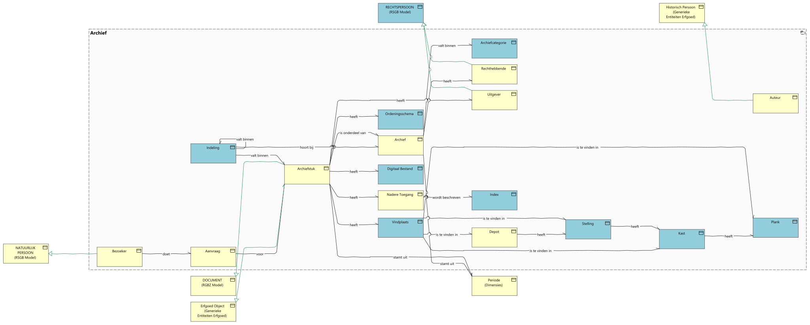
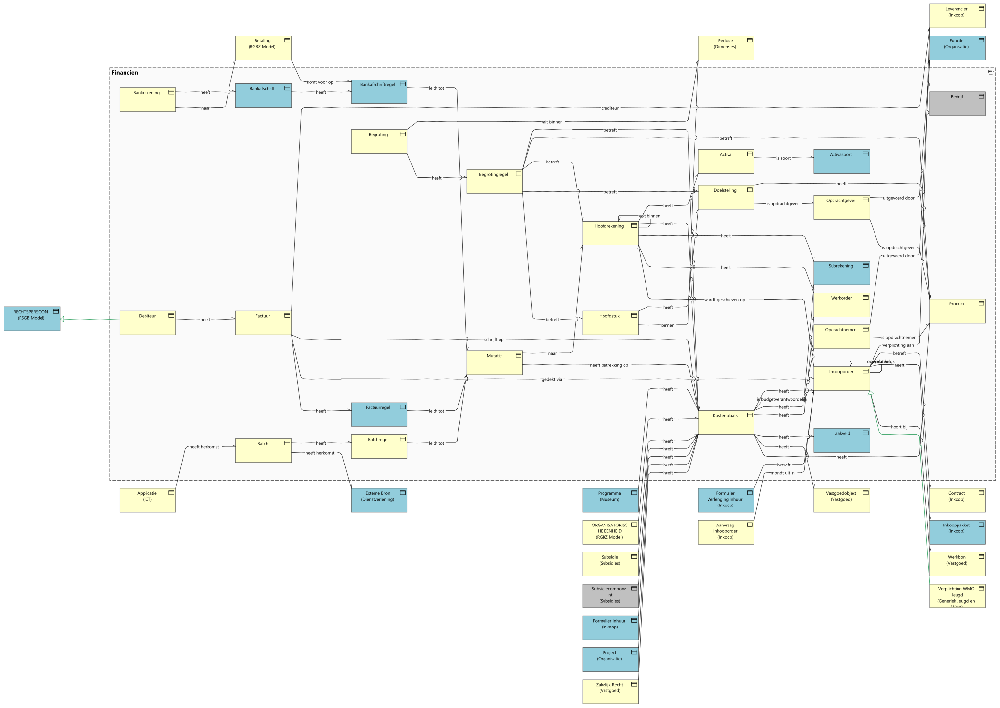
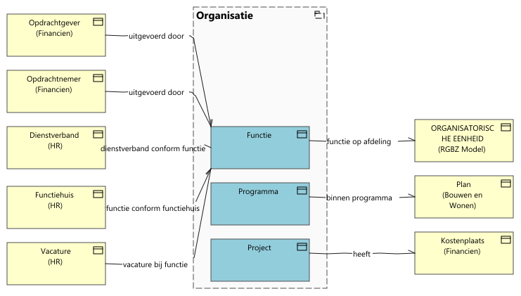

# GGM data-objecten

Report generated at: 2023-12-13  09:01:12

---
## Inhoudsopgave

* [Gemeentelijk Gegevensmodel in ArchiMate](#gemeentelijk-gegevensmodel-in-archimate)
  * [Afval (GGM)](#afval-ggm)
  * [Archeologie (GGM)](#archeologie-ggm)
  * [Archief (GGM)](#archief-ggm)
  * [BAG (GGM)](#bag-ggm)
  * [Beheer Openbare Ruimte (GGM)](#beheer-openbare-ruimte-ggm)
  * [Bouwen en Wonen (GGM)](#bouwen-en-wonen-ggm)
  * [Complex datatype (GGM)](#complex-datatype-ggm)
  * [Dienstverlening (GGM)](#dienstverlening-ggm)
  * [Dimensies (GGM)](#dimensies-ggm)
  * [Economie (GGM)](#economie-ggm)
  * [Enumeratiesoort (GGM)](#enumeratiesoort-ggm)
  * [Financien (GGM)](#financien-ggm)
  * [Gemeentebegrafenissen (GGM)](#gemeentebegrafenissen-ggm)
  * [Generiek (GGM)](#generiek-ggm)
  * [Generieke Entiteiten Erfgoed (GGM)](#generieke-entiteiten-erfgoed-ggm)
  * [Generiek Jeugd en Wmo (GGM)](#generiek-jeugd-en-wmo-ggm)
  * [Griffie (GGM)](#griffie-ggm)
  * [Groepattribuutsoort (GGM)](#groepattribuutsoort-ggm)
  * [HR (GGM)](#hr-ggm)
  * [ICT (GGM)](#ict-ggm)
  * [Inburgering (GGM)](#inburgering-ggm)
  * [Inkoop (GGM)](#inkoop-ggm)
  * [Leerplicht en Leerlingenvervoer (GGM)](#leerplicht-en-leerlingenvervoer-ggm)
  * [Meldingen Openbare Ruimte (GGM)](#meldingen-openbare-ruimte-ggm)
  * [Metagegevens (GGM)](#metagegevens-ggm)
  * [Monumenten  (GGM)](#monumenten-ggm)
  * [Museum (GGM)](#museum-ggm)
  * [Omgevingswet (GGM)](#omgevingswet-ggm)
  * [Onderwijs (GGM)](#onderwijs-ggm)
  * [Organisatie (GGM)](#organisatie-ggm)
  * [Parkeren (GGM)](#parkeren-ggm)
  * [Participatie (GGM)](#participatie-ggm)
  * [Referentielijsten (GGM)](#referentielijsten-ggm)
  * [Relatieklasse (GGM)](#relatieklasse-ggm)
  * [RGBZ Model (GGM)](#rgbz-model-ggm)
  * [RSGB Model (GGM)](#rsgb-model-ggm)
  * [Schuldhulpverlening (GGM)](#schuldhulpverlening-ggm)
  * [Sociale Teams (GGM)](#sociale-teams-ggm)
  * [Sport (GGM)](#sport-ggm)
  * [Subsidies (GGM)](#subsidies-ggm)
  * [Tekenwijze (GGM)](#tekenwijze-ggm)
  * [Union (GGM)](#union-ggm)
  * [Vastgoed (GGM)](#vastgoed-ggm)
  * [Veiligheid en Vergunningen (GGM)](#veiligheid-en-vergunningen-ggm)
  * [Verkeer (GGM)](#verkeer-ggm)

---

## Gemeentelijk Gegevensmodel in ArchiMate

Dit model bevat een ArchiMate weergave van het GGM UML informatiemodel. De GGM UML classes, enumeraties en relations zijn ingelezen en omgezet naar ArchiMate objecten. Vervolgens zijn er met een script views per iv3-domein gegenereerd.

**Wat kun je doen met dit model?**
Dit model wordt gebruikt als basis voor de GEMMA bedrijfsobjectmodellen. Nadat het model is ingelezen wordt beoordeeld welke data-objecten gebruikt kunnen worden als basis voor een bedrijfsobject. Hiervoor krijgen de data-objecten een extra eigenschap archimate-type. In deze eigenschap wordt aangegeven dat het data-object een kandidaat bedrijfsobject is.

### Legenda views

- Kandidaat GEMMA bedrijfsobjecten zijn geel gekleurd.
- Specialization-relationships zijn groen gekleurd om deze beter te laten opvallen

### Afval (GGM)

<figure align="center">
  
  <figcaption><i>Afval (GGM)</i></figcaption>
</figure>

<table>
  <thead>
    <tr>
      <th colspan="2" width="20%">Element</th>
      <th rowspan="2" width="80%">Documentation</th>
    </tr>
  </thead>
  <tbody>
    <tr><td></td><td></td><td></td></tr>
    <tr valign="top")>
      <td colspan="2">Afval</td>
      <td>
706
</td>
    </tr>
    <tr valign="top")>
      <td colspan="1"></td>
      <td colspan="1">Prijsafspraak</td>
      <td>
Overeenkomst tussen concurrenten met betrekking tot de prijs van goederen of diensten.
</td>
    </tr>
    <tr valign="top")>
      <td colspan="1"></td>
      <td colspan="1">Prijsregel</td>
      <td></td>
    </tr>
    <tr valign="top")>
      <td colspan="1"></td>
      <td colspan="1">Categorie</td>
      <td>
Categorie waarop leveranciers zich voor de levering van personeel voor kunnen kwalificeren
</td>
    </tr>
    <tr valign="top")>
      <td colspan="1"></td>
      <td colspan="1">Pas</td>
      <td></td>
    </tr>
    <tr valign="top")>
      <td colspan="1"></td>
      <td colspan="1">Milieustraat</td>
      <td>
Een locatie die specifiek bestemd is voor het brengen van gescheiden huishoudelijk afval en grofvuil.
</td>
    </tr>
    <tr valign="top")>
      <td colspan="1"></td>
      <td colspan="1">Storting</td>
      <td>
Activiteit, inhoudende a. het zich ontdoen van stoffen
</td>
    </tr>
    <tr valign="top")>
      <td colspan="1"></td>
      <td colspan="1">Fractie</td>
      <td>
Onderdeel, deeltje
</td>
    </tr>
    <tr valign="top")>
      <td colspan="1"></td>
      <td colspan="1">Route</td>
      <td>
Routes die gereden worden om bepaalde fracties vuilnis op te halen. Routes gaan langs locaties, waar afhankelijk van de routesoort een containers, bepaalde plekken of adressen worden aangedaan.

<ul>
 <li>huis-aan-huis: er worden locaties met adressen aangedaan</li>
 <li>illegale dumping, grofvuil: er worden locaties aangedaan (evt met adres)</li>
 <li>containters: er worden locaties met containers aangedaan</li>
</ul></td>
    </tr>
    <tr valign="top")>
      <td colspan="1"></td>
      <td colspan="1">Rit</td>
      <td>
Verplaatsing van een wegvoertuig over een wegpad
</td>
    </tr>
    <tr valign="top")>
      <td colspan="1"></td>
      <td colspan="1">Melding</td>
      <td>
De betekenisvolle formulering van een waargenomen feit, waaraan een waarde kan worden toegekend
</td>
    </tr>
    <tr valign="top")>
      <td colspan="1"></td>
      <td colspan="1">Locatie</td>
      <td>
Locaties die worden aangedaan tijdens het rijden van een route. Dit kunnen adressen zijn en/of GML-punten met een x- en y-coordinaat. Avalex hanteert op het moment van schrijven alleen adressen, ook voor de containers.
</td>
    </tr>
    <tr valign="top")>
      <td colspan="1"></td>
      <td colspan="1">Ophaalmoment</td>
      <td>
Een stop die een vuilniswagen maakt tijdens het doen van een rit. Bijgehouden wordt de gewichtstoename van de lading
</td>
    </tr>
    <tr valign="top")>
      <td colspan="1"></td>
      <td colspan="1">Container</td>
      <td>
Container voor het gescheiden inzamelen van huishoudelijke afvalstoffen dwz afvalstoffen afkomstig uit particuliere huishoudens behoudens voor zover het ingezamelde bestanddelen van die afvalstoffen betreft die zijn aangewezen als gevaarlijke afvalstoffen
</td>
    </tr>
    <tr valign="top")>
      <td colspan="1"></td>
      <td colspan="1">Vuilniswagen</td>
      <td>
Een vrachtwagen die gebruikt wordt om afval in te zamelen bij bedrijven en huishoudens (huisvuil)
</td>
    </tr>
    <tr valign="top")>
      <td colspan="1"></td>
      <td colspan="1">Containertype</td>
      <td>
Typologie van container
</td>
    </tr>
    <tr valign="top")>
      <td colspan="1"></td>
      <td colspan="1">Vulgraadmeting</td>
      <td>
Mate waarin een (afval)container gevuld is
</td>
    </tr>
    <tr valign="top")>
      <td colspan="1"></td>
      <td colspan="1">Routesoort</td>
      <td></td>
    </tr>
    <tr valign="top")>
      <td colspan="2">AanvraagOfMelding</td>
      <td>
Komt overeen met een VJV

Bron: GEM<em>VJV (Distinct op REQ</em>ID)
ID: REQ_ID
</td>
    </tr>
  </tbody>
</table>

### Archeologie (GGM)

<figure align="center">
  
  <figcaption><i>Archeologie (GGM)</i></figcaption>
</figure>

<table>
  <thead>
    <tr>
      <th colspan="2" width="20%">Element</th>
      <th rowspan="2" width="80%">Documentation</th>
    </tr>
  </thead>
  <tbody>
    <tr><td></td><td></td><td></td></tr>
    <tr valign="top")>
      <td colspan="2">Archeologie</td>
      <td>
583
</td>
    </tr>
    <tr valign="top")>
      <td colspan="1"></td>
      <td colspan="1">Vindplaats</td>
      <td>
Een plek waar men iets gevonden heeft.
</td>
    </tr>
    <tr valign="top")>
      <td colspan="1"></td>
      <td colspan="1">Project</td>
      <td>
Geheel van activiteiten uitgevoerd in een tijdelijk samenwerkingsverband gericht op het binnen bepaalde randvoorwaarden (bv. tijd, geld) bereiken van een vooraf gedefinieerd resultaat.
</td>
    </tr>
    <tr valign="top")>
      <td colspan="1"></td>
      <td colspan="1">Archeologiebesluit</td>
      <td>
Een professioneel oordeel dat gebaseerd is op algemeen aanvaarde wetenschap ten aanzien van de archeologie
</td>
    </tr>
    <tr valign="top")>
      <td colspan="1"></td>
      <td colspan="1">boring</td>
      <td></td>
    </tr>
    <tr valign="top")>
      <td colspan="1"></td>
      <td colspan="1">Put</td>
      <td>
Grondspoor, veelal verstevigd en gefundeerd aangelegd, bedoeld voor de tijdelijke opslag van danwel water (waterput) danwel uitwerpselen en afval (beerput).
</td>
    </tr>
    <tr valign="top")>
      <td colspan="1"></td>
      <td colspan="1">locatie</td>
      <td></td>
    </tr>
    <tr valign="top")>
      <td colspan="1"></td>
      <td colspan="1">Vlak</td>
      <td>
Plat, oneindig oppervlak of variëteit zonder enige kromming.
</td>
    </tr>
    <tr valign="top")>
      <td colspan="1"></td>
      <td colspan="1">Spoor</td>
      <td>
Een blijk van eerdere aanwezigheid.
</td>
    </tr>
    <tr valign="top")>
      <td colspan="1"></td>
      <td colspan="1">Vulling</td>
      <td>
Dunne wegeringsplank gebruikt om de ruimte tussen de bovenste kimweger en de onderste balkweger op te vullen (Sopers, 1974).
</td>
    </tr>
    <tr valign="top")>
      <td colspan="1"></td>
      <td colspan="1">Vondst</td>
      <td>
Overblijfsel, voorwerp of ander spoor van menselijke aanwezigheid in het verleden afkomstig van een archeologisch monument
</td>
    </tr>
    <tr valign="top")>
      <td colspan="1"></td>
      <td colspan="1">Artefact</td>
      <td>
De benaming voor ieder verplaatsbaar object dat door de mens is vervaardigd, bewerkt en/of gebruikt.
</td>
    </tr>
    <tr valign="top")>
      <td colspan="1"></td>
      <td colspan="1">Artefactsoort</td>
      <td>
Typering van artefacten
</td>
    </tr>
    <tr valign="top")>
      <td colspan="1"></td>
      <td colspan="1">Magazijnplaatsing</td>
      <td>
Het ergens neerzetten van een object in een magazijn.
</td>
    </tr>
    <tr valign="top")>
      <td colspan="1"></td>
      <td colspan="1">Doos</td>
      <td>
Een afsluitbaar object waar iets in wordt opgeborgen of verpakt.
</td>
    </tr>
    <tr valign="top")>
      <td colspan="1"></td>
      <td colspan="1">Stelling</td>
      <td>
Een systeem om goederen op te slaan die worden vervoerd en opgeslagen op pallets, in bundels of per stuk.(Wikipedia)
</td>
    </tr>
    <tr valign="top")>
      <td colspan="1"></td>
      <td colspan="1">Magazijnlocatie</td>
      <td>
Locatie van een magazijn
</td>
    </tr>
    <tr valign="top")>
      <td colspan="1"></td>
      <td colspan="1">Kaart</td>
      <td>
De geografische weergave van een gedeelte van het aardoppervlak
</td>
    </tr>
  </tbody>
</table>

### Archief (GGM)

<figure align="center">
  
  <figcaption><i>Archief (GGM)</i></figcaption>
</figure>

<table>
  <thead>
    <tr>
      <th colspan="2" width="20%">Element</th>
      <th rowspan="2" width="80%">Documentation</th>
    </tr>
  </thead>
  <tbody>
    <tr><td></td><td></td><td></td></tr>
    <tr valign="top")>
      <td colspan="2">RECHTSPERSOON</td>
      <td>
Een NATUURLIJK PERSOON of een NIET-NATUURLIJK PERSOON
</td>
    </tr>
    <tr valign="top")>
      <td colspan="2">Historisch Persoon</td>
      <td>
Natuurlijk persoon waarvan informatie beschikbaar is uit het verleden.
</td>
    </tr>
    <tr valign="top")>
      <td colspan="2">NATUURLIJK PERSOON</td>
      <td>
Een INGESCHREVEN PERSOON of ANDER NATUURLIJK PERSOON
</td>
    </tr>
    <tr valign="top")>
      <td colspan="2">Archief</td>
      <td>
601
</td>
    </tr>
    <tr valign="top")>
      <td colspan="1"></td>
      <td colspan="1">Archiefcategorie</td>
      <td>
Typologie van een archief conform landelijke indeling
</td>
    </tr>
    <tr valign="top")>
      <td colspan="1"></td>
      <td colspan="1">Rechthebbende</td>
      <td>
Een rechthebbende is iemand die rechten heeft op een goed.
</td>
    </tr>
    <tr valign="top")>
      <td colspan="1"></td>
      <td colspan="1">Ordeningsschema</td>
      <td>
Ordening om archief en collecties beter vindbaar en bruikbaar voor betrokkenen.
</td>
    </tr>
    <tr valign="top")>
      <td colspan="1"></td>
      <td colspan="1">Uitgever</td>
      <td>
Iemand die iets op de markt brengt; iemand die iets uitgeeft
</td>
    </tr>
    <tr valign="top")>
      <td colspan="1"></td>
      <td colspan="1">Auteur</td>
      <td>
De persoon die verantwoordelijk is voor de inhoud van een (digitaal) document
</td>
    </tr>
    <tr valign="top")>
      <td colspan="1"></td>
      <td colspan="1">Indeling</td>
      <td>
Onderwerpen groeperen in samenhangende categorieën.
</td>
    </tr>
    <tr valign="top")>
      <td colspan="1"></td>
      <td colspan="1">Archief</td>
      <td>
De bewaarplaats van belangrijke gegevens die zijn vastgelegd in documentvorm alsook de verzameling van documenten die voor een bepaald doel vervaardigd zijn.
</td>
    </tr>
    <tr valign="top")>
      <td colspan="1"></td>
      <td colspan="1">Archiefstuk</td>
      <td>
Bijeengebrachte informatie, ongeacht het medium, die wordt gecreëerd, ontvangen en gearchiveerd door een bureau, een instelling, een organisatie of een individu met het oog op het nakomen van wettelijke verplichtingen of het uitvoeren van zakelijke transacties.(AAT)
</td>
    </tr>
    <tr valign="top")>
      <td colspan="1"></td>
      <td colspan="1">Digitaal Bestand</td>
      <td>
Bestand dat uitsluitend met behulp van besturingsprogrammatuur of toepassingsprogrammatuur geraadpleegd kunnen worden
</td>
    </tr>
    <tr valign="top")>
      <td colspan="1"></td>
      <td colspan="1">Nadere Toegang</td>
      <td>
De bevoegdheid om gegevens te raadplegen, bepaalde plaatsen te betreden of een bepaalde taak uit te oefenen.
</td>
    </tr>
    <tr valign="top")>
      <td colspan="1"></td>
      <td colspan="1">Index</td>
      <td></td>
    </tr>
    <tr valign="top")>
      <td colspan="1"></td>
      <td colspan="1">Vindplaats</td>
      <td>
Een plek waar men iets gevonden heeft.
</td>
    </tr>
    <tr valign="top")>
      <td colspan="1"></td>
      <td colspan="1">Stelling</td>
      <td>
Een systeem om goederen op te slaan die worden vervoerd en opgeslagen op pallets, in bundels of per stuk.(Wikipedia)
</td>
    </tr>
    <tr valign="top")>
      <td colspan="1"></td>
      <td colspan="1">Plank</td>
      <td>
Deel, plaat; stuk hout breder dan het dik is en langer dan breed.
</td>
    </tr>
    <tr valign="top")>
      <td colspan="1"></td>
      <td colspan="1">Bezoeker</td>
      <td>
Een persoon die iemand of iets bezoekt.
</td>
    </tr>
    <tr valign="top")>
      <td colspan="1"></td>
      <td colspan="1">Aanvraag</td>
      <td>
(officieel) verzoek, iets (officieel) vragen aan een bevoegde macht.
</td>
    </tr>
    <tr valign="top")>
      <td colspan="1"></td>
      <td colspan="1">Depot</td>
      <td>
Plaats waar iets bewaard wordt.
</td>
    </tr>
    <tr valign="top")>
      <td colspan="1"></td>
      <td colspan="1">Kast</td>
      <td>
Object met een permanent karakter dat dient om iets in te bergen en te beschermen.
</td>
    </tr>
    <tr valign="top")>
      <td colspan="2">DOCUMENT</td>
      <td>
Geheel van gegevens met een eigen identiteit ongeacht zijn vorm, met de bijbehorende metadata ontvangen of opgemaakt door een natuurlijke en/of rechtspersoon bij de uitvoering van taken, zijnde een ENKELVOUDIG DOCUMENT of een SAMENGESTELD DOCUMENT.
</td>
    </tr>
    <tr valign="top")>
      <td colspan="2">Periode</td>
      <td>
bepaalde tijdsduur.
</td>
    </tr>
    <tr valign="top")>
      <td colspan="2">Erfgoed Object</td>
      <td>
Uit het verleden geërfde materiële en immateriële objecten
</td>
    </tr>
  </tbody>
</table>

### BAG (GGM)

<figure align="center">
  
  <figcaption><i>BAG (GGM)</i></figcaption>
</figure>

<table>
  <thead>
    <tr>
      <th colspan="2" width="20%">Element</th>
      <th rowspan="2" width="80%">Documentation</th>
    </tr>
  </thead>
  <tbody>
    <tr><td></td><td></td><td></td></tr>
    <tr valign="top")>
      <td colspan="2">BAG</td>
      <td>
375
</td>
    </tr>
    <tr valign="top")>
      <td colspan="1"></td>
      <td colspan="1">NUMMERAANDUIDING</td>
      <td>
Een nummeraanduiding is een door het bevoegde gemeentelijke orgaan als zodanig toegekende aanduiding van een verblijfsobject, een standplaats of een ligplaats. Het is het samenstel van postcode, huisnummer, huisletter en huisnummertoevoeging.
</td>
    </tr>
    <tr valign="top")>
      <td colspan="1"></td>
      <td colspan="1">OPENBARE RUIMTE</td>
      <td>
Definitie
Een openbare ruimte is een door het bevoegde gemeentelijke orgaan als zodanig aangewezen en van een naam voorziene buitenruimte die binnen &#233;&#233;n woonplaats is gelegen.

Beschrijving
Een buitenruimte die door de gemeente als openbare ruimte is aangewezen en waaraan de gemeente een naam heeft gegeven. Een openbare ruimte ligt binnen 1 woonplaats. De BAG kent 7 soorten openbare ruimten: weg, water, spoorbaan, terrein, kunstwerk, landschappelijk gebied en administratief gebied. Een openbare ruimte is meestal een straat(naam).
</td>
    </tr>
    <tr valign="top")>
      <td colspan="1"></td>
      <td colspan="1">BUURT</td>
      <td>
Een aaneengesloten gedeelte van een wijk, waarvan de grenzen zo veel mogelijk gebaseerd zijn op topografische elementen.
</td>
    </tr>
    <tr valign="top")>
      <td colspan="1"></td>
      <td colspan="1">WIJK</td>
      <td>
Een aaneengesloten gedeelte van het grondgebied van een gemeente, waarvan de grenzen zo veel mogelijk zijn gebaseerd op sociaal-geografische kenmerken.
</td>
    </tr>
    <tr valign="top")>
      <td colspan="1"></td>
      <td colspan="1">WOONPLAATS</td>
      <td>
Definitie
Een woonplaats is een door het bevoegde gemeentelijke orgaan als zodanig aangewezen en van een naam voorzien gedeelte van het grondgebied van de gemeente

Beschrijving
Een stuk grond binnen de gemeente dat als woonplaats is aangewezen en waaraan de gemeente ook een naam heeft gegeven.
</td>
    </tr>
    <tr valign="top")>
      <td colspan="1"></td>
      <td colspan="1">GEMEENTE</td>
      <td>
Een gedeelte van het grondgebied van Nederland, ingesteld op basis van artikel 123 van de Grondwet.
</td>
    </tr>
    <tr valign="top")>
      <td colspan="1"></td>
      <td colspan="1">Boolean</td>
      <td></td>
    </tr>
    <tr valign="top")>
      <td colspan="1"></td>
      <td colspan="1">ADRESSEERBAAR OBJECT</td>
      <td>
Definitie
Een adresseerbaar object is een object waaraan formeel adressen kunnen en moeten worden toegekend: een verblijfsobject, standplaats of ligplaats.

Is generalisatie van
ligplaats
standplaats
verblijfsobject

Toelichting
Een object dat een adres heeft of krijgt. Adresseerbare objecten zijn: een verblijfsobject, een standplaats en een ligplaats.
</td>
    </tr>
    <tr valign="top")>
      <td colspan="1"></td>
      <td colspan="1">TypeAdresseerbaarObject</td>
      <td></td>
    </tr>
    <tr valign="top")>
      <td colspan="1"></td>
      <td colspan="1">ontsluitingswijzeVerdieping</td>
      <td>
De verschillende waarden die de ontsluiting van een verdieping kan aannemen.
</td>
    </tr>
    <tr valign="top")>
      <td colspan="1"></td>
      <td colspan="1">soortWoonobject</td>
      <td>
De verschillende waarden die een soort woonobject kan aannemen.
</td>
    </tr>
    <tr valign="top")>
      <td colspan="1"></td>
      <td colspan="1">statusLigplaats</td>
      <td>
Een aanduiding van alle waarden die de status van een lig- of standplaats 
kan aannemen.
</td>
    </tr>
    <tr valign="top")>
      <td colspan="1"></td>
      <td colspan="1">LIGPLAATS</td>
      <td>
Definitie
Een ligplaats is een door het bevoegde gemeentelijke orgaan als zodanig aangewezen plaats in het water al dan niet aangevuld met een op de oever aanwezig terrein of een gedeelte daarvan, die bestemd is voor het permanent afmeren van een voor woon-, bedrijfsmatige of recreatieve doeleinden geschikt drijvend object

Beschrijving
Een plaats in het water met soms ook een (deel van een) terrein op de oever. Deze plaats moet kunnen worden gebruikt door een drijvend object dat langere tijd daar wordt vastgemaakt. Het drijvende object moet geschikt zijn om in te wonen, om een bedrijf in te hebben of om voor plezier in te verblijven. Bijvoorbeeld een woonboot. De gemeente mag zeggen of er voor de BAG ergens een ligplaats komt.
</td>
    </tr>
    <tr valign="top")>
      <td colspan="1"></td>
      <td colspan="1">statusStandplaats</td>
      <td>
Een aanduiding van alle waarden die de status van een lig- of standplaats 
kan aannemen.
</td>
    </tr>
    <tr valign="top")>
      <td colspan="1"></td>
      <td colspan="1">VERBLIJFSOBJECT</td>
      <td>
Definitie
Een verblijfsobject is een kleinste binnen &#233;&#233;n of meer panden gelegen en voor woon-, bedrijfsmatige, of recreatieve doeleinden geschikte eenheid van gebruik die ontsloten wordt via een eigen afsluitbare toegang vanaf de openbare weg, een erf of een gedeelde verkeersruimte, onderwerp kan zijn van goederenrechtelijke rechtshandelingen en in functioneel opzicht zelfstandig is.

Beschrijving
Een verblijfsobject is een ruimte in 1 of meer panden en voldoet aan de volgende eisen: kan worden gebruikt om in te wonen, een bedrijf in te hebben of om voor plezier in te verblijven, is bereikbaar via een eigen afsluitbare toegang vanaf de openbare weg, een erf of een gedeelde verkeersruimte, kan worden gekocht en verkocht, kan helemaal zelf worden gebruikt voor het doel dat ervoor is gegeven. Deze eisen voor verblijfsobjecten worden toegelicht in de Catalogus BAG 2018. Een verblijfsobject krijgt een adres.
</td>
    </tr>
    <tr valign="top")>
      <td colspan="1"></td>
      <td colspan="1">PAND</td>
      <td>
Definitie
Een pand is een kleinste bij de totstandkoming functioneel en bouwkundig-constructief zelfstandige eenheid die direct en duurzaam met de aarde is verbonden en betreedbaar en afsluitbaar is.

Beschrijving
Een zelfstandig bouwwerk, zowel zelfstandig in de manier hoe het is gebouwd als waarvoor het is bedoeld om te gebruiken. Een pand voldoet ook aan de volgende eisen: een pand is direct en voor lange tijd met de aarde verbonden (een pand is niet makkelijk te verplaatsen) en een pand kun je binnengaan en afsluiten. Een eenheid kan alleen een pand zijn als het voldoet aan alle eisen uit de Catalogus BAG 2018.
</td>
    </tr>
    <tr valign="top")>
      <td colspan="1"></td>
      <td colspan="1">statusNummeraanduiding</td>
      <td>
Een aanduiding van alle  fases van de levenscyclus  die een  nummeraanduiding kan aannemen.
</td>
    </tr>
    <tr valign="top")>
      <td colspan="1"></td>
      <td colspan="1">statusOpenbareRuimte</td>
      <td>
Een aanduiding van alle fasen van de levenscyclus die een openbare ruimte kan aannemen.
</td>
    </tr>
    <tr valign="top")>
      <td colspan="1"></td>
      <td colspan="1">gebruiksdoel</td>
      <td>
Een aanduiding va alle waarden waarmee het gebruiksdoel van een object kan 
worden verbijzonderd.
</td>
    </tr>
    <tr valign="top")>
      <td colspan="1"></td>
      <td colspan="1">STANDPLAATS</td>
      <td>
Definitie
Een standplaats is een door het bevoegde gemeentelijke orgaan als zodanig aangewezen terrein of gedeelte daarvan dat bestemd is voor het permanent plaatsen van een niet direct en niet duurzaam met de aarde verbonden en voor woon-, bedrijfsmatige, of recreatieve doeleinden geschikte ruimte.

Beschrijving
Een terrein of een deel daarvan dat moet kunnen worden gebruikt om langere tijd een object neer te zetten. Dit object moet geschikt zijn om in te wonen, om een bedrijf in te hebben of om voor plezier in te verblijven. Het moet verplaatsbaar zijn en mag dus niet helemaal vastgemaakt worden aan de grond. Bijvoorbeeld een woonwagen of strandtent. De gemeente mag zeggen of er voor de BAG ergens een standplaats komt.
</td>
    </tr>
    <tr valign="top")>
      <td colspan="1"></td>
      <td colspan="1">statusPand</td>
      <td>
De verschillende waarden die de status van een pand kan aannemen.
</td>
    </tr>
    <tr valign="top")>
      <td colspan="1"></td>
      <td colspan="1">statusVerblijfsobject</td>
      <td>
Een aanduiding van alle waarden die de status van een verblijfsobject kan aannemen.
</td>
    </tr>
    <tr valign="top")>
      <td colspan="1"></td>
      <td colspan="1">statusVoortgangBouw</td>
      <td>
Een aanduiding van alle fases die de voortgang bouw pand kan aannemen.
</td>
    </tr>
    <tr valign="top")>
      <td colspan="1"></td>
      <td colspan="1">statusWoonplaats</td>
      <td>
Een aanduiding van alle waarden die de status van een woonplaats 
kan aannemen.
</td>
    </tr>
    <tr valign="top")>
      <td colspan="1"></td>
      <td colspan="1">typeringOpenbareRuimte</td>
      <td>
De verschillende waarden die de typering van een openbare ruimte kan aannemen.
</td>
    </tr>
  </tbody>
</table>

### Beheer Openbare Ruimte (GGM)

<figure align="center">
  
  <figcaption><i>Beheer Openbare Ruimte (GGM)</i></figcaption>
</figure>

<table>
  <thead>
    <tr>
      <th colspan="2" width="20%">Element</th>
      <th rowspan="2" width="80%">Documentation</th>
    </tr>
  </thead>
  <tbody>
    <tr><td></td><td></td><td></td></tr>
    <tr valign="top")>
      <td colspan="2">BEGROEID TERREINDEEL</td>
      <td>
Kleinste functioneel onafhankelijk stukje van een terrein dat er binnen het objecttype Terrein van NEN 3610 wordt onderscheiden, met aaneengesloten homogene vegetatie.
</td>
    </tr>
    <tr valign="top")>
      <td colspan="2">V-Log-Info</td>
      <td>
V-log is een open standaard voor datalogging van een verkeersregelinstallatie.
</td>
    </tr>
    <tr valign="top")>
      <td colspan="2">FUNCTIONEEL GEBIED</td>
      <td>
Begrensd en benoemd gebied dat door een functionele eenheid beschreven wordt.
</td>
    </tr>
    <tr valign="top")>
      <td colspan="2">GEBOUWINSTALLATIE</td>
      <td>
Een component aan de buitenzijde van een gebouw, die het aanzicht van het gebouw mede bepaalt.
</td>
    </tr>
    <tr valign="top")>
      <td colspan="2">INRICHTINGSELEMENT</td>
      <td>
Ruimtelijk object al dan niet ter detaillering dan wel ter inrichting van de
overige benoemde ruimtelijke objecten of een ander inrichtingselement.
</td>
    </tr>
    <tr valign="top")>
      <td colspan="2">MEDEWERKER</td>
      <td>
Een medewerker van de organisatie die zaken behandelt uit hoofde van zijn of haar functie binnen een ORGANISATORISCHE EENHEID.
</td>
    </tr>
    <tr valign="top")>
      <td colspan="2">KUNSTWERKDEEL</td>
      <td>
Onderdeel van een civiel-technisch werk voor de infrastructuur van wegen, water, spoorbanen, waterkeringen en/of leidingen.
</td>
    </tr>
    <tr valign="top")>
      <td colspan="2">Leverancier</td>
      <td>
Een niet-natuurlijk persoon die een product of dienst levert aan de organisatie
</td>
    </tr>
    <tr valign="top")>
      <td colspan="2">ONBEGROEID TERREINDEEL</td>
      <td>
Kleinste functioneel onafhankelijk stukje van een terrein, dat er binnen het objecttype Terrein van NEN 3610 wordt onderscheiden, zonder aaneengesloten vegetatie.
</td>
    </tr>
    <tr valign="top")>
      <td colspan="2">Verkeerstelling</td>
      <td>
Een onderzoek om inzicht te krijgen in het verkeer, in de hoeveelheid verkeer, de verdeling en de gereden snelheid.
</td>
    </tr>
    <tr valign="top")>
      <td colspan="2">NATUURLIJK PERSOON</td>
      <td>
Een INGESCHREVEN PERSOON of ANDER NATUURLIJK PERSOON
</td>
    </tr>
    <tr valign="top")>
      <td colspan="2">BUURT</td>
      <td>
Een aaneengesloten gedeelte van een wijk, waarvan de grenzen zo veel mogelijk gebaseerd zijn op topografische elementen.
</td>
    </tr>
    <tr valign="top")>
      <td colspan="2">Beheer Openbare Ruimte</td>
      <td>
791
</td>
    </tr>
    <tr valign="top")>
      <td colspan="1"></td>
      <td colspan="1">Bak</td>
      <td>
Object met een permanent karakter dat dient om iets in te bergen of te verzamelen. (bron: definities.geostandaarden.nl)
Synoniemen: Bak
</td>
    </tr>
    <tr valign="top")>
      <td colspan="1"></td>
      <td colspan="1">Afvalbak</td>
      <td>
Inzamelobject voor afval in de openbare ruimte dat handmatig kan worden leeggemaakt.
Toelichting: Inzamelobject voor afval in de openbare ruimte dat handmatig kan worden leeggemaakt.
</td>
    </tr>
    <tr valign="top")>
      <td colspan="1"></td>
      <td colspan="1">Sensor</td>
      <td>
Apparaat voor de meting van een fysieke grootheid (bijv. temperatuur, licht, druk, elektriciteit).
</td>
    </tr>
    <tr valign="top")>
      <td colspan="1"></td>
      <td colspan="1">Putdeksel</td>
      <td>
Deksel met als functie het afdekken van een put (GWSW). Dekt meestal de opening van een rioolput af, is meestal rond,  van zwaar metaal, soms van kunststof.
</td>
    </tr>
    <tr valign="top")>
      <td colspan="1"></td>
      <td colspan="1">Verkeersdrempel</td>
      <td>
Verhoging in de rijbaan, bedoeld om het gemotoriseerde verkeer met een lage(re) snelheid te laten rijden. Toelichting: Sinds ongeveer 2000 beschikt de Nederlandse wegenbouw over technische mogelijkheden om drempels uit te voeren in een doorlopende asfaltverharding en dan zodanig dat deze een specifieke snelheid uitlokken bij circa 80 procent van het gemotoriseerde verkeer.
</td>
    </tr>
    <tr valign="top")>
      <td colspan="1"></td>
      <td colspan="1">Boom</td>
      <td>
Een houtachtig gewas (loofboom of conifeer) met een wortelgestel en een enkele, stevige, houtige stam, die zich boven de grond vertakt.
Toelichting: Een houtachtig gewas (loofboom of conifeer) met een wortelgestel en een enkele, stevige, houtige stam, die zich boven de grond vertakt.
</td>
    </tr>
    <tr valign="top")>
      <td colspan="1"></td>
      <td colspan="1">Deelplan/Veld</td>
      <td></td>
    </tr>
    <tr valign="top")>
      <td colspan="1"></td>
      <td colspan="1">Fase/Oplevering</td>
      <td></td>
    </tr>
    <tr valign="top")>
      <td colspan="1"></td>
      <td colspan="1">Actie</td>
      <td>
Kleinst mogelijke eenheid van werk die zinvol onderscheiden kan worden, uitgevoerd door een persoon of machine op 1 plek op 1 moment.
</td>
    </tr>
    <tr valign="top")>
      <td colspan="1"></td>
      <td colspan="1">Kwaliteitskenmerken</td>
      <td>
Aanduiding van de hoedanigheid van uitvoering, bewerking en representativiteit van een meting, volgens een overeengekomen waarderingsschaal.
</td>
    </tr>
    <tr valign="top")>
      <td colspan="1"></td>
      <td colspan="1">Logboek</td>
      <td>
Registratie waarin gebeurtenissen worden bijgehouden.
</td>
    </tr>
    <tr valign="top")>
      <td colspan="1"></td>
      <td colspan="1">Klimplant</td>
      <td>
Plant met buigzame stengels die zich op diverse manieren aan muren, bomen of constructies hecht en zodoende omhoog klimt.
Toelichting: Plant met buigzame stengels die zich op diverse manieren aan muren, bomen of constructies hecht en zodoende omhoog klimt.
</td>
    </tr>
    <tr valign="top")>
      <td colspan="1"></td>
      <td colspan="1">Proces-verbaal-MOOR-melding</td>
      <td>
Officieel op papier gesteld verslag met betrekking tot heen MOOR-melding
</td>
    </tr>
    <tr valign="top")>
      <td colspan="1"></td>
      <td colspan="1">Weginrichtingsobject</td>
      <td>
Een ruimtelijk object dat dient voor de inrichting van de openbare weg.
</td>
    </tr>
    <tr valign="top")>
      <td colspan="1"></td>
      <td colspan="1">SolitairePlant</td>
      <td>
Plant, heester of siergras, te beheren als solitair beplantingselement.
</td>
    </tr>
    <tr valign="top")>
      <td colspan="1"></td>
      <td colspan="1">Areaal</td>
      <td>
Het verspreidingsgebied van een een soort, een levensgemeenschap of een biotooptype.
</td>
    </tr>
    <tr valign="top")>
      <td colspan="1"></td>
      <td colspan="1">MOOR-melding</td>
      <td>
Meldingsproces rondom werkzaamheden aan kabels en leidingen.
</td>
    </tr>
    <tr valign="top")>
      <td colspan="1"></td>
      <td colspan="1">Waterobject</td>
      <td>
Kleinste functioneel onafhankelijk stukje water met gelijkblijvende, homogene eigenschappen en relaties dat er binnen het objecttype Water van NEN 3610 wordt onderscheiden en dat permanent met water bedekt is. (imgeo.geostandaarden.nl)
</td>
    </tr>
    <tr valign="top")>
      <td colspan="1"></td>
      <td colspan="1">Geluidsscherm</td>
      <td>
Een scheiding bedoeld om geluidshinder in de buitenlucht te verminderen. (IMGeo)
</td>
    </tr>
    <tr valign="top")>
      <td colspan="1"></td>
      <td colspan="1">CROW-Melding</td>
      <td>
BOR-MELD is een CROW-standaard voor het vastleggen van meldingen.
</td>
    </tr>
    <tr valign="top")>
      <td colspan="1"></td>
      <td colspan="1">Waterinrichtingsobject</td>
      <td>
Een ruimtelijk object ter inrichting van het water.
</td>
    </tr>
    <tr valign="top")>
      <td colspan="1"></td>
      <td colspan="1">Kademuur</td>
      <td>
Verticale wand ter scheiding van land en water, opgebouwd uit een muur van gemetselde stenen of gestort beton. (bron: definities.geostandaarden.nl)
</td>
    </tr>
    <tr valign="top")>
      <td colspan="1"></td>
      <td colspan="1">Inspectie</td>
      <td>
het inwinnen, verwerken en interpreteren van informatie met het doel om de momentane toestand van de boezemkade vast te stellen.
</td>
    </tr>
    <tr valign="top")>
      <td colspan="1"></td>
      <td colspan="1">Paal</td>
      <td>
Langwerpig stuk hout, ijzer, steen enz., dat in de grond staat.
</td>
    </tr>
    <tr valign="top")>
      <td colspan="1"></td>
      <td colspan="1">Keermuur</td>
      <td>
Muur die door vorm, gewicht en fundering zonder verankering de grond keert, vaak van beton met L-vormige doorsnede.  Een keermuur of keerwand is een stijf, grond- of waterkerend kunstwerk dat door een groot gewicht en een brede voet een grote standzekerheid kan bereiken. Een keermuur is meestal van gewapend beton, maar er kan ook ander materiaal gebruikt worden. (IMGeo)
Synoniemen: Keerwand, klip
</td>
    </tr>
    <tr valign="top")>
      <td colspan="1"></td>
      <td colspan="1">Verlichtingsobject</td>
      <td>
Paal of mast waaraan openbare verlichting is bevestigd.
</td>
    </tr>
    <tr valign="top")>
      <td colspan="1"></td>
      <td colspan="1">Aansluitput</td>
      <td>
Type put met de functie aansluitleidingen aansluiten
</td>
    </tr>
    <tr valign="top")>
      <td colspan="1"></td>
      <td colspan="1">Verhardingsobject</td>
      <td>
Verharde lagen van een weglichaam, speel- en sportondergronden en onbegroeid terreindelen inclusief de fundering.
</td>
    </tr>
    <tr valign="top")>
      <td colspan="1"></td>
      <td colspan="1">Drainageput</td>
      <td>
Put welke toegang geeft naar een poreuze of geperforeerde buisleiding, aangebracht onder de grond om de afwatering van de grond te verbeteren.
</td>
    </tr>
    <tr valign="top")>
      <td colspan="1"></td>
      <td colspan="1">Vegetatieobject</td>
      <td>
Verzamelobject van alle vegetatieobjecten - niveau 2
</td>
    </tr>
    <tr valign="top")>
      <td colspan="1"></td>
      <td colspan="1">Filterput</td>
      <td>
Put met een filterconstructie voor het onttrekken van grondwater. Kan ook beschouwd worden als een soort drainagevoorziening.
</td>
    </tr>
    <tr valign="top")>
      <td colspan="1"></td>
      <td colspan="1">Kast</td>
      <td>
Object met een permanent karakter dat dient om iets in te bergen en te beschermen.
</td>
    </tr>
    <tr valign="top")>
      <td colspan="1"></td>
      <td colspan="1">Infiltratieput</td>
      <td>
Een put met waterdoorlatende wanden bestemd voor de inzameling van hemelwater, waarbij het hemelwater door middel van infiltratie door de wanden kan worden afgevoerd
</td>
    </tr>
    <tr valign="top")>
      <td colspan="1"></td>
      <td colspan="1">Kolk</td>
      <td>
Een reservoir bestemd voor de opvang van hemelwater afkomstig van erop aangesloten oppervlakken, het laten bezinken van in dit water meegevoerde bezinkbare stoffen en de afvoer van dit water naar een rioolstelsel of naar de ondergrond.
Synoniemen: Afvoerput
</td>
    </tr>
    <tr valign="top")>
      <td colspan="1"></td>
      <td colspan="1">Tunnelobject</td>
      <td>
Onderdeel van een kunstmatig aangelegde, kokervormige onderdoorgang dat essentieel is voor de constructie.
</td>
    </tr>
    <tr valign="top")>
      <td colspan="1"></td>
      <td colspan="1">Rioolput</td>
      <td>
Constructie toegang gevend tot het rioolstelselÂ&nbsp;Â
</td>
    </tr>
    <tr valign="top")>
      <td colspan="1"></td>
      <td colspan="1">Beheerobject</td>
      <td>
Verzamelobject - niveau 1
</td>
    </tr>
    <tr valign="top")>
      <td colspan="1"></td>
      <td colspan="1">Terreindeel</td>
      <td>
Kleinste functioneel onafhankelijk stukje van een terrein, dat er binnen het objecttype Terrein van NEN 3610 wordt onderscheiden, met of zonder aaneengesloten vegetatie.
</td>
    </tr>
    <tr valign="top")>
      <td colspan="1"></td>
      <td colspan="1">Brug</td>
      <td>
Kunstwerk over een waterweg, watergang of waterloop, bestaande uit een brugdek gesteund door pijlers en/of landhoofden.
</td>
    </tr>
    <tr valign="top")>
      <td colspan="1"></td>
      <td colspan="1">Scheiding</td>
      <td>
Kunstmatig, meestal lineair obstakel met een werende functie.
</td>
    </tr>
    <tr valign="top")>
      <td colspan="1"></td>
      <td colspan="1">Put</td>
      <td>
Verticale waterdichte constructie, toegepast om leidingen aan te sluiten, van richting of niveau te veranderen, om toegang te verschaffen aan personeel en/of apparatuur voor inspectie en onderhoud, en om beluchting en ventilatie mogelijk te maken
</td>
    </tr>
    <tr valign="top")>
      <td colspan="1"></td>
      <td colspan="1">Schouwronde</td>
      <td>
Activiteit om te controleren of de opdrachtnemer aan de afspraken voldoet.
</td>
    </tr>
    <tr valign="top")>
      <td colspan="1"></td>
      <td colspan="1">Melding</td>
      <td>
De betekenisvolle formulering van een waargenomen feit, waaraan een waarde kan worden toegekend
</td>
    </tr>
    <tr valign="top")>
      <td colspan="1"></td>
      <td colspan="1">Uitvoerder Graafwerkzaamheden</td>
      <td>
Degene die op de bouwlocatie van een project de leiding heeft met betrekking tot de graafwerkzaamheden
</td>
    </tr>
    <tr valign="top")>
      <td colspan="1"></td>
      <td colspan="1">Opbreking</td>
      <td>
Vorm van wegwerkzaamheid
</td>
    </tr>
    <tr valign="top")>
      <td colspan="1"></td>
      <td colspan="1">Overbruggingsobject</td>
      <td>
Onderdeel van een beweegbare of vaste verbinding tussen twee punten, die door water, een weg of anderszins gescheiden zijn, dat essentieel is voor de constructie .
</td>
    </tr>
    <tr valign="top")>
      <td colspan="1"></td>
      <td colspan="1">Kwaliteitscatalogus Openbare Ruimte</td>
      <td>
zie https://www.crow.nl/publicaties/kwaliteitscatalogus-openbare-ruimte-2018
</td>
    </tr>
    <tr valign="top")>
      <td colspan="1"></td>
      <td colspan="1">Geo-Object</td>
      <td>
Abstractie van een fenomeen in de werkelijkheid, dat direct of indirect is geassocieerd met een locatie relatief ten opzichte van de aarde. [NEN 3610:2011]
</td>
    </tr>
    <tr valign="top")>
      <td colspan="1"></td>
      <td colspan="1">Meubilair</td>
      <td>
De verzameling van ruimtelijke objecten ter inrichting van de openbare ruimte of terreinen.
Een ruimtelijk object ter inrichting van de openbare ruimte.
</td>
    </tr>
    <tr valign="top")>
      <td colspan="1"></td>
      <td colspan="1">Mast</td>
      <td>
Draagconstructie, bestaande uit een verticale buispaal, die wordt gebruikt om iets op hoogte te brengen.
</td>
    </tr>
    <tr valign="top")>
      <td colspan="1"></td>
      <td colspan="1">Leidingelement</td>
      <td>
Een object dat bij een leiding behoort.
</td>
    </tr>
    <tr valign="top")>
      <td colspan="1"></td>
      <td colspan="1">Leiding</td>
      <td>
Een geheel van geleiders welke voorzien zijn van één ommanteling en bestemd is voor transport van materie GWSW
</td>
    </tr>
    <tr valign="top")>
      <td colspan="1"></td>
      <td colspan="1">Kunstwerk</td>
      <td>
Civiel-technisch werk voor de infrastructuur van wegen, water, spoorbanen, waterkeringen en/of leidingen en niet bedoeld voor permanent menselijk verblijf. http://definities.geostandaarden.nl
</td>
    </tr>
    <tr valign="top")>
      <td colspan="1"></td>
      <td colspan="1">Installatie</td>
      <td>
Samenhangend systeem dat een bepaald doel dient.
</td>
    </tr>
    <tr valign="top")>
      <td colspan="1"></td>
      <td colspan="1">Ecoduct</td>
      <td>
Wildwissel in de vorm van een viaduct voor passages van dieren over een weg of spoorweg. IMGeo
Synoniemen: Natuurbrug, Faunabrug, Ecobrug, Ecopassage, Natuurpassage
Toelichting: Opheffen van barrières en de migratie van fauna mogelijk maken tussen of binnen leefgebieden en populaties.
</td>
    </tr>
    <tr valign="top")>
      <td colspan="1"></td>
      <td colspan="1">Groenobject</td>
      <td>
Kleinste functioneel onafhankelijk stukje van een terrein dat er binnen het objecttype Terrein van NEN 3610 wordt onderscheiden, met aaneengesloten vegetatie.
</td>
    </tr>
    <tr valign="top")>
      <td colspan="1"></td>
      <td colspan="1">Flyover</td>
      <td>
Kunstwerk in de vorm van een viaduct dat deel uitmaakt van een verkeersbaan en waarmee een verkeersstroom over twee of meer ongelijkvloerse verkeersstromen wordt geleid.
</td>
    </tr>
    <tr valign="top")>
      <td colspan="1"></td>
      <td colspan="1">Viaduct</td>
      <td>
Kunstwerk over een weg, spoorweg of terreinverdieping, bestaande uit een dek gesteund door pijlers en/of landhoofden.
</td>
    </tr>
    <tr valign="top")>
      <td colspan="1"></td>
      <td colspan="1">Bank</td>
      <td>
Aaneengesloten zitplaats voor verscheidene personen, bedoeld voor openbaar gebruik en geplaatst in de openbare ruimte (vnl. in parken, plantsoenen, bossen en langs wegen).
</td>
    </tr>
    <tr valign="top")>
      <td colspan="1"></td>
      <td colspan="1">FunctioneelGebied</td>
      <td>
Begrensd en benoemd gebied dat door een functionele eenheid beschreven wordt.   (bron: definities.geostandaarden.nl)
</td>
    </tr>
    <tr valign="top")>
      <td colspan="1"></td>
      <td colspan="1">Fietsparkeervoorziening</td>
      <td>
Een duurzaam verankerd rek in de openbare ruimte voor het stallen van fietsen
</td>
    </tr>
    <tr valign="top")>
      <td colspan="1"></td>
      <td colspan="1">Bouwwerk</td>
      <td>
Met de aarde verbonden duurzaam bouwwerk, dat niet valt onder de definities van een pand of kunstwerk  (bron: definities.geostandaarden.nl)
</td>
    </tr>
    <tr valign="top")>
      <td colspan="1"></td>
      <td colspan="1">Storing</td>
      <td>
Verlies van de mogelijkheid om volgens een specificatie te werken of om het vereiste resultaat te leveren.
</td>
    </tr>
    <tr valign="top")>
      <td colspan="1"></td>
      <td colspan="1">Bord</td>
      <td>
Paneel waarop (statische) informatie wordt afgebeeld, verwoord in tekst, pictogram of code.
</td>
    </tr>
    <tr valign="top")>
      <td colspan="1"></td>
      <td colspan="1">Speeltoestel</td>
      <td>
Toestel en structuren, met inbegrip van componenten en constructieve onderdelen, waarmee of waarop kinderen binnen of buiten kunnen spelen, individueel of gezamenlijk, volgens hun eigen spelregels of beweegredenen, die te allen tijde kunnen worden gewijzi
Synoniemen: Speelvoorziening
</td>
    </tr>
    <tr valign="top")>
      <td colspan="1"></td>
      <td colspan="1">MeldingOngeval</td>
      <td>
Aangifte vna een ongeval
</td>
    </tr>
    <tr valign="top")>
      <td colspan="1"></td>
      <td colspan="1">Gemaal</td>
      <td>
Een constructie ten behoeve van het verplaatsen van waterÂ&nbsp;Â&nbsp;GWSW
</td>
    </tr>
    <tr valign="top")>
      <td colspan="1"></td>
      <td colspan="1">Uitlaatconstructie</td>
      <td>
Het eindpunt van een rioolleiding waar uitstroming van afvalwater uit het rioolstelsel naar het oppervlaktewater mogelijk is.
</td>
    </tr>
    <tr valign="top")>
      <td colspan="1"></td>
      <td colspan="1">Grondbeheerder</td>
      <td>
Beheerder van grondgrondbeheer., oplossing voor duurzaam landbeheer en voedselproductie
</td>
    </tr>
    <tr valign="top")>
      <td colspan="1"></td>
      <td colspan="1">Omgevingsvergunning</td>
      <td>
Vergunning als bedoeld in afdeling 5.1 van de Omgevingswet
</td>
    </tr>
    <tr valign="top")>
      <td colspan="1"></td>
      <td colspan="1">Overstortconstructie</td>
      <td>
Een constructie voorzien van een overstortdrempel met een ontworpen drempelbreedte en -hoogte.
</td>
    </tr>
    <tr valign="top")>
      <td colspan="1"></td>
      <td colspan="1">Onderhoud</td>
      <td>
Maatregelen om de functionele kwaliteit in stand te houden of te herstellen en dus de levensduur van een (object)onderdeel te realiseren c.q. te verlengen.
</td>
    </tr>
    <tr valign="top")>
      <td colspan="1"></td>
      <td colspan="1">Pomp</td>
      <td>
Een technische installatie die het (afval) water onder druk transporteert.
</td>
    </tr>
    <tr valign="top")>
      <td colspan="1"></td>
      <td colspan="1">Taak</td>
      <td>
Een samenhangende set activiteiten.
</td>
    </tr>
    <tr valign="top")>
      <td colspan="1"></td>
      <td colspan="1">Bemalingsgebied</td>
      <td>
Een rioleringsgebied waaruit het afvalwater door een gemaal wordt verwijderd.
Toelichting: Een rioleringsgebied waaruit het afvalwater door een gemaal wordt verwijderd
</td>
    </tr>
    <tr valign="top")>
      <td colspan="1"></td>
      <td colspan="1">KadastraleMutatie</td>
      <td>
Wijziging in de kadatrale registratie
</td>
    </tr>
    <tr valign="top")>
      <td colspan="1"></td>
      <td colspan="1">Verkeerslicht</td>
      <td>
Lichten die aangeven dat je moet stoppen, dat je mag doorrijden, of die je waarschuwen voor gevaar.
</td>
    </tr>
    <tr valign="top")>
      <td colspan="1"></td>
      <td colspan="1">Stuwgebied</td>
      <td>
Een deelgebied van een bemalingsgebied waarvan de afvoer via een stuwput of stuwriool wordt beperkt.
</td>
    </tr>
    <tr valign="top")>
      <td colspan="1"></td>
      <td colspan="1">CROW-Kwaliteitsniveaus</td>
      <td></td>
    </tr>
    <tr valign="top")>
      <td colspan="1"></td>
      <td colspan="1">Sportterrein</td>
      <td>
Terrein mogelijk met groenvoorziening, verharding en bebouwing bestemd voor sportbeoefening.
Synoniemen: Sportveld
</td>
    </tr>
    <tr valign="top")>
      <td colspan="1"></td>
      <td colspan="1">Energielabel</td>
      <td></td>
    </tr>
    <tr valign="top")>
      <td colspan="1"></td>
      <td colspan="1">Speelterrein</td>
      <td>
Geheel van begroeiing verharding opstallen en speelwerktuigen bedoeld als speelplaats voor kinderen.
Synoniemen: Speelplek, Speelgelegenheid
</td>
    </tr>
    <tr valign="top")>
      <td colspan="1"></td>
      <td colspan="1">Oppervlakte Woning</td>
      <td></td>
    </tr>
    <tr valign="top")>
      <td colspan="1"></td>
      <td colspan="1">Rioleringsgebied</td>
      <td>
Het gebied waarbinnen één of meerdere inliggende rioolstelsel(s) het afvalwater naar één gemaal of overnamepunt transporteert/teren. Een rioleringsgebied kan een enkelvoudig gebied zijn, maar kan ook meerdere rioleringsgebieden omvatten. Een gebied is zodanig gekozen dat het voldoende inzicht geeft in de belasting van oppervlaktewater en overnamepunt.
Toelichting: Het gebied waarbinnen één of meerdere inliggende rioolstelsel(s) het afvalwater naar één gemaal of overnamepunt transporteert/teren. Een rioleringsgebied kan een enkelvoudig gebied zijn, maar kan ook meerdere rioleringsgebieden omvatten. Een gebied is zodanig gekozen dat het voldoende inzicht geeft in de belasting van oppervlaktewater en overnamepunt.
</td>
    </tr>
    <tr valign="top")>
      <td colspan="1"></td>
      <td colspan="1">Bergingsbassin</td>
      <td>
Een gesloten reservoir waarin het afvalwater tijdelijk wordt opgevangen
Synoniemen: Retentiebassin, bufferbassin
</td>
    </tr>
    <tr valign="top")>
      <td colspan="2">DOCUMENT</td>
      <td>
Geheel van gegevens met een eigen identiteit ongeacht zijn vorm, met de bijbehorende metadata ontvangen of opgemaakt door een natuurlijke en/of rechtspersoon bij de uitvoering van taken, zijnde een ENKELVOUDIG DOCUMENT of een SAMENGESTELD DOCUMENT.
</td>
    </tr>
    <tr valign="top")>
      <td colspan="2">Plan</td>
      <td>
Project waarin woningen worden gerealiseerd
</td>
    </tr>
    <tr valign="top")>
      <td colspan="2">ONDERSTEUNEND WATERDEEL</td>
      <td>
Object dat in het kader van de waterhuishouding periodiek gedeeltelijk of geheel met water is bedekt.
</td>
    </tr>
    <tr valign="top")>
      <td colspan="2">RECHTSPERSOON</td>
      <td>
Een NATUURLIJK PERSOON of een NIET-NATUURLIJK PERSOON
</td>
    </tr>
    <tr valign="top")>
      <td colspan="2">WIJK</td>
      <td>
Een aaneengesloten gedeelte van het grondgebied van een gemeente, waarvan de grenzen zo veel mogelijk zijn gebaseerd op sociaal-geografische kenmerken.
</td>
    </tr>
    <tr valign="top")>
      <td colspan="2">ONDERSTEUNEND WEGDEEL</td>
      <td>
Een deel van de weg dat niet primair bedoeld is voor gebruik door het verkeer.
</td>
    </tr>
    <tr valign="top")>
      <td colspan="2">KADASTRALE ONROERENDE ZAAK</td>
      <td>
Een geregistreerd goed waarvoor bij overdracht of vestiging van rechten inschrijving in de openbare registers van het Kadaster is vereist zijnde een KADASTRAAL PERCEEL of een APPARTEMENTSRECHT.
</td>
    </tr>
    <tr valign="top")>
      <td colspan="2">OVERBRUGGINGSDEEL</td>
      <td>
Onderdeel van een beweegbare of vaste verbinding tussen twee punten, die door water, een weg of anderszins gescheiden zijn, dat essentieel is voor de constructie.
</td>
    </tr>
    <tr valign="top")>
      <td colspan="2">ZAKELIJK RECHT</td>
      <td>
Het eigendom van, of een beperkt recht van een natuurlijk of niet-natuurlijk persoon (PERSOON) op, een onroerende zaak (met uitzondering van hypotheken en beslagen).
</td>
    </tr>
    <tr valign="top")>
      <td colspan="2">OVERIG BENOEMD TERREIN</td>
      <td>
Een door het bevoegde gemeentelijke orgaan als zodanig aangewezen onbebouwd terrein of een gedeelte daarvan, geen standplaats of gedeelte van een ligplaats zijnde, dat bestemd is voor het gedurende langere tijd verrichten van een maatschappelijke activiteit.
</td>
    </tr>
    <tr valign="top")>
      <td colspan="2">OVERIG BOUWWERK</td>
      <td>
Met de aarde verbonden duurzaam bouwwerk, dat niet valt onder de definities van een pand of kunstwerk.
</td>
    </tr>
    <tr valign="top")>
      <td colspan="2">OVERIGE SCHEIDING</td>
      <td>
Kunstmatig, meestal lineair obstakel met een werende functie, met kleinere afmetingen dan toegestaan voor opname in de BGT.
</td>
    </tr>
    <tr valign="top")>
      <td colspan="2">PAND</td>
      <td>
De kleinste bij de totstandkoming functioneel en bouwkundig-constructief zelfstandige eenheid die direct en duurzaam met de aarde is verbonden en betreedbaar en afsluitbaar is.
</td>
    </tr>
    <tr valign="top")>
      <td colspan="2">SCHEIDING</td>
      <td>
Kunstmatig, meestal lineair obstakel met een werende functie.
</td>
    </tr>
    <tr valign="top")>
      <td colspan="2">SPOOR</td>
      <td>
De as van het spoor, dat wil zeggen het midden van twee stalen staven op een onderling vaste afstand, waarover trein, tram, of sneltram rijdt.
</td>
    </tr>
    <tr valign="top")>
      <td colspan="2">TUNNELDEEL</td>
      <td>
Onderdeel van een kunstmatig aangelegde, kokervormige onderdoorgang, dat essentieel is voor de constructie.
</td>
    </tr>
    <tr valign="top")>
      <td colspan="2">VEGETATIEOBJECT</td>
      <td>
Solitair vegetatieobject of lijn- of vlakvormige groep gelijksoortige vegetatieobjecten met een beperkte omvang.
</td>
    </tr>
    <tr valign="top")>
      <td colspan="2">WATERDEEL</td>
      <td>
Kleinste functioneel onafhankelijk stukje water met gelijkblijvende, homogene eigenschappen en relaties dat er binnen het objecttype Water van NEN 3610 wordt onderscheiden.
</td>
    </tr>
    <tr valign="top")>
      <td colspan="2">WEGDEEL</td>
      <td>
Kleinste functioneel onafhankelijk stukje van een NEN 3610 Weg,  met gelijkblijvende homogene eigenschappen en relaties en primair bedoeld voor gebruik door weg-, spoor- en vliegverkeer te land
</td>
    </tr>
  </tbody>
</table>

### Bouwen en Wonen (GGM)

<figure align="center">
  
  <figcaption><i>Bouwen en Wonen (GGM)</i></figcaption>
</figure>

<table>
  <thead>
    <tr>
      <th colspan="2" width="20%">Element</th>
      <th rowspan="2" width="80%">Documentation</th>
    </tr>
  </thead>
  <tbody>
    <tr><td></td><td></td><td></td></tr>
    <tr valign="top")>
      <td colspan="2">NIET NATUURLIJK PERSOON</td>
      <td>
Een INGESCHREVEN NIET-NATUURLIJK PERSOON of een ANDER BUITENLANDS NIET-NATUURLIJK PERSOON
</td>
    </tr>
    <tr valign="top")>
      <td colspan="2">NATUURLIJK PERSOON</td>
      <td>
Een INGESCHREVEN PERSOON of ANDER NATUURLIJK PERSOON
</td>
    </tr>
    <tr valign="top")>
      <td colspan="2">Bouwen en Wonen</td>
      <td>
798
</td>
    </tr>
    <tr valign="top")>
      <td colspan="1"></td>
      <td colspan="1">Projectontwikkelaar</td>
      <td>
Een persoon of een firma die een project ontwikkelt voor financieel gewin.
</td>
    </tr>
    <tr valign="top")>
      <td colspan="1"></td>
      <td colspan="1">Studentenwoningen</td>
      <td>
Een woning waar uitsluitend (meerdere) studenten (of soms ook werkende jongeren) een woongemeenschap vorme
</td>
    </tr>
    <tr valign="top")>
      <td colspan="1"></td>
      <td colspan="1">Projectleider</td>
      <td>
De persoon die een project aanstuurt
</td>
    </tr>
    <tr valign="top")>
      <td colspan="1"></td>
      <td colspan="1">Plan</td>
      <td>
Project waarin woningen worden gerealiseerd
</td>
    </tr>
    <tr valign="top")>
      <td colspan="1"></td>
      <td colspan="1">Gebouw</td>
      <td>
Een complex van ruimten uitsluitend bedoeld voor de huisvesting van een afzonderlijk huishouden
</td>
    </tr>
    <tr valign="top")>
      <td colspan="1"></td>
      <td colspan="1">Koopwoningen</td>
      <td>
Een woning die eigendom is van een particulier (in het algemeen de bewoner van de woning).
</td>
    </tr>
    <tr valign="top")>
      <td colspan="1"></td>
      <td colspan="1">Huurwoningen</td>
      <td>
Wen woning die de bewoner huurt van de eigenaar, veelal een woningcorporatie of een particulier.
</td>
    </tr>
    <tr valign="top")>
      <td colspan="2">Programma</td>
      <td>
Een tijdelijke, flexibele organisatiestructuur, die is opgezet om de implementatie van een verzameling met elkaar samenhangende projecten en activiteiten te coördineren, te sturen en te controleren teneinde te zorgen voor de realisatie van de eindresultaten en benefits die zijn gerelateerd aan de strategische doelstellingen van de organisatie.
</td>
    </tr>
    <tr valign="top")>
      <td colspan="2">Omgevingsvergunning</td>
      <td>
Vergunning als bedoeld in afdeling 5.1 van de Omgevingswet
</td>
    </tr>
  </tbody>
</table>

### Complex datatype (GGM)

<figure align="center">
  
  <figcaption><i>Complex datatype (GGM)</i></figcaption>
</figure>

<table>
  <thead>
    <tr>
      <th colspan="2" width="20%">Element</th>
      <th rowspan="2" width="80%">Documentation</th>
    </tr>
  </thead>
  <tbody>
    <tr><td></td><td></td><td></td></tr>
    <tr valign="top")>
      <td colspan="2">Complex datatype</td>
      <td>
846
</td>
    </tr>
    <tr valign="top")>
      <td colspan="1"></td>
      <td colspan="1">BAGObjectnummering</td>
      <td>
Unieke objectaanduiding van een object uit de BAG binnen een gemeente.
</td>
    </tr>
    <tr valign="top")>
      <td colspan="1"></td>
      <td colspan="1">CompositeID</td>
      <td>
Unieke identificatie door het Kadaster toegekend. De identificatie heeft een opbouw conform NEN3610:2011 maar 
namespaces zijn onder beheer van kadaster (CDMKAD, delen van IMKAD) of Geonovum/NEN3610 (IMKAD).
</td>
    </tr>
    <tr valign="top")>
      <td colspan="1"></td>
      <td colspan="1">TypeBedrag</td>
      <td>
Een hoeveelheid geld in cijfers in een bepaalde valuta.
</td>
    </tr>
    <tr valign="top")>
      <td colspan="1"></td>
      <td colspan="1">TypeBreuk</td>
      <td>
De uitkomst van een deling van een geheel getal (de teller) door een ander geheel getal (de noemer).
</td>
    </tr>
    <tr valign="top")>
      <td colspan="1"></td>
      <td colspan="1">TypeKadastraleAanduiding</td>
      <td>
De typering van de kadastrale aanduiding van een onroerende zaak conform Kadaster.
</td>
    </tr>
    <tr valign="top")>
      <td colspan="1"></td>
      <td colspan="1">TypeKadastraleAanduiding - Copy</td>
      <td>
De typering van de kadastrale aanduiding van een onroerende zaak conform Kadaster.
</td>
    </tr>
    <tr valign="top")>
      <td colspan="1"></td>
      <td colspan="1">TypeKoopsom</td>
      <td>
Hetbedrag, waarvoor één of meer onroerende zaken zijn verkregen, het koopjaar en een indicator of het meerdere onroerende goederen betreft.
</td>
    </tr>
    <tr valign="top")>
      <td colspan="1"></td>
      <td colspan="1">TypeLabel</td>
      <td>
De tekst en positie van een label.
</td>
    </tr>
    <tr valign="top")>
      <td colspan="1"></td>
      <td colspan="1">TypeLabelpositie</td>
      <td>
De positie van een label op de kaart, samengesteld uit plaatsingspunt en rotatiehoek.
</td>
    </tr>
    <tr valign="top")>
      <td colspan="1"></td>
      <td colspan="1">TypeLandinrichtingsrente</td>
      <td>
De rente die berekend is over de percelen die in een herverkavelingblok van een landinrichtingsproject hebben 
gelegen.
</td>
    </tr>
    <tr valign="top")>
      <td colspan="1"></td>
      <td colspan="1">TypeLandinrichtingsrente - Copy</td>
      <td>
De rente die berekend is over de percelen die in een herverkavelingblok van een landinrichtingsproject hebben 
gelegen.
</td>
    </tr>
  </tbody>
</table>

### Dienstverlening (GGM)

<figure align="center">
  
  <figcaption><i>Dienstverlening (GGM)</i></figcaption>
</figure>

<table>
  <thead>
    <tr>
      <th colspan="2" width="20%">Element</th>
      <th rowspan="2" width="80%">Documentation</th>
    </tr>
  </thead>
  <tbody>
    <tr><td></td><td></td><td></td></tr>
    <tr valign="top")>
      <td colspan="2">Dienstverlening</td>
      <td>
13
</td>
    </tr>
    <tr valign="top")>
      <td colspan="1"></td>
      <td colspan="1">Afspraakstatus</td>
      <td></td>
    </tr>
    <tr valign="top")>
      <td colspan="1"></td>
      <td colspan="1">Aanvraagdata</td>
      <td>
Bron: GEN<em>REQ</em>DATA
ID: REQ<em>DATA icm VELD</em>NAAM
</td>
    </tr>
    <tr valign="top")>
      <td colspan="1"></td>
      <td colspan="1">Formuliersoortveld</td>
      <td>
Bron: GEM<em>VELD
ID: FORM</em>ID en VELD_NAAM
</td>
    </tr>
    <tr valign="top")>
      <td colspan="1"></td>
      <td colspan="1">Telefoonstatus</td>
      <td><ul>
 <li>ABANDONEDALERTING: “Opgehangen tijdens overgaan telefoon”</li>
 <li>DROPPEDCANCELED: “Opgehangen door systeem”</li>
 <li>ABANDONEDQUEUED: “Opgehangen tijdens wachten, zonder boodschap. ”</li>
 <li>CONNECTEDDIRECT: “Direct verbonden”</li>
 <li>CONNECTEDQUEUEDANNOUNCE: “Verbonden na wachtrij met boodschap”</li>
 <li>AbandonedQUEUEDANNOUNCE: “Opgehangen in wachtrij met boodschap”</li>
 <li>DroppedBusy: “Opgehangen door systeem, te druk”</li>
 <li>REJECTED: “Geweigerd door systeem”</li>
 <li>Droppedoverload: “Opgehangen door systeem vanwege overbelasting”</li>
</ul></td>
    </tr>
    <tr valign="top")>
      <td colspan="1"></td>
      <td colspan="1">Onderwerp</td>
      <td>
Bron: GEM<em>VJV</em>ONDERWERP
ID: ONDERWERP_ID
</td>
    </tr>
    <tr valign="top")>
      <td colspan="1"></td>
      <td colspan="1">Balieafspraak</td>
      <td>
Balieafspraken zijn afspraken voor een klantcontact. Dit ongeacht of deze werkelijk heeft plaatsgevonden of gaat plaatsvinden, soms liggen deze in de toekomst of is iemand niet op komen dagen, of iets anders waardoor het klantcontact nog niet heeft plaatsgevonden.
</td>
    </tr>
    <tr valign="top")>
      <td colspan="1"></td>
      <td colspan="1">Formuliersoort</td>
      <td>
Bron: GEM<em>FORM
ID: FORM</em>ID
</td>
    </tr>
    <tr valign="top")>
      <td colspan="1"></td>
      <td colspan="1">Artikel</td>
      <td>
Tekst die is gemaakt om gepubliceerd te worden als een onafhankelijk deel van een tijdschrift, krant, encyclopedie of ander werk
</td>
    </tr>
    <tr valign="top")>
      <td colspan="1"></td>
      <td colspan="1">Telefoontje</td>
      <td>
De telefoontjes zijn alle keren dat iemand naar de gemeente belt en het telefoonsysteem neemt deze telefoontjes aan. Ongeacht of iemand daarna ophangt, door het systeem uit de wachtrij wordt gezet, doorverbonden wordt met een derde partij of er werkelijk wordt opgenomen.
</td>
    </tr>
    <tr valign="top")>
      <td colspan="1"></td>
      <td colspan="1">ProductOfDienst</td>
      <td>
Bron: QP<em>CALENDAR.CFM</em>SERVICES
</td>
    </tr>
    <tr valign="top")>
      <td colspan="1"></td>
      <td colspan="1">Externe Bron</td>
      <td>
Bron buiten de eigen organisatie
</td>
    </tr>
    <tr valign="top")>
      <td colspan="1"></td>
      <td colspan="1">Telefoononderwerp</td>
      <td></td>
    </tr>
    <tr valign="top")>
      <td colspan="1"></td>
      <td colspan="1">AanvraagOfMelding</td>
      <td>
Komt overeen met een VJV

Bron: GEM<em>VJV (Distinct op REQ</em>ID)
ID: REQ_ID
</td>
    </tr>
    <tr valign="top")>
      <td colspan="1"></td>
      <td colspan="1">MORAanvraagOfMelding</td>
      <td></td>
    </tr>
    <tr valign="top")>
      <td colspan="2">MEDEWERKER</td>
      <td>
Een medewerker van de organisatie die zaken behandelt uit hoofde van zijn of haar functie binnen een ORGANISATORISCHE EENHEID.
</td>
    </tr>
    <tr valign="top")>
      <td colspan="2">ZAAK</td>
      <td>
Een samenhangende hoeveelheid werk met een welgedefinieerde aanleiding en een welgedefinieerd eindresultaat, waarvan kwaliteit en doorlooptijd bewaakt moeten worden.
</td>
    </tr>
    <tr valign="top")>
      <td colspan="2">ZAAKTYPE</td>
      <td>
Generieke aanduiding van de aard van een zaak
</td>
    </tr>
    <tr valign="top")>
      <td colspan="2">VESTIGING VAN ZAAKBEHANDELENDE ORGANISATIE</td>
      <td>
Een VESTIGING van een onderneming of rechtspersoon zijnde de zaakbehandelende organisatie.
</td>
    </tr>
    <tr valign="top")>
      <td colspan="2">DOCUMENT</td>
      <td>
Geheel van gegevens met een eigen identiteit ongeacht zijn vorm, met de bijbehorende metadata ontvangen of opgemaakt door een natuurlijke en/of rechtspersoon bij de uitvoering van taken, zijnde een ENKELVOUDIG DOCUMENT of een SAMENGESTELD DOCUMENT.
</td>
    </tr>
    <tr valign="top")>
      <td colspan="2">Klantcontact</td>
      <td>
Klantcontacten zijn contactmomenten die werkelijk hebben plaatsgevonden, terwijl Balieafspraken afspraken zijn voor een klantcontact. Dit ongeacht of deze werkelijk heeft plaatsgevonden, soms liggen deze in de toekomst of is iemand niet op komen dagen, of iets anders waardoor het klantcontact nog niet heeft plaatsgevonden.

Hetzelfde geldt voor de telefoontjes, de klantcontacten komen uit levelOneData, dat zijn alle telefoontjes die werkelijk met een medewerker (of een gedelegeerde) hebben plaatsgevonden (soms zelfs meerdere binnen 1 telefoontje).
</td>
    </tr>
    <tr valign="top")>
      <td colspan="2">Indiener</td>
      <td>
Persoon die meldiing of aanvraag doet
</td>
    </tr>
    <tr valign="top")>
      <td colspan="2">AOMstatus</td>
      <td></td>
    </tr>
    <tr valign="top")>
      <td colspan="2">Melding</td>
      <td>
De betekenisvolle formulering van een waargenomen feit, waaraan een waarde kan worden toegekend
</td>
    </tr>
    <tr valign="top")>
      <td colspan="2">AOM_MeldingWmoJeugd</td>
      <td></td>
    </tr>
    <tr valign="top")>
      <td colspan="2">AOM_AanvraagWmoJeugd</td>
      <td></td>
    </tr>
    <tr valign="top")>
      <td colspan="2">VTH-Melding</td>
      <td>
Melding met betrekking tot Vergunningen, Toezicht en Handhaving
</td>
    </tr>
    <tr valign="top")>
      <td colspan="2">WoonoverlastAanvraagOfMelding</td>
      <td>
Melding of aanvraag met betrekking tot Woonoverlast
</td>
    </tr>
    <tr valign="top")>
      <td colspan="2">WoonfraudeAanvraagOfMelding</td>
      <td>
Melding of aanvraag van woonfraude
</td>
    </tr>
    <tr valign="top")>
      <td colspan="2">VOMAanvraagOfMelding</td>
      <td>
VOM staat voor Vergunning, Ontheffing of Melding. Het betreft hier een melding of een aanvraag voor een vergunning of een ontheffing.
</td>
    </tr>
    <tr valign="top")>
      <td colspan="2">MORAanvraagOfMelding</td>
      <td></td>
    </tr>
    <tr valign="top")>
      <td colspan="2">Batch</td>
      <td>
Verzameling van posten die in het kader van automatische verwerking een logisch geheel vormen.
</td>
    </tr>
    <tr valign="top")>
      <td colspan="2">AanvraagOfMelding</td>
      <td>
Komt overeen met een VJV

Bron: GEM<em>VJV (Distinct op REQ</em>ID)
ID: REQ_ID
</td>
    </tr>
  </tbody>
</table>

### Dimensies (GGM)

<figure align="center">
  
  <figcaption><i>Dimensies (GGM)</i></figcaption>
</figure>

<table>
  <thead>
    <tr>
      <th colspan="2" width="20%">Element</th>
      <th rowspan="2" width="80%">Documentation</th>
    </tr>
  </thead>
  <tbody>
    <tr><td></td><td></td><td></td></tr>
    <tr valign="top")>
      <td colspan="2">Archiefstuk</td>
      <td>
Bijeengebrachte informatie, ongeacht het medium, die wordt gecreëerd, ontvangen en gearchiveerd door een bureau, een instelling, een organisatie of een individu met het oog op het nakomen van wettelijke verplichtingen of het uitvoeren van zakelijke transacties.(AAT)
</td>
    </tr>
    <tr valign="top")>
      <td colspan="2">Archief</td>
      <td>
De bewaarplaats van belangrijke gegevens die zijn vastgelegd in documentvorm alsook de verzameling van documenten die voor een bepaald doel vervaardigd zijn.
</td>
    </tr>
    <tr valign="top")>
      <td colspan="2">Begroting</td>
      <td>
Een overzicht van de verwachte ontvangsten en voorziene uitgaven voor een bepaalde (meestal toekomstige) periode zodat hier een afstemming tussen plaats kan vinden om eventuele tekorten en overschotten vroegtijdig in kaart te kunnen brengen.
</td>
    </tr>
    <tr valign="top")>
      <td colspan="2">Hoofdstuk</td>
      <td>
Onderdeel van een langere tekst.
</td>
    </tr>
    <tr valign="top")>
      <td colspan="2">Dimensies</td>
      <td>
376
</td>
    </tr>
    <tr valign="top")>
      <td colspan="1"></td>
      <td colspan="1">Periode</td>
      <td>
bepaalde tijdsduur.
</td>
    </tr>
  </tbody>
</table>

### Economie (GGM)

<figure align="center">
  
  <figcaption><i>Economie (GGM)</i></figcaption>
</figure>

<table>
  <thead>
    <tr>
      <th colspan="2" width="20%">Element</th>
      <th rowspan="2" width="80%">Documentation</th>
    </tr>
  </thead>
  <tbody>
    <tr><td></td><td></td><td></td></tr>
    <tr valign="top")>
      <td colspan="2">Economie</td>
      <td>
535
</td>
    </tr>
    <tr valign="top")>
      <td colspan="1"></td>
      <td colspan="1">Hotel</td>
      <td>
Gebouw waar je tegen betaling kunt logeren.
</td>
    </tr>
    <tr valign="top")>
      <td colspan="1"></td>
      <td colspan="1">Hotelbezoek</td>
      <td>
Verblijf in een hotel
</td>
    </tr>
    <tr valign="top")>
      <td colspan="1"></td>
      <td colspan="1">Contact</td>
      <td>
Persoon waarmee communicatie plaatsvindt
</td>
    </tr>
    <tr valign="top")>
      <td colspan="1"></td>
      <td colspan="1">Verkooppunt</td>
      <td>
Locatie waar iets wordt verkocht
</td>
    </tr>
    <tr valign="top")>
      <td colspan="1"></td>
      <td colspan="1">Werkgelegenheid</td>
      <td>
De vraag naar arbeid, te berekenen door de totale productie te delen door de arbeidsproductiviteit per persoon.
</td>
    </tr>
    <tr valign="top")>
      <td colspan="1"></td>
      <td colspan="1">Winkelvloeroppervlak</td>
      <td>
Gemeten oppervlakte in vierkante meters van een winkel
</td>
    </tr>
    <tr valign="top")>
      <td colspan="2">NATUURLIJK PERSOON</td>
      <td>
Een INGESCHREVEN PERSOON of ANDER NATUURLIJK PERSOON
</td>
    </tr>
    <tr valign="top")>
      <td colspan="2">GEBOUWD OBJECT</td>
      <td>
Een VERBLIJFSOBJECT of een OVERIG GEBOUWD OBJECT
</td>
    </tr>
    <tr valign="top")>
      <td colspan="2">VESTIGING</td>
      <td>
Een gebouw of complex van gebouwen waar duurzame uitoefening van de activiteiten van een onderneming of rechtspersoon plaatsvindt.
</td>
    </tr>
  </tbody>
</table>

### Enumeratiesoort (GGM)

<figure align="center">
  
  <figcaption><i>Enumeratiesoort (GGM)</i></figcaption>
</figure>

<table>
  <thead>
    <tr>
      <th colspan="2" width="20%">Element</th>
      <th rowspan="2" width="80%">Documentation</th>
    </tr>
  </thead>
  <tbody>
    <tr><td></td><td></td><td></td></tr>
    <tr valign="top")>
      <td colspan="2">Klantcontact</td>
      <td>
Klantcontacten zijn contactmomenten die werkelijk hebben plaatsgevonden, terwijl Balieafspraken afspraken zijn voor een klantcontact. Dit ongeacht of deze werkelijk heeft plaatsgevonden, soms liggen deze in de toekomst of is iemand niet op komen dagen, of iets anders waardoor het klantcontact nog niet heeft plaatsgevonden.

Hetzelfde geldt voor de telefoontjes, de klantcontacten komen uit levelOneData, dat zijn alle telefoontjes die werkelijk met een medewerker (of een gedelegeerde) hebben plaatsgevonden (soms zelfs meerdere binnen 1 telefoontje).
</td>
    </tr>
    <tr valign="top")>
      <td colspan="2">GEBOUWD OBJECT</td>
      <td>
Een VERBLIJFSOBJECT of een OVERIG GEBOUWD OBJECT
</td>
    </tr>
    <tr valign="top")>
      <td colspan="2">Enumeratiesoort</td>
      <td>
1038
</td>
    </tr>
    <tr valign="top")>
      <td colspan="1"></td>
      <td colspan="1">Geslachtsaanduiding MEDEWERKER</td>
      <td></td>
    </tr>
    <tr valign="top")>
      <td colspan="1"></td>
      <td colspan="1">Soorten Klantcontact</td>
      <td></td>
    </tr>
    <tr valign="top")>
      <td colspan="1"></td>
      <td colspan="1">Vertrouwelijk aanduiding DOCUMENT</td>
      <td></td>
    </tr>
    <tr valign="top")>
      <td colspan="1"></td>
      <td colspan="1">Vervalreden BESLUIT</td>
      <td></td>
    </tr>
    <tr valign="top")>
      <td colspan="1"></td>
      <td colspan="1">Boolean</td>
      <td></td>
    </tr>
    <tr valign="top")>
      <td colspan="1"></td>
      <td colspan="1">Gezinsrelatie</td>
      <td></td>
    </tr>
    <tr valign="top")>
      <td colspan="1"></td>
      <td colspan="1">Huishoudensoort</td>
      <td>
<b>Definitie</b>:

Typering van het huishouden naar grootte en verbondenheid.

<b>Toelichting</b>:

Voor de definities van institutioneel huishouden en particulier huishouden: zie de toelichting bij het objecttype Huishouden. Onder Thuiswonende kinderen wordt verstaan: alle in het huishouden van hun ouder(s) aanwezige eigen, pleeg-, stief- of adoptiekinderen die ongehuwd zijn en zelf geen kinderen hebben (CBS, Huishoudensprognose 1996). In een adresseerbaar object kunnen één of meer huishoudens wonen. In de tabel worden de huishoudens gekarakteriseerd, uitgaande van de CBS-Huishoudensprognose. Tot de categorie Overig particulier huishouden behoren bijvoorbeeld: een woongroep, studenten die gezamenlijk een huishouden vormen, een kamerbewoner die in zijn eigen onderhoud voorziet, twee zussen die samenwonen.
</td>
    </tr>
    <tr valign="top")>
      <td colspan="1"></td>
      <td colspan="1">aanduidingEigenaarGebruiker</td>
      <td>
Een aanduiding van alle waarden waarmee soort belang van een eigenaar / gebruiker wordt aangeduid.
</td>
    </tr>
    <tr valign="top")>
      <td colspan="1"></td>
      <td colspan="1">aanduidingInhoudingVermissingReisdocument</td>
      <td>
De mogelijke waarden van de aanduiding van inhouding of vermissing van een Nederlands reisdocument. 
Zie logisch ontwerp BRP bij de stamtabellen
</td>
    </tr>
    <tr valign="top")>
      <td colspan="1"></td>
      <td colspan="1">aangever</td>
      <td>
De aangever adreshouding mag alleen een binnen de centrale voorzieningen voorgedefinieerde waarde hebben. Zie logisch ontwerp BRP bij de stamtabellen
</td>
    </tr>
    <tr valign="top")>
      <td colspan="1"></td>
      <td colspan="1">burgelijkeStaat</td>
      <td>
Een aanduiding van alle waarden die een burgelijke staat kan aannemen
</td>
    </tr>
    <tr valign="top")>
      <td colspan="1"></td>
      <td colspan="1">adelijkeTitel</td>
      <td>
Zie logisch ontwerp BRP bij de stamtabellen
</td>
    </tr>
    <tr valign="top")>
      <td colspan="1"></td>
      <td colspan="1">bouwkundigeBestemming</td>
      <td>
Een aanduiding van alle waarden waarmee de bouwkundige bestemming van een gebouwd object kan worden verbijzonderd
</td>
    </tr>
    <tr valign="top")>
      <td colspan="1"></td>
      <td colspan="1">bronAdresBuitenland</td>
      <td></td>
    </tr>
    <tr valign="top")>
      <td colspan="1"></td>
      <td colspan="1">codeExploitant</td>
      <td>
De verschillende rechten voor exploitatie van een perceel in eigendom van de gemeenten
</td>
    </tr>
    <tr valign="top")>
      <td colspan="1"></td>
      <td colspan="1">functieOndersteunendWegdeel</td>
      <td>
Een aanduiding van alle waarden waarmee de functie van een ondersteunend wegdeel kan worden verbijzonderd
</td>
    </tr>
    <tr valign="top")>
      <td colspan="1"></td>
      <td colspan="1">functieOndersteunendWegdeelPlus</td>
      <td>
De verschillende  waarden waarmee een nadere classificatie van de functie van een ondersteunend wegdeel kan worden aangegeven.
</td>
    </tr>
    <tr valign="top")>
      <td colspan="1"></td>
      <td colspan="1">functieSpoor</td>
      <td>
Een aanduiding van alle waarden waarmee de functie van een spoor kan worden verbijzonderd
</td>
    </tr>
    <tr valign="top")>
      <td colspan="1"></td>
      <td colspan="1">functieWeg</td>
      <td>
Een aanduiding van alle waarden waarmee het hoofdgebruiksdoel van een weg kan worden verbijzonderd
</td>
    </tr>
    <tr valign="top")>
      <td colspan="1"></td>
      <td colspan="1">functieWegPlus</td>
      <td>
De verschillende waarden waarmee een nadere categorisering van het gebruiksdoel van een weg kan worden verbijzonderd
</td>
    </tr>
    <tr valign="top")>
      <td colspan="1"></td>
      <td colspan="1">fysiekVoorkomenBegroeidTerrein</td>
      <td>
Een aanduiding van alle waarden waarmee het fysiek voorkomen van een begroeid terrein kan worden verbijzonderd
</td>
    </tr>
    <tr valign="top")>
      <td colspan="1"></td>
      <td colspan="1">fysiekVoorkomenBegroeidTerreinPlus</td>
      <td>
De verschillende waarden waarmee een nadere categorisering van het fysiek voorkomen van een begroeid terrein kan worden verbijzonderd
</td>
    </tr>
    <tr valign="top")>
      <td colspan="1"></td>
      <td colspan="1">fysiekVoorkomenOnbegroeidTerrein</td>
      <td>
Een aanduiding van alle waarden waarmee het fysiek voorkomen van een onbegroeid terrein kan worden verbijzonderd
</td>
    </tr>
    <tr valign="top")>
      <td colspan="1"></td>
      <td colspan="1">fysiekVoorkomenOnbegroeidTerreinPlus</td>
      <td>
Een aanduiding van alle waarden waarmee een nadere categorisering van het fysiek voorkomen van een onbegroeid terrein kan worden verbijzonderd
</td>
    </tr>
    <tr valign="top")>
      <td colspan="1"></td>
      <td colspan="1">fysiekVoorkomenOndersteunendWegdeel</td>
      <td>
Een aanduiding van alle waarden die de mate waarin een ondersteunend wegdeel al of niet verhard is weergeven
</td>
    </tr>
    <tr valign="top")>
      <td colspan="1"></td>
      <td colspan="1">fysiekVoorkomenOndersteunendWegdeelPlus</td>
      <td>
De verschillend waarden die een nadere classificatie van de mate waarin een ondersteunend wegdeel al of niet verhard is, kan aannemen.
</td>
    </tr>
    <tr valign="top")>
      <td colspan="1"></td>
      <td colspan="1">fysiekVoorkomenWeg</td>
      <td>
Een aanduiding van alle waarden waarmee het fysiek voorkomen van een weg kan worden verbijzonderd
</td>
    </tr>
    <tr valign="top")>
      <td colspan="1"></td>
      <td colspan="1">fysiekVoorkomenWegPlus</td>
      <td>
De verschillende waarden die een nadere classificatie van de mate waarin een wegdeel al of niet verhard is, kan aannemen.
</td>
    </tr>
    <tr valign="top")>
      <td colspan="1"></td>
      <td colspan="1">gebruiksdoel</td>
      <td>
Een aanduiding va alle waarden waarmee het gebruiksdoel van een object kan 
worden verbijzonderd.
</td>
    </tr>
    <tr valign="top")>
      <td colspan="1"></td>
      <td colspan="1">geslacht</td>
      <td></td>
    </tr>
    <tr valign="top")>
      <td colspan="1"></td>
      <td colspan="1">inwinningsmethodeOppervlakte</td>
      <td>
Een codering van de verschillende waarden die de inningswijze van een verkrijging oppervlakte kan aannemen.
</td>
    </tr>
    <tr valign="top")>
      <td colspan="1"></td>
      <td colspan="1">inwinningsmethodeGeometrie</td>
      <td>
Een codering van de verschillende waarden die de inwinning geometrie kan aannemen
</td>
    </tr>
    <tr valign="top")>
      <td colspan="1"></td>
      <td colspan="1">naamgebruik</td>
      <td>
De voorgedefinieerde waarden van naamgebruik volgens de centrale voorzieningen. Zie attribuut <i>Naamgebruik</i> van groep A.1.12 Naamgebruik van BRP.
</td>
    </tr>
    <tr valign="top")>
      <td colspan="1"></td>
      <td colspan="1">ontsluitingswijzeVerdieping</td>
      <td>
De verschillende waarden die de ontsluiting van een verdieping kan aannemen.
</td>
    </tr>
    <tr valign="top")>
      <td colspan="1"></td>
      <td colspan="1">predicaat</td>
      <td>
Een erenaam of betiteling van een persoon zoals die voorkomen in de centrale voorzieningen. Zie logisch ontwerp BRP bij de stamtabellen
</td>
    </tr>
    <tr valign="top")>
      <td colspan="1"></td>
      <td colspan="1">redenEindeRelatie</td>
      <td>
De mogelijke redenen voor het beëindigen van een huwelijk of geregistreerd partnerschap. Zie logisch ontwerp BRP bij de stamtabellen
</td>
    </tr>
    <tr valign="top")>
      <td colspan="1"></td>
      <td colspan="1">redenWijzigingAdres</td>
      <td>
De aanduiding waarom het adres is gewijzigd.Zie logisch ontwerp BRP bij de stamtabellen
</td>
    </tr>
    <tr valign="top")>
      <td colspan="1"></td>
      <td colspan="1">soortBewind</td>
      <td>
Een aanduiding van de soorten bewind  waaronder een niet natuurlijke persoon kan staan.
</td>
    </tr>
    <tr valign="top")>
      <td colspan="1"></td>
      <td colspan="1">soortBijzondereRechtstoestandNatuurlijkPersoon</td>
      <td>
Een aanduiding van de bijzondere rechtstoestanden waarin een natuurlijke persoon kan verkeren
</td>
    </tr>
    <tr valign="top")>
      <td colspan="1"></td>
      <td colspan="1">soortBijzondereRechtstoestandNietNatuurlijkPersoon</td>
      <td>
Een aanduiding van de bijzondere rechtstoestanden waarin een niet natuurlijke persoon kan verkeren
</td>
    </tr>
    <tr valign="top")>
      <td colspan="1"></td>
      <td colspan="1">soortGebruik</td>
      <td>
Typering van het WOZ-object naar soorten gebruik
</td>
    </tr>
    <tr valign="top")>
      <td colspan="1"></td>
      <td colspan="1">soortMigratie</td>
      <td>
A.1.23. Soort migratie van BRP
</td>
    </tr>
    <tr valign="top")>
      <td colspan="1"></td>
      <td colspan="1">soortPubliekrechtelijkRechtsvorm</td>
      <td>
Door de Kamers van Koophandel vastgestelde publiekrechtelijk rechtsvormen.
</td>
    </tr>
    <tr valign="top")>
      <td colspan="1"></td>
      <td colspan="1">soortRechtsvorm</td>
      <td>
Door de Kamers van Koophandel vastgestelde rechtsvormen van binnenlandse rechtspersonen (in oprichting), samenwerkingsverbanden en buitenlandse vennootschap met een onderneming of vestiging in Nederland
</td>
    </tr>
    <tr valign="top")>
      <td colspan="1"></td>
      <td colspan="1">soortWoonobject</td>
      <td>
De verschillende waarden die een soort woonobject kan aannemen.
</td>
    </tr>
    <tr valign="top")>
      <td colspan="1"></td>
      <td colspan="1">statusWOZ-Beschikking</td>
      <td>
De verschillende waarden die de status van een beschikking waarmee de waarde is vastgesteld, kan aannemen.
</td>
    </tr>
    <tr valign="top")>
      <td colspan="1"></td>
      <td colspan="1">statusGeoObject</td>
      <td>
Een aanduiding van alle waarden van de status  die een geo-object kan aannemen.
</td>
    </tr>
    <tr valign="top")>
      <td colspan="1"></td>
      <td colspan="1">StatLigplaatsStandplaats</td>
      <td>
Een aanduiding van alle waarden die de status van een lig- of standplaats 
kan aannemen.
</td>
    </tr>
    <tr valign="top")>
      <td colspan="1"></td>
      <td colspan="1">statusNummeraanduiding</td>
      <td>
Een aanduiding van alle  fases van de levenscyclus  die een  nummeraanduiding kan aannemen.
</td>
    </tr>
    <tr valign="top")>
      <td colspan="1"></td>
      <td colspan="1">statusOpenbareRuimte</td>
      <td>
Een aanduiding van alle fasen van de levenscyclus die een openbare ruimte kan aannemen.
</td>
    </tr>
    <tr valign="top")>
      <td colspan="1"></td>
      <td colspan="1">statusPand</td>
      <td>
De verschillende waarden die de status van een pand kan aannemen.
</td>
    </tr>
    <tr valign="top")>
      <td colspan="1"></td>
      <td colspan="1">statusVerblijfsobject</td>
      <td>
Een aanduiding van alle waarden die de status van een verblijfsobject kan aannemen.
</td>
    </tr>
    <tr valign="top")>
      <td colspan="1"></td>
      <td colspan="1">statusVoortgangBouw</td>
      <td>
Een aanduiding van alle fases die de voortgang bouw pand kan aannemen.
</td>
    </tr>
    <tr valign="top")>
      <td colspan="1"></td>
      <td colspan="1">statusWoonplaats</td>
      <td>
Een aanduiding van alle waarden die de status van een woonplaats 
kan aannemen.
</td>
    </tr>
    <tr valign="top")>
      <td colspan="1"></td>
      <td colspan="1">statusWOZ(Deel)Object</td>
      <td>
Een aanduiding van alle  fasen van de levenscyclus van WOZ-(deel)objecten
</td>
    </tr>
    <tr valign="top")>
      <td colspan="1"></td>
      <td colspan="1">typeOverbrugging</td>
      <td>
Een codering van de verschillende waarden die de typering van een overbrugging kan aannemen.
</td>
    </tr>
    <tr valign="top")>
      <td colspan="1"></td>
      <td colspan="1">typeringAppartementsrechtsplitsing</td>
      <td>
De verschillende waarden die de typering van appartementsrechtsplitsingen kan aannemen.
</td>
    </tr>
    <tr valign="top")>
      <td colspan="1"></td>
      <td colspan="1">typeringFunctie</td>
      <td>
De verschillende waarden die een type functie conform KvK kan aannemen
</td>
    </tr>
    <tr valign="top")>
      <td colspan="1"></td>
      <td colspan="1">typeringFunctionaris</td>
      <td>
De verschillende waarden die een type functionaris conform KvK kan aannemen.
</td>
    </tr>
    <tr valign="top")>
      <td colspan="1"></td>
      <td colspan="1">typeringFunctioneelGebied</td>
      <td>
De verschillende waarden die de typering  van het functioneel gebied kan aannemen.
</td>
    </tr>
    <tr valign="top")>
      <td colspan="1"></td>
      <td colspan="1">typeringGebouwinstallatie</td>
      <td>
De verschillende waarden die de typering van een gebouwinstallatie kan aannemen.
</td>
    </tr>
    <tr valign="top")>
      <td colspan="1"></td>
      <td colspan="1">typeringIngeschrevenNietNatuurlijkPersoon</td>
      <td>
De verschillende waarden die de typering van een ingeschreven niet natuurlijk personen conform KvK kan aannemen
</td>
    </tr>
    <tr valign="top")>
      <td colspan="1"></td>
      <td colspan="1">typeringInrichtingselement</td>
      <td>
De verschillende waarden die de typering van het inrichtingselement kan aannemen.
</td>
    </tr>
    <tr valign="top")>
      <td colspan="1"></td>
      <td colspan="1">typeringKunstwerk</td>
      <td>
De verschillende waarden die de typering van het kunstwerk kan aannemen.
</td>
    </tr>
    <tr valign="top")>
      <td colspan="1"></td>
      <td colspan="1">typeringInrichtingselementPlus</td>
      <td>
De verschillende waarden die een nadere categorisering van een type inrichtingselement kan aannemen.
</td>
    </tr>
    <tr valign="top")>
      <td colspan="1"></td>
      <td colspan="1">typeObjectcode</td>
      <td>
Codering van de binnen de BAG onderscheiden objecttypen.
</td>
    </tr>
    <tr valign="top")>
      <td colspan="1"></td>
      <td colspan="1">typeringOndersteunendWater</td>
      <td>
De verschillende waarden die de typeringen van het  ondersteunend water kan aannemen.
</td>
    </tr>
    <tr valign="top")>
      <td colspan="1"></td>
      <td colspan="1">typeringOndersteunendWaterPlus</td>
      <td>
De verschillende waarden die een nadere classificatie van de typering van het ondersteunend water kan aannemen.
</td>
    </tr>
    <tr valign="top")>
      <td colspan="1"></td>
      <td colspan="1">typeringOpenbareRuimte</td>
      <td>
De verschillende waarden die de typering van een openbare ruimte kan aannemen.
</td>
    </tr>
    <tr valign="top")>
      <td colspan="1"></td>
      <td colspan="1">typeringOverbruggingsdeel</td>
      <td>
De verschillende waarden die de typering van een  onderdeel van een brugconstructie kan aannemen
</td>
    </tr>
    <tr valign="top")>
      <td colspan="1"></td>
      <td colspan="1">typeringOverigBouwwerk</td>
      <td>
De verschillende waarden die de typering van een overig bouwwerk kan aannemen
</td>
    </tr>
    <tr valign="top")>
      <td colspan="1"></td>
      <td colspan="1">typeringOverigeScheiding</td>
      <td>
De verschillende waarden die de typering van een overige scheiding kan aannemen.
</td>
    </tr>
    <tr valign="top")>
      <td colspan="1"></td>
      <td colspan="1">typeringScheiding</td>
      <td>
De verschillende waarden die de typering van een  scheiding kan aannemen
</td>
    </tr>
    <tr valign="top")>
      <td colspan="1"></td>
      <td colspan="1">typeringVegetatieobject</td>
      <td>
De verschillende waarden die de typeringen van een  vrijstaande vegetatieobject kan aannemen
</td>
    </tr>
    <tr valign="top")>
      <td colspan="1"></td>
      <td colspan="1">typeringWater</td>
      <td>
De verschillende waarden die de typering van het water kan aannemen.
</td>
    </tr>
    <tr valign="top")>
      <td colspan="1"></td>
      <td colspan="1">typeringWaterPlus</td>
      <td>
De verschillende waarden die een nadere categorisering van een type water kan aannemen.
</td>
    </tr>
    <tr valign="top")>
      <td colspan="1"></td>
      <td colspan="1">typeringZekerheidsrecht</td>
      <td>
De verschillende waarden die de typering van het zekerheidsrecht kan aannemen.
</td>
    </tr>
    <tr valign="top")>
      <td colspan="1"></td>
      <td colspan="1">enum_AanOfVrijliggend</td>
      <td></td>
    </tr>
    <tr valign="top")>
      <td colspan="1"></td>
      <td colspan="1">enum_Afmeting</td>
      <td></td>
    </tr>
    <tr valign="top")>
      <td colspan="1"></td>
      <td colspan="1">enum_Bedienaar</td>
      <td></td>
    </tr>
    <tr valign="top")>
      <td colspan="1"></td>
      <td colspan="1">enum_Beheergebied</td>
      <td></td>
    </tr>
    <tr valign="top")>
      <td colspan="1"></td>
      <td colspan="1">enum_BeheerobjectGebruiksfunctie</td>
      <td></td>
    </tr>
    <tr valign="top")>
      <td colspan="1"></td>
      <td colspan="1">enum_Belasting</td>
      <td></td>
    </tr>
    <tr valign="top")>
      <td colspan="1"></td>
      <td colspan="1">enum_BelastingklasseNieuw</td>
      <td></td>
    </tr>
    <tr valign="top")>
      <td colspan="1"></td>
      <td colspan="1">enum_BelastingklasseOud</td>
      <td></td>
    </tr>
    <tr valign="top")>
      <td colspan="1"></td>
      <td colspan="1">enum_Beleidsstatus</td>
      <td></td>
    </tr>
    <tr valign="top")>
      <td colspan="1"></td>
      <td colspan="1">enum_BeoogdeOmlooptijd</td>
      <td></td>
    </tr>
    <tr valign="top")>
      <td colspan="1"></td>
      <td colspan="1">enum_Bereikbaarheid</td>
      <td></td>
    </tr>
    <tr valign="top")>
      <td colspan="1"></td>
      <td colspan="1">enum_BereikbaarheidKolk</td>
      <td></td>
    </tr>
    <tr valign="top")>
      <td colspan="1"></td>
      <td colspan="1">enum_Boombeeld</td>
      <td></td>
    </tr>
    <tr valign="top")>
      <td colspan="1"></td>
      <td colspan="1">enum_Boomgroep</td>
      <td></td>
    </tr>
    <tr valign="top")>
      <td colspan="1"></td>
      <td colspan="1">enum_BoomhoogteklasseActueel</td>
      <td></td>
    </tr>
    <tr valign="top")>
      <td colspan="1"></td>
      <td colspan="1">enum_BoomTypeBeschermingsstatusPlus</td>
      <td></td>
    </tr>
    <tr valign="top")>
      <td colspan="1"></td>
      <td colspan="1">enum_Boomveiligheidsklasse</td>
      <td></td>
    </tr>
    <tr valign="top")>
      <td colspan="1"></td>
      <td colspan="1">enum_Boomvoorziening</td>
      <td></td>
    </tr>
    <tr valign="top")>
      <td colspan="1"></td>
      <td colspan="1">enum_BreedteklasseHaag</td>
      <td></td>
    </tr>
    <tr valign="top")>
      <td colspan="1"></td>
      <td colspan="1">enum_Certificeringsinstantie</td>
      <td></td>
    </tr>
    <tr valign="top")>
      <td colspan="1"></td>
      <td colspan="1">enum_Constructielaagsoort</td>
      <td></td>
    </tr>
    <tr valign="top")>
      <td colspan="1"></td>
      <td colspan="1">enum_Constructietype</td>
      <td></td>
    </tr>
    <tr valign="top")>
      <td colspan="1"></td>
      <td colspan="1">enum_Controlefrequentie</td>
      <td></td>
    </tr>
    <tr valign="top")>
      <td colspan="1"></td>
      <td colspan="1">enum_CultuurhistorischWaardevol</td>
      <td></td>
    </tr>
    <tr valign="top")>
      <td colspan="1"></td>
      <td colspan="1">enum_Doelsoort</td>
      <td></td>
    </tr>
    <tr valign="top")>
      <td colspan="1"></td>
      <td colspan="1">enum_Fabrikant</td>
      <td></td>
    </tr>
    <tr valign="top")>
      <td colspan="1"></td>
      <td colspan="1">enum_Formaat</td>
      <td></td>
    </tr>
    <tr valign="top")>
      <td colspan="1"></td>
      <td colspan="1">enum_FunderingLeiding</td>
      <td></td>
    </tr>
    <tr valign="top")>
      <td colspan="1"></td>
      <td colspan="1">enum_Gebiedstype</td>
      <td></td>
    </tr>
    <tr valign="top")>
      <td colspan="1"></td>
      <td colspan="1">enum_GewenstSluitingspercentage</td>
      <td></td>
    </tr>
    <tr valign="top")>
      <td colspan="1"></td>
      <td colspan="1">enum_Groeifase</td>
      <td></td>
    </tr>
    <tr valign="top")>
      <td colspan="1"></td>
      <td colspan="1">enum_GroenobjectBereikbaarheidPlus</td>
      <td></td>
    </tr>
    <tr valign="top")>
      <td colspan="1"></td>
      <td colspan="1">enum_Grondsoort</td>
      <td></td>
    </tr>
    <tr valign="top")>
      <td colspan="1"></td>
      <td colspan="1">enum_GrondsoortPlus</td>
      <td></td>
    </tr>
    <tr valign="top")>
      <td colspan="1"></td>
      <td colspan="1">enum_HoogteklasseHaag</td>
      <td></td>
    </tr>
    <tr valign="top")>
      <td colspan="1"></td>
      <td colspan="1">enum_IMKLThema</td>
      <td></td>
    </tr>
    <tr valign="top")>
      <td colspan="1"></td>
      <td colspan="1">enum_Installateur</td>
      <td></td>
    </tr>
    <tr valign="top")>
      <td colspan="1"></td>
      <td colspan="1">enum_Kleur</td>
      <td></td>
    </tr>
    <tr valign="top")>
      <td colspan="1"></td>
      <td colspan="1">enum_KroondiameterklasseActueel</td>
      <td></td>
    </tr>
    <tr valign="top")>
      <td colspan="1"></td>
      <td colspan="1">enum_KwaliteitsniveauGewenst</td>
      <td></td>
    </tr>
    <tr valign="top")>
      <td colspan="1"></td>
      <td colspan="1">enum_Kweker</td>
      <td></td>
    </tr>
    <tr valign="top")>
      <td colspan="1"></td>
      <td colspan="1">enum_LengteKunstgras</td>
      <td></td>
    </tr>
    <tr valign="top")>
      <td colspan="1"></td>
      <td colspan="1">enum_Leverancier</td>
      <td></td>
    </tr>
    <tr valign="top")>
      <td colspan="1"></td>
      <td colspan="1">enum_LiningType</td>
      <td></td>
    </tr>
    <tr valign="top")>
      <td colspan="1"></td>
      <td colspan="1">enum_Markeringsbreedte</td>
      <td></td>
    </tr>
    <tr valign="top")>
      <td colspan="1"></td>
      <td colspan="1">enum_Markeringsoort</td>
      <td></td>
    </tr>
    <tr valign="top")>
      <td colspan="1"></td>
      <td colspan="1">enum_Markeringspatroon</td>
      <td></td>
    </tr>
    <tr valign="top")>
      <td colspan="1"></td>
      <td colspan="1">enum_Materiaal</td>
      <td></td>
    </tr>
    <tr valign="top")>
      <td colspan="1"></td>
      <td colspan="1">enum_Ondergroei</td>
      <td></td>
    </tr>
    <tr valign="top")>
      <td colspan="1"></td>
      <td colspan="1">enum_Onderhoudsplichtige</td>
      <td></td>
    </tr>
    <tr valign="top")>
      <td colspan="1"></td>
      <td colspan="1">enum_Onderhoudsregime</td>
      <td></td>
    </tr>
    <tr valign="top")>
      <td colspan="1"></td>
      <td colspan="1">enum_Ondersteuningsvorm</td>
      <td></td>
    </tr>
    <tr valign="top")>
      <td colspan="1"></td>
      <td colspan="1">enum_Oriëntatie</td>
      <td></td>
    </tr>
    <tr valign="top")>
      <td colspan="1"></td>
      <td colspan="1">enum_OverbruggingsobjectModaliteit</td>
      <td></td>
    </tr>
    <tr valign="top")>
      <td colspan="1"></td>
      <td colspan="1">enum_Plaatsoriëntatie</td>
      <td></td>
    </tr>
    <tr valign="top")>
      <td colspan="1"></td>
      <td colspan="1">enum_RioolputConstructieonderdeel</td>
      <td></td>
    </tr>
    <tr valign="top")>
      <td colspan="1"></td>
      <td colspan="1">enum_Snoeifase</td>
      <td></td>
    </tr>
    <tr valign="top")>
      <td colspan="1"></td>
      <td colspan="1">enum_Soortnaam</td>
      <td></td>
    </tr>
    <tr valign="top")>
      <td colspan="1"></td>
      <td colspan="1">enum_SoortPlantenbak</td>
      <td></td>
    </tr>
    <tr valign="top")>
      <td colspan="1"></td>
      <td colspan="1">enum_SoortVoeg</td>
      <td></td>
    </tr>
    <tr valign="top")>
      <td colspan="1"></td>
      <td colspan="1">enum_SpeelterreinLeeftijdDoelgroep</td>
      <td></td>
    </tr>
    <tr valign="top")>
      <td colspan="1"></td>
      <td colspan="1">enum_SpeeltoestelToestelonderdeel</td>
      <td></td>
    </tr>
    <tr valign="top")>
      <td colspan="1"></td>
      <td colspan="1">enum_SportterreinTypeSport</td>
      <td></td>
    </tr>
    <tr valign="top")>
      <td colspan="1"></td>
      <td colspan="1">enum_Stamdiameterklasse</td>
      <td></td>
    </tr>
    <tr valign="top")>
      <td colspan="1"></td>
      <td colspan="1">enum_Status</td>
      <td></td>
    </tr>
    <tr valign="top")>
      <td colspan="1"></td>
      <td colspan="1">enum_TakvrijeStam</td>
      <td></td>
    </tr>
    <tr valign="top")>
      <td colspan="1"></td>
      <td colspan="1">enum_Taludsteilte</td>
      <td></td>
    </tr>
    <tr valign="top")>
      <td colspan="1"></td>
      <td colspan="1">enum_Toestelgroep</td>
      <td></td>
    </tr>
    <tr valign="top")>
      <td colspan="1"></td>
      <td colspan="1">enum_Type</td>
      <td></td>
    </tr>
    <tr valign="top")>
      <td colspan="1"></td>
      <td colspan="1">enum_TypeAfdekking</td>
      <td></td>
    </tr>
    <tr valign="top")>
      <td colspan="1"></td>
      <td colspan="1">enum_TypeAsbesthoudend</td>
      <td></td>
    </tr>
    <tr valign="top")>
      <td colspan="1"></td>
      <td colspan="1">enum_TypeBediening</td>
      <td></td>
    </tr>
    <tr valign="top")>
      <td colspan="1"></td>
      <td colspan="1">enum_TypeBeheerder</td>
      <td></td>
    </tr>
    <tr valign="top")>
      <td colspan="1"></td>
      <td colspan="1">enum_TypeBeheerderPlus</td>
      <td></td>
    </tr>
    <tr valign="top")>
      <td colspan="1"></td>
      <td colspan="1">enum_TypeBeschermingsstatus</td>
      <td></td>
    </tr>
    <tr valign="top")>
      <td colspan="1"></td>
      <td colspan="1">enum_TypeBewerking</td>
      <td></td>
    </tr>
    <tr valign="top")>
      <td colspan="1"></td>
      <td colspan="1">enum_TypeBouwdeel</td>
      <td></td>
    </tr>
    <tr valign="top")>
      <td colspan="1"></td>
      <td colspan="1">enum_TypeBovenkantKademuur</td>
      <td></td>
    </tr>
    <tr valign="top")>
      <td colspan="1"></td>
      <td colspan="1">enum_TypeCommunicatie</td>
      <td></td>
    </tr>
    <tr valign="top")>
      <td colspan="1"></td>
      <td colspan="1">enum_TypeConstructie</td>
      <td></td>
    </tr>
    <tr valign="top")>
      <td colspan="1"></td>
      <td colspan="1">enum_TypeDeurbediening</td>
      <td></td>
    </tr>
    <tr valign="top")>
      <td colspan="1"></td>
      <td colspan="1">enum_TypeEigenaar</td>
      <td></td>
    </tr>
    <tr valign="top")>
      <td colspan="1"></td>
      <td colspan="1">enum_TypeEigenaarPlus</td>
      <td></td>
    </tr>
    <tr valign="top")>
      <td colspan="1"></td>
      <td colspan="1">enum_TypeElement</td>
      <td></td>
    </tr>
    <tr valign="top")>
      <td colspan="1"></td>
      <td colspan="1">enum_TypeFundering</td>
      <td></td>
    </tr>
    <tr valign="top")>
      <td colspan="1"></td>
      <td colspan="1">enum_TypeLigging</td>
      <td></td>
    </tr>
    <tr valign="top")>
      <td colspan="1"></td>
      <td colspan="1">enum_TypeMantel</td>
      <td></td>
    </tr>
    <tr valign="top")>
      <td colspan="1"></td>
      <td colspan="1">enum_TypeMonument</td>
      <td></td>
    </tr>
    <tr valign="top")>
      <td colspan="1"></td>
      <td colspan="1">enum_TypeNivelleerschijf</td>
      <td></td>
    </tr>
    <tr valign="top")>
      <td colspan="1"></td>
      <td colspan="1">enum_TypeOmgevingsrisicoklasse</td>
      <td></td>
    </tr>
    <tr valign="top")>
      <td colspan="1"></td>
      <td colspan="1">enum_TypeOnderdeelMetPomp</td>
      <td></td>
    </tr>
    <tr valign="top")>
      <td colspan="1"></td>
      <td colspan="1">enum_TypePlus</td>
      <td></td>
    </tr>
    <tr valign="top")>
      <td colspan="1"></td>
      <td colspan="1">enum_TypeSlot</td>
      <td></td>
    </tr>
    <tr valign="top")>
      <td colspan="1"></td>
      <td colspan="1">enum_TypeStandplaats</td>
      <td></td>
    </tr>
    <tr valign="top")>
      <td colspan="1"></td>
      <td colspan="1">enum_TypeStandplaatsPlus</td>
      <td></td>
    </tr>
    <tr valign="top")>
      <td colspan="1"></td>
      <td colspan="1">enum_TypeTeerhoudend</td>
      <td></td>
    </tr>
    <tr valign="top")>
      <td colspan="1"></td>
      <td colspan="1">enum_TypeVaarwater</td>
      <td></td>
    </tr>
    <tr valign="top")>
      <td colspan="1"></td>
      <td colspan="1">enum_TypeVermeerderingsvorm</td>
      <td></td>
    </tr>
    <tr valign="top")>
      <td colspan="1"></td>
      <td colspan="1">enum_TypeVoeg</td>
      <td></td>
    </tr>
    <tr valign="top")>
      <td colspan="1"></td>
      <td colspan="1">enum_TypeVoegvulling</td>
      <td></td>
    </tr>
    <tr valign="top")>
      <td colspan="1"></td>
      <td colspan="1">enum_TypeWaaier</td>
      <td></td>
    </tr>
    <tr valign="top")>
      <td colspan="1"></td>
      <td colspan="1">enum_TypeWaterplant</td>
      <td></td>
    </tr>
    <tr valign="top")>
      <td colspan="1"></td>
      <td colspan="1">enum_Vegen</td>
      <td></td>
    </tr>
    <tr valign="top")>
      <td colspan="1"></td>
      <td colspan="1">enum_Verbindingstype</td>
      <td></td>
    </tr>
    <tr valign="top")>
      <td colspan="1"></td>
      <td colspan="1">enum_VerhardingsobjectWegfunctie</td>
      <td></td>
    </tr>
    <tr valign="top")>
      <td colspan="1"></td>
      <td colspan="1">enum_Vorm</td>
      <td></td>
    </tr>
    <tr valign="top")>
      <td colspan="1"></td>
      <td colspan="1">enum_VrijeDoorrijhoogte</td>
      <td></td>
    </tr>
    <tr valign="top")>
      <td colspan="1"></td>
      <td colspan="1">enum_VrijeTakval</td>
      <td></td>
    </tr>
    <tr valign="top")>
      <td colspan="1"></td>
      <td colspan="1">enum_VulmateriaalKunstgras</td>
      <td></td>
    </tr>
    <tr valign="top")>
      <td colspan="1"></td>
      <td colspan="1">enum_Waterdoorlatendheid</td>
      <td></td>
    </tr>
    <tr valign="top")>
      <td colspan="1"></td>
      <td colspan="1">enum_WegasTypeRoute</td>
      <td></td>
    </tr>
    <tr valign="top")>
      <td colspan="1"></td>
      <td colspan="1">enum_WegcategorieDV</td>
      <td></td>
    </tr>
    <tr valign="top")>
      <td colspan="1"></td>
      <td colspan="1">enum_WegtypeBestaand</td>
      <td></td>
    </tr>
    <tr valign="top")>
      <td colspan="1"></td>
      <td colspan="1">enum_Zettingsgevoeligheid</td>
      <td></td>
    </tr>
    <tr valign="top")>
      <td colspan="1"></td>
      <td colspan="1">enum_ZettingsgevoeligheidPlus</td>
      <td></td>
    </tr>
  </tbody>
</table>

### Financien (GGM)

<figure align="center">
  
  <figcaption><i>Financien (GGM)</i></figcaption>
</figure>

<table>
  <thead>
    <tr>
      <th colspan="2" width="20%">Element</th>
      <th rowspan="2" width="80%">Documentation</th>
    </tr>
  </thead>
  <tbody>
    <tr><td></td><td></td><td></td></tr>
    <tr valign="top")>
      <td colspan="2">Leverancier</td>
      <td>
Een niet-natuurlijk persoon die een product of dienst levert aan de organisatie
</td>
    </tr>
    <tr valign="top")>
      <td colspan="2">Betaling</td>
      <td></td>
    </tr>
    <tr valign="top")>
      <td colspan="2">Periode</td>
      <td>
bepaalde tijdsduur.
</td>
    </tr>
    <tr valign="top")>
      <td colspan="2">Functie</td>
      <td>
Een samenhangende verzameling van rollen
</td>
    </tr>
    <tr valign="top")>
      <td colspan="2">RECHTSPERSOON</td>
      <td>
Een NATUURLIJK PERSOON of een NIET-NATUURLIJK PERSOON
</td>
    </tr>
    <tr valign="top")>
      <td colspan="2">Financien</td>
      <td>
71
</td>
    </tr>
    <tr valign="top")>
      <td colspan="1"></td>
      <td colspan="1">Bankrekening</td>
      <td>
Een rekening-courant bij een bank
</td>
    </tr>
    <tr valign="top")>
      <td colspan="1"></td>
      <td colspan="1">Bankafschrift</td>
      <td>
Overzicht van de bij- en afschrijvingen van een rekening
</td>
    </tr>
    <tr valign="top")>
      <td colspan="1"></td>
      <td colspan="1">Bankafschriftregel</td>
      <td>
Een item op het bankafschrift
</td>
    </tr>
    <tr valign="top")>
      <td colspan="1"></td>
      <td colspan="1">Bedrijf</td>
      <td></td>
    </tr>
    <tr valign="top")>
      <td colspan="1"></td>
      <td colspan="1">Begroting</td>
      <td>
Een overzicht van de verwachte ontvangsten en voorziene uitgaven voor een bepaalde (meestal toekomstige) periode zodat hier een afstemming tussen plaats kan vinden om eventuele tekorten en overschotten vroegtijdig in kaart te kunnen brengen.
</td>
    </tr>
    <tr valign="top")>
      <td colspan="1"></td>
      <td colspan="1">Begrotingregel</td>
      <td>
Een item op de begroting
</td>
    </tr>
    <tr valign="top")>
      <td colspan="1"></td>
      <td colspan="1">Activa</td>
      <td>
Bezittingen van een onderneming op een boekhoudkundige balans
</td>
    </tr>
    <tr valign="top")>
      <td colspan="1"></td>
      <td colspan="1">Activasoort</td>
      <td>
Typering van activa
</td>
    </tr>
    <tr valign="top")>
      <td colspan="1"></td>
      <td colspan="1">Doelstelling</td>
      <td>
Een op korte of middellange termijn nagestreefde situatie
</td>
    </tr>
    <tr valign="top")>
      <td colspan="1"></td>
      <td colspan="1">Opdrachtgever</td>
      <td>
Persoon die een opdracht verstrekt.
</td>
    </tr>
    <tr valign="top")>
      <td colspan="1"></td>
      <td colspan="1">Hoofdrekening</td>
      <td>
is kostensoort
</td>
    </tr>
    <tr valign="top")>
      <td colspan="1"></td>
      <td colspan="1">Subrekening</td>
      <td>
Ondergeschikte rekening van een hoofdrekening
</td>
    </tr>
    <tr valign="top")>
      <td colspan="1"></td>
      <td colspan="1">Debiteur</td>
      <td>
Iemand aan wie een dienst of product geleverd is waardoor recht op een vergoeding is ontstaan
</td>
    </tr>
    <tr valign="top")>
      <td colspan="1"></td>
      <td colspan="1">Factuur</td>
      <td>
Schriftelijke rekening of nota voor de geleverde zaken of verrichte diensten.
</td>
    </tr>
    <tr valign="top")>
      <td colspan="1"></td>
      <td colspan="1">Hoofdstuk</td>
      <td>
Onderdeel van een langere tekst.
</td>
    </tr>
    <tr valign="top")>
      <td colspan="1"></td>
      <td colspan="1">Werkorder</td>
      <td>
Opdracht voor de uitvoering van een activiteit of een stap in een proces.
</td>
    </tr>
    <tr valign="top")>
      <td colspan="1"></td>
      <td colspan="1">Product</td>
      <td>
Het resultaat van een proces dat in het economisch verkeer een waarde bezit.
</td>
    </tr>
    <tr valign="top")>
      <td colspan="1"></td>
      <td colspan="1">Opdrachtnemer</td>
      <td>
Partij die een opdracht aanvaardt.
</td>
    </tr>
    <tr valign="top")>
      <td colspan="1"></td>
      <td colspan="1">Mutatie</td>
      <td>
Wijziging van een situatie
</td>
    </tr>
    <tr valign="top")>
      <td colspan="1"></td>
      <td colspan="1">Inkooporder</td>
      <td>
Een opdracht (gezien vanuit de klant) voor één of meer leveringen door de leverancier aan die klant van een bepaalde hoeveelheid gespecificeerde goederen en/of diensten onder overeengekomen leveringsvoorwaarden en prijzen.
</td>
    </tr>
    <tr valign="top")>
      <td colspan="1"></td>
      <td colspan="1">Factuurregel</td>
      <td>
Een item op de factuur
</td>
    </tr>
    <tr valign="top")>
      <td colspan="1"></td>
      <td colspan="1">Batch</td>
      <td>
Verzameling van posten die in het kader van automatische verwerking een logisch geheel vormen.
</td>
    </tr>
    <tr valign="top")>
      <td colspan="1"></td>
      <td colspan="1">Batchregel</td>
      <td>
Een item uit een batch
</td>
    </tr>
    <tr valign="top")>
      <td colspan="1"></td>
      <td colspan="1">Kostenplaats</td>
      <td>
Rekening waaraan boekingen in een financiële administratie samen worden toegeschreven.
</td>
    </tr>
    <tr valign="top")>
      <td colspan="1"></td>
      <td colspan="1">Taakveld</td>
      <td>
Een samenhangend geheel van activiteiten en taken en hangt onder een programma.
</td>
    </tr>
    <tr valign="top")>
      <td colspan="2">Applicatie</td>
      <td>
Een applicatiecomponent die gericht is op het ondersteunen van eindgebruikers.
</td>
    </tr>
    <tr valign="top")>
      <td colspan="2">Externe Bron</td>
      <td>
Bron buiten de eigen organisatie
</td>
    </tr>
    <tr valign="top")>
      <td colspan="2">Programma</td>
      <td>
Een tijdelijke, flexibele organisatiestructuur, die is opgezet om de implementatie van een verzameling met elkaar samenhangende projecten en activiteiten te coördineren, te sturen en te controleren teneinde te zorgen voor de realisatie van de eindresultaten en benefits die zijn gerelateerd aan de strategische doelstellingen van de organisatie.
</td>
    </tr>
    <tr valign="top")>
      <td colspan="2">Formulier Verlenging Inhuur</td>
      <td>
Formulier ten behoeve van verlenging inhuur personeel
</td>
    </tr>
    <tr valign="top")>
      <td colspan="2">Vastgoedobject</td>
      <td>
Perceel of vastgoed waar de gemeente een zakelijk recht heeft, en optioneel verhuurd, verpacht of anderzinds aan een derde partij.
</td>
    </tr>
    <tr valign="top")>
      <td colspan="2">Contract</td>
      <td>
Bindende overeenkomst
</td>
    </tr>
    <tr valign="top")>
      <td colspan="2">ORGANISATORISCHE EENHEID</td>
      <td>
Het deel van een functioneel afgebakend onderdeel binnen de organisatie dat haar activiteiten uitvoert binnen een VESTIGING VAN ZAAKBEHANDELENDE ORGANISATIE en die verantwoordelijk is voor de behandeling van zaken.
</td>
    </tr>
    <tr valign="top")>
      <td colspan="2">Aanvraag Inkooporder</td>
      <td>
het betreft hier het formulier 'Aanvraag Inkooporder'
</td>
    </tr>
    <tr valign="top")>
      <td colspan="2">Inkooppakket</td>
      <td>
Standaard indeling om de werken, diensten en leveringen die de aanbestedende dienst helpt bij het structureren van haar uitgaven. Samenhangende leveringen, diensten en producten zijn hierin gegroepeerd.
</td>
    </tr>
    <tr valign="top")>
      <td colspan="2">Subsidie</td>
      <td>
Aan derden toegekende financiele middelen, bestemd voor het uitvoeren van bepaalde activiteiten
</td>
    </tr>
    <tr valign="top")>
      <td colspan="2">Werkbon</td>
      <td>
Document waarin een heoveelheid werk is beschreven
</td>
    </tr>
    <tr valign="top")>
      <td colspan="2">Subsidiecomponent</td>
      <td>
Onderdeel van een subisidie met een eigen kostenplaats.
</td>
    </tr>
    <tr valign="top")>
      <td colspan="2">Verplichting WMO Jeugd</td>
      <td></td>
    </tr>
    <tr valign="top")>
      <td colspan="2">Formulier Inhuur</td>
      <td>
Formulier ten behoeve van inhuur personeel
</td>
    </tr>
    <tr valign="top")>
      <td colspan="2">Project</td>
      <td>
Geheel van activiteiten uitgevoerd in een tijdelijk samenwerkingsverband gericht op het binnen bepaalde randvoorwaarden (bv. tijd, geld) bereiken van een vooraf gedefinieerd resultaat.
</td>
    </tr>
    <tr valign="top")>
      <td colspan="2">Zakelijk Recht</td>
      <td>
Geeft een recht op een goed, zoals een onroerende zaak of een roerende zaak.
</td>
    </tr>
  </tbody>
</table>

### Gemeentebegrafenissen (GGM)

<figure align="center">
  
  <figcaption><i>Gemeentebegrafenissen (GGM)</i></figcaption>
</figure>

<table>
  <thead>
    <tr>
      <th colspan="2" width="20%">Element</th>
      <th rowspan="2" width="80%">Documentation</th>
    </tr>
  </thead>
  <tbody>
    <tr><td></td><td></td><td></td></tr>
    <tr valign="top")>
      <td colspan="2">Gemeentebegrafenissen</td>
      <td>
406
</td>
    </tr>
    <tr valign="top")>
      <td colspan="1"></td>
      <td colspan="1">Gemeentebegrafenis</td>
      <td>
Teraardebestelling onder verantwoordelijjkheid van de gemeente.
</td>
    </tr>
    <tr valign="top")>
      <td colspan="2">NATUURLIJK PERSOON</td>
      <td>
Een INGESCHREVEN PERSOON of ANDER NATUURLIJK PERSOON
</td>
    </tr>
  </tbody>
</table>

### Generiek (GGM)

<figure align="center">
  
  <figcaption><i>Generiek (GGM)</i></figcaption>
</figure>

<table>
  <thead>
    <tr>
      <th colspan="2" width="20%">Element</th>
      <th rowspan="2" width="80%">Documentation</th>
    </tr>
  </thead>
  <tbody>
    <tr><td></td><td></td><td></td></tr>
    <tr valign="top")>
      <td colspan="2">Beschermde Status</td>
      <td>
Status van de bescherming van een monument. Een monument / erfgoed is een overblijfsel van kunst, cultuur, architectuur of nijverheid dat van algemeen belang wordt geacht vanwege de historische, volkskundige, artistieke, wetenschappelijke, industrieel-archeologische of andere sociaal-culturele waarde. Vormen van monument / erfgoed met de status rijks- provinciaal- of gemeentelijke monument / erfgoed zijn beschermd op grond van een besluit van respectievelijk het Ministerie OCW, de provincie of de gemeente,
</td>
    </tr>
    <tr valign="top")>
      <td colspan="2">VTH-Melding</td>
      <td>
Melding met betrekking tot Vergunningen, Toezicht en Handhaving
</td>
    </tr>
    <tr valign="top")>
      <td colspan="2">Toepasbare Regel</td>
      <td>
<i>Vanwege de leesbaarheid wordt gewerkt met de term Toepasbare regel ipv regelbeheersobject</i>
<i>
</i><i>Een regelbeheerobject heeft een koppeling met een samenhangende set met regels om een afleiding te kunnen doen. Het regelbeheerobject ‘conclusie gevelaanpassing’ kan een vraag beantwoorden zoals: “Heb ik een vergunning nodig voor het veranderen van een kozijn, kozijninvulling of gevelpaneel”. Het regelbeheerobject ‘melding lozing’ beantwoordt de vraag “Wat moet ik aan informatie (gegevens en documenten) aanleveren als ik ga lozen vanuit particuliere huishoudens”. Het regelbeheerobject “Opslaan van gasolie smeerolie of afgewerkte olie in een bovengrondse opslagtank” </i>geeft aan welke maatregelen genomen dienen te worden.
Het regelbeheerobject is onderdeel van de functionele structuur. De set met regels is gedefinieerd in het Toepasbare regelbestand2.
</td>
    </tr>
    <tr valign="top")>
      <td colspan="2">Juridische Regel</td>
      <td>
De beschrijving van een regel met juridische werkingskracht. Een regel betreft binnen de Omgevingswet veelal activiteiten, en/of normen en/of functies en/of beperkingengebieden.
</td>
    </tr>
    <tr valign="top")>
      <td colspan="2">Verzoek</td>
      <td>
Een vraag aan het bevoegd gezag om een speficieke product of dienst te leveren.
</td>
    </tr>
    <tr valign="top")>
      <td colspan="2">Normwaarde</td>
      <td>
Één van de kwantitatieve of kwalitatieve waarden van een norm. De normwaarde geeft aan wat de specifieke kwantitatieve of kwalitatieve eisen zijn, inclusief de toewijzing ervan aan de specifieke locatie(s) waar de normwaarde voor geldt.
</td>
    </tr>
    <tr valign="top")>
      <td colspan="2">Generiek</td>
      <td>
385
</td>
    </tr>
    <tr valign="top")>
      <td colspan="1"></td>
      <td colspan="1">Foto</td>
      <td>
Afbeelding op een plat vlak vervaardigd door middel van fotografie
</td>
    </tr>
    <tr valign="top")>
      <td colspan="1"></td>
      <td colspan="1">Gebiedengroep</td>
      <td>
Verzameling van gebieden
</td>
    </tr>
    <tr valign="top")>
      <td colspan="1"></td>
      <td colspan="1">Gebied</td>
      <td>
Een aaneengesloten gedeelte van een wijk, waarvan de grenzen zo veel mogelijk gebaseerd zijn op topografische elementen.
</td>
    </tr>
    <tr valign="top")>
      <td colspan="1"></td>
      <td colspan="1">Locatie</td>
      <td>
De locatie beschrijft middels coördinaten de ruimtelijke dimensie of ruimtelijke afbakening van een regel of van een objecttype die in de regel beschreven wordt. (CIMOW)
</td>
    </tr>
    <tr valign="top")>
      <td colspan="1"></td>
      <td colspan="1">Lijn</td>
      <td>
Denkbeeldige streep op de aardoppervlakte
</td>
    </tr>
    <tr valign="top")>
      <td colspan="1"></td>
      <td colspan="1">Lijnengroep</td>
      <td>
Verzameling van lijnen
</td>
    </tr>
    <tr valign="top")>
      <td colspan="1"></td>
      <td colspan="1">Puntengroep</td>
      <td>
Verzameling van punten
</td>
    </tr>
    <tr valign="top")>
      <td colspan="1"></td>
      <td colspan="1">Punt</td>
      <td>
Plaats in de ruimte
</td>
    </tr>
    <tr valign="top")>
      <td colspan="1"></td>
      <td colspan="1">Video-opname</td>
      <td>
Opnametechniek om bewegende beelden als een elektronisch signaal te registreren en weer te geven.
</td>
    </tr>
    <tr valign="top")>
      <td colspan="2">Erfgoed Object</td>
      <td>
Uit het verleden geërfde materiële en immateriële objecten
</td>
    </tr>
    <tr valign="top")>
      <td colspan="2">Activiteit</td>
      <td>
Ieder menselijk handelen waarbij, of ieder menselijk nalaten waardoor een verandering of effect in de (fysieke) leefomgeving wordt of kan worden bewerkstelligd.
</td>
    </tr>
    <tr valign="top")>
      <td colspan="2">Regeltekst</td>
      <td>
De kleinste zelfstandige eenheid van (een of meer) bij elkaar horende juridische regels: een artikel en lid.
</td>
    </tr>
    <tr valign="top")>
      <td colspan="2">Projectlocatie</td>
      <td>
Fysieke locatie waar een project betrekking op heeft of wordt uitgevoerd.
</td>
    </tr>
    <tr valign="top")>
      <td colspan="2">Gebiedsaanwijzing</td>
      <td>
Functie of een Beperkingengebied, met een verwijzing naar locatie, veelal een gebied, waarbij aangegeven wordt hoe het gebied beschouwd wordt vanuit de bijbehorende regels.
</td>
    </tr>
    <tr valign="top")>
      <td colspan="2">Agendapunt</td>
      <td>
Een onderwerp dat in de vergadering wordt behandeld.
</td>
    </tr>
    <tr valign="top")>
      <td colspan="2">Vergadering</td>
      <td>
Een bijeenkomst van meerdere mensen (meestal van eenzelfde organisatie) die met elkaar spreken en/of afspraken maken over de gemeenschappelijke toekomst.
</td>
    </tr>
  </tbody>
</table>

### Generieke Entiteiten Erfgoed (GGM)

<figure align="center">
  
  <figcaption><i>Generieke Entiteiten Erfgoed (GGM)</i></figcaption>
</figure>

<table>
  <thead>
    <tr>
      <th colspan="2" width="20%">Element</th>
      <th rowspan="2" width="80%">Documentation</th>
    </tr>
  </thead>
  <tbody>
    <tr><td></td><td></td><td></td></tr>
    <tr valign="top")>
      <td colspan="2">NATUURLIJK PERSOON</td>
      <td>
Een INGESCHREVEN PERSOON of ANDER NATUURLIJK PERSOON
</td>
    </tr>
    <tr valign="top")>
      <td colspan="2">Tentoonstelling</td>
      <td>
Een uitstalling van voorwerpen om door het grote publiek bekeken te worden.
</td>
    </tr>
    <tr valign="top")>
      <td colspan="2">Archiefstuk</td>
      <td>
Bijeengebrachte informatie, ongeacht het medium, die wordt gecreëerd, ontvangen en gearchiveerd door een bureau, een instelling, een organisatie of een individu met het oog op het nakomen van wettelijke verplichtingen of het uitvoeren van zakelijke transacties.(AAT)
</td>
    </tr>
    <tr valign="top")>
      <td colspan="2">Foto</td>
      <td>
Afbeelding op een plat vlak vervaardigd door middel van fotografie
</td>
    </tr>
    <tr valign="top")>
      <td colspan="2">Video-opname</td>
      <td>
Opnametechniek om bewegende beelden als een elektronisch signaal te registreren en weer te geven.
</td>
    </tr>
    <tr valign="top")>
      <td colspan="2">Generieke Entiteiten Erfgoed</td>
      <td>
605
</td>
    </tr>
    <tr valign="top")>
      <td colspan="1"></td>
      <td colspan="1">Erfgoed Object</td>
      <td>
Uit het verleden geërfde materiële en immateriële objecten
</td>
    </tr>
    <tr valign="top")>
      <td colspan="1"></td>
      <td colspan="1">ObjectClassificatie</td>
      <td>
Systematische identificatie en ordening van objecten in categorieën overeenkomstig logisch gestructureerde conventies, methoden en procedureregels weergegeven in een classificatiesysteem.
</td>
    </tr>
    <tr valign="top")>
      <td colspan="1"></td>
      <td colspan="1">Historisch Persoon</td>
      <td>
Natuurlijk persoon waarvan informatie beschikbaar is uit het verleden.
</td>
    </tr>
    <tr valign="top")>
      <td colspan="1"></td>
      <td colspan="1">Historische Rol</td>
      <td>
Rol waarvan informatie beschikbaar is uit het verleden.
</td>
    </tr>
    <tr valign="top")>
      <td colspan="2">Auteur</td>
      <td>
De persoon die verantwoordelijk is voor de inhoud van een (digitaal) document
</td>
    </tr>
    <tr valign="top")>
      <td colspan="2">Museumobject</td>
      <td>
Beschrijving van een fenomeen in de werkelijkheid met een zekere cultuurhistorische waarde die deel uitmaakt van de culthuurhistorisch object index. Een museum object kan gedifiniëerd worden als een object met betrekking tot gebouwd, archeologisch, roerend of cultuurlandschappelijk erfgoed. Denk hierbij bijvoorbeeld aan een gebouwd of archeologisch rijksmonument, een schilderij of een beschermd stads- of dorpsgezicht.
</td>
    </tr>
  </tbody>
</table>

### Generiek Jeugd en Wmo (GGM)

<figure align="center">
  
  <figcaption><i>Generiek Jeugd en Wmo (GGM)</i></figcaption>
</figure>

<table>
  <thead>
    <tr>
      <th colspan="2" width="20%">Element</th>
      <th rowspan="2" width="80%">Documentation</th>
    </tr>
  </thead>
  <tbody>
    <tr><td></td><td></td><td></td></tr>
    <tr valign="top")>
      <td colspan="2">AanvraagOfMelding</td>
      <td>
Komt overeen met een VJV

Bron: GEM<em>VJV (Distinct op REQ</em>ID)
ID: REQ_ID
</td>
    </tr>
    <tr valign="top")>
      <td colspan="2">RECHTSPERSOON</td>
      <td>
Een NATUURLIJK PERSOON of een NIET-NATUURLIJK PERSOON
</td>
    </tr>
    <tr valign="top")>
      <td colspan="2">Contract</td>
      <td>
Bindende overeenkomst
</td>
    </tr>
    <tr valign="top")>
      <td colspan="2">Inkooporder</td>
      <td>
Een opdracht (gezien vanuit de klant) voor één of meer leveringen door de leverancier aan die klant van een bepaalde hoeveelheid gespecificeerde goederen en/of diensten onder overeengekomen leveringsvoorwaarden en prijzen.
</td>
    </tr>
    <tr valign="top")>
      <td colspan="2">Generiek Jeugd en Wmo</td>
      <td>
448
</td>
    </tr>
    <tr valign="top")>
      <td colspan="1"></td>
      <td colspan="1">Beperkingscategorie</td>
      <td>
Een categorisering van beperkingen
</td>
    </tr>
    <tr valign="top")>
      <td colspan="1"></td>
      <td colspan="1">AOM_MeldingWmoJeugd</td>
      <td></td>
    </tr>
    <tr valign="top")>
      <td colspan="1"></td>
      <td colspan="1">AanvraagDelftpas</td>
      <td>
Te specifiek. AanvraagGemeentepas
</td>
    </tr>
    <tr valign="top")>
      <td colspan="1"></td>
      <td colspan="1">Score</td>
      <td>
Het aantal behaalde punten
</td>
    </tr>
    <tr valign="top")>
      <td colspan="1"></td>
      <td colspan="1">Beperking</td>
      <td>
Een stoornis of conditie – lichamelijk, zintuiglijk en-of geestelijk – die een normaal maatschappelijk functioneren belemmert en nadelige sociale gevolgen met zich meebrengt.
</td>
    </tr>
    <tr valign="top")>
      <td colspan="1"></td>
      <td colspan="1">Beperkingscore</td>
      <td>
Getalsmatige duiding van een beperking
</td>
    </tr>
    <tr valign="top")>
      <td colspan="1"></td>
      <td colspan="1">Beperkingscoresoort</td>
      <td>
Typering van beperkingscores
</td>
    </tr>
    <tr valign="top")>
      <td colspan="1"></td>
      <td colspan="1">Leveringsvorm</td>
      <td>
Een van de vormen waarin Wlz-zorg geleverd kan worden, namelijk verblijf in een instelling of zorg thuis via een Volledig Pakket Thuis (VPT) of een Modulair Pakket Thuis (MPT) als zorg in natura (ZIN), via een persoonsgebonden budget (pgb) of via een combinatie van pgb en MPT.
</td>
    </tr>
    <tr valign="top")>
      <td colspan="1"></td>
      <td colspan="1">Beschikkingsoort</td>
      <td>
Typering van een beschikking
</td>
    </tr>
    <tr valign="top")>
      <td colspan="1"></td>
      <td colspan="1">Leefgebied</td>
      <td>
Gebied waarin alle activiteiten van een inwoner zich kunnen afspelen
</td>
    </tr>
    <tr valign="top")>
      <td colspan="1"></td>
      <td colspan="1">Delftpas</td>
      <td>
Te specifiek, voorstel "gemeentepas"?
</td>
    </tr>
    <tr valign="top")>
      <td colspan="1"></td>
      <td colspan="1">Zelfredzaamheidmatrix</td>
      <td>
Een geordend systeem waarbij aan elf domeinen van het dagelijks leven (zoals inkomen en dagbesteding; zie figuur) een waarde voor zelfredzaamheid wordt toegekend.
</td>
    </tr>
    <tr valign="top")>
      <td colspan="1"></td>
      <td colspan="1">Scoresoort</td>
      <td>
Typologie van score
</td>
    </tr>
    <tr valign="top")>
      <td colspan="1"></td>
      <td colspan="1">Team</td>
      <td>
Een groep personen die door middel van samenwerking een gezamenlijk doel nastreeft, waarbij de teamleden afhankelijk van elkaar zijn om het doel te bereiken.
</td>
    </tr>
    <tr valign="top")>
      <td colspan="1"></td>
      <td colspan="1">PGB-Toekenning</td>
      <td>
Betreft alleen toegekende voorzieningen met als leveringsvorm PGB
Opgebouwd op basis van het TKB (Toekenninsgbericht) aan het SVB, en het BAB-bericht (budgetafsluiting). zie: https://istandaarden.nl/istandaarden/ipgb
</td>
    </tr>
    <tr valign="top")>
      <td colspan="1"></td>
      <td colspan="1">Budgetuitputting</td>
      <td>
Overzicht van de te verwachte inkomsten en uitgaven over een bepaalde periode
</td>
    </tr>
    <tr valign="top")>
      <td colspan="1"></td>
      <td colspan="1">Huishouden</td>
      <td>
persoon of groep personen die een huishouden voert waarbij sprake is van een onderlinge verbondenheid en continuïteit in de samenstelling ervan, die binnen een woning gebruik maakt van dezelfde voorzieningen
</td>
    </tr>
    <tr valign="top")>
      <td colspan="1"></td>
      <td colspan="1">Beschikte Voorziening</td>
      <td>
Een voorziening waarover een beschikking is gedaan.
</td>
    </tr>
    <tr valign="top")>
      <td colspan="1"></td>
      <td colspan="1">AOM_AanvraagWmoJeugd</td>
      <td></td>
    </tr>
    <tr valign="top")>
      <td colspan="1"></td>
      <td colspan="1">Melding Eigen bijdrage</td>
      <td>
Aangifte van de evetuele eigen bijdrage
</td>
    </tr>
    <tr valign="top")>
      <td colspan="1"></td>
      <td colspan="1">Beschikking</td>
      <td>
In het bestuursrecht: Een beslissing van een overheidsorgaan in een concreet geval, bijvoorbeeld het verlenen van een bouwvergunning. In het civiele recht: een rechterlijke uitspraak in een procedure die begint met een verzoekschrift.
</td>
    </tr>
    <tr valign="top")>
      <td colspan="1"></td>
      <td colspan="1">Relatie</td>
      <td>
Betrekking waarin personen, zaken, begrippen of grootheden van nature tot elkaar staan.
</td>
    </tr>
    <tr valign="top")>
      <td colspan="1"></td>
      <td colspan="1">Relatiesoort</td>
      <td>
De typering van het structurele verband tussen een object van een objecttype en een (ander) object van een ander (of hetzelfde) objecttype.
</td>
    </tr>
    <tr valign="top")>
      <td colspan="1"></td>
      <td colspan="1">Declaratieregel</td>
      <td></td>
    </tr>
    <tr valign="top")>
      <td colspan="1"></td>
      <td colspan="1">Declaratie</td>
      <td>
Een opgave van te vergoeden kosten.
</td>
    </tr>
    <tr valign="top")>
      <td colspan="1"></td>
      <td colspan="1">Leverancier</td>
      <td>
Een niet-natuurlijk persoon die een product of dienst levert aan de organisatie
</td>
    </tr>
    <tr valign="top")>
      <td colspan="1"></td>
      <td colspan="1">Verplichting WMO Jeugd</td>
      <td></td>
    </tr>
    <tr valign="top")>
      <td colspan="1"></td>
      <td colspan="1">Clientbegeleider</td>
      <td>
De persoon die verantwoordelijk is voor het opstellen en uitvoeren van het  ondersteuningsplan in samenwering met de client en personen uit zijn/haar omgeving .
</td>
    </tr>
    <tr valign="top")>
      <td colspan="1"></td>
      <td colspan="1">Toewijzing</td>
      <td>
Toewijzing die door gemeente aan zorgaanbieder wordt gestuurd. zie https://informatiemodel.istandaarden.nl/2019/views/view_274300.html
</td>
    </tr>
    <tr valign="top")>
      <td colspan="1"></td>
      <td colspan="1">Levering</td>
      <td>
Levering van zorg door leverancier. Is in het geval van resultaatverplichting steeds: 1 stuk

In PxQ uren maal tarief
</td>
    </tr>
    <tr valign="top")>
      <td colspan="1"></td>
      <td colspan="1">Voorziening</td>
      <td>
Middel om services/maatregelen in te vullen.
</td>
    </tr>
    <tr valign="top")>
      <td colspan="1"></td>
      <td colspan="1">Tarief</td>
      <td>
Hoogte van een bedrag voor een bepaald product of dient
</td>
    </tr>
    <tr valign="top")>
      <td colspan="1"></td>
      <td colspan="1">Verzoek om Toewijzing</td>
      <td>
Verzoek tot toewijzing dat vanuit leverancier (via H10-portal) aan de gemeente wordt gestuurd. Zie https://informatiemodel.istandaarden.nl/2019/views/view_274300.html
</td>
    </tr>
    <tr valign="top")>
      <td colspan="1"></td>
      <td colspan="1">Tarief</td>
      <td>
Hoogte van een bedrag voor een bepaald product of dient
</td>
    </tr>
    <tr valign="top")>
      <td colspan="1"></td>
      <td colspan="1">Voorzieningsoort</td>
      <td>
Typering van een voorziening
</td>
    </tr>
    <tr valign="top")>
      <td colspan="1"></td>
      <td colspan="1">Doelgroep</td>
      <td></td>
    </tr>
    <tr valign="top")>
      <td colspan="1"></td>
      <td colspan="1">Client</td>
      <td>
Een ingeschreven persoon die gebruik maakt van producten en diensten van de gemeente.
</td>
    </tr>
    <tr valign="top")>
      <td colspan="1"></td>
      <td colspan="1">Eenheid</td>
      <td>
Eenheden uit WMO756, zie https://www.istandaarden.nl/ibieb/functionele-uitwerking-release-iwmo-20
</td>
    </tr>
    <tr valign="top")>
      <td colspan="1"></td>
      <td colspan="1">Frequentie</td>
      <td></td>
    </tr>
    <tr valign="top")>
      <td colspan="1"></td>
      <td colspan="1">Leveringsvorm</td>
      <td>
Een van de vormen waarin Wlz-zorg geleverd kan worden, namelijk verblijf in een instelling of zorg thuis via een Volledig Pakket Thuis (VPT) of een Modulair Pakket Thuis (MPT) als zorg in natura (ZIN), via een persoonsgebonden budget (pgb) of via een combinatie van pgb en MPT.
</td>
    </tr>
    <tr valign="top")>
      <td colspan="1"></td>
      <td colspan="1">Soort Verwijzer</td>
      <td></td>
    </tr>
    <tr valign="top")>
      <td colspan="1"></td>
      <td colspan="1">Wet</td>
      <td></td>
    </tr>
    <tr valign="top")>
      <td colspan="2">INGESCHREVEN PERSOON</td>
      <td>
Een INGEZETENE of NIET-INGEZETENE
</td>
    </tr>
    <tr valign="top")>
      <td colspan="2">Uitstroomreden</td>
      <td>
Motivatie voor uitstroom
</td>
    </tr>
    <tr valign="top")>
      <td colspan="2">Inkomensvoorziening</td>
      <td>
Een regeling die zorg draag voor een inkomen confom de landelijke wetgeving
</td>
    </tr>
    <tr valign="top")>
      <td colspan="2">Financiele Situatie</td>
      <td>
Verhouding in inkomsten en uitgaven van een persoon of bedrijf
</td>
    </tr>
    <tr valign="top")>
      <td colspan="2">Traject</td>
      <td>
Samenstel van achtereenvolgens uit te voeren en onderling samenhangende deelhandelingen of van opeenvolgende stadia in een proces, voorgesteld als een route die via opeenvolgende bestemmingen naar de eindbestemming voert.
</td>
    </tr>
    <tr valign="top")>
      <td colspan="2">Traject</td>
      <td>
Samenstel van achtereenvolgens uit te voeren en onderling samenhangende deelhandelingen of van opeenvolgende stadia in een proces, voorgesteld als een route die via opeenvolgende bestemmingen naar de eindbestemming voert.
</td>
    </tr>
    <tr valign="top")>
      <td colspan="2">NATUURLIJK PERSOON</td>
      <td>
Een INGESCHREVEN PERSOON of ANDER NATUURLIJK PERSOON
</td>
    </tr>
    <tr valign="top")>
      <td colspan="2">Doelgroep</td>
      <td>
Een groep mensen of klanten die een bedrijf of organisatie wil benaderen om een product, dienst of informatie onder de aandacht te brengen
</td>
    </tr>
    <tr valign="top")>
      <td colspan="2">SociaalTeamDossier</td>
      <td></td>
    </tr>
    <tr valign="top")>
      <td colspan="2">Fraudegegevens</td>
      <td>
Gegevens met betrekking tot fraude
</td>
    </tr>
    <tr valign="top")>
      <td colspan="2">Informatie Dakloosheid</td>
      <td>
Informatie met betrekking tot dakloosheid
</td>
    </tr>
    <tr valign="top")>
      <td colspan="2">Regeling</td>
      <td>
Verzamelnaam voor AMvB’s, Ministeriële regelingen, lokale verordeningen, etc. De regeling is de meest concrete uitleg van de wet.
</td>
    </tr>
    <tr valign="top")>
      <td colspan="2">Taalniveau</td>
      <td>
Het duiden van bepaald gebruik en begrijpelijkheid van een taal. Het is er om verschil in taalvaardigheid te kunnen meten.
</td>
    </tr>
    <tr valign="top")>
      <td colspan="2">Tegenprestatie</td>
      <td>
Verplichting die tegenover een prestatie staat
</td>
    </tr>
    <tr valign="top")>
      <td colspan="2">MEDEWERKER</td>
      <td>
Een medewerker van de organisatie die zaken behandelt uit hoofde van zijn of haar functie binnen een ORGANISATORISCHE EENHEID.
</td>
    </tr>
    <tr valign="top")>
      <td colspan="2">Participatiedossier</td>
      <td>
Overzicht van alle informatie over integratie en participatie betreffende een inwoner
</td>
    </tr>
  </tbody>
</table>

### Griffie (GGM)

<figure align="center">
  
  <figcaption><i>Griffie (GGM)</i></figcaption>
</figure>

<table>
  <thead>
    <tr>
      <th colspan="2" width="20%">Element</th>
      <th rowspan="2" width="80%">Documentation</th>
    </tr>
  </thead>
  <tbody>
    <tr><td></td><td></td><td></td></tr>
    <tr valign="top")>
      <td colspan="2">RECHTSPERSOON</td>
      <td>
Een NATUURLIJK PERSOON of een NIET-NATUURLIJK PERSOON
</td>
    </tr>
    <tr valign="top")>
      <td colspan="2">Video-opname</td>
      <td>
Opnametechniek om bewegende beelden als een elektronisch signaal te registreren en weer te geven.
</td>
    </tr>
    <tr valign="top")>
      <td colspan="2">Griffie</td>
      <td>
529
</td>
    </tr>
    <tr valign="top")>
      <td colspan="1"></td>
      <td colspan="1">Indiener</td>
      <td>
Persoon die meldiing of aanvraag doet
</td>
    </tr>
    <tr valign="top")>
      <td colspan="1"></td>
      <td colspan="1">Taakveld</td>
      <td>
Een samenhangend geheel van activiteiten en taken en hangt onder een programma.
</td>
    </tr>
    <tr valign="top")>
      <td colspan="1"></td>
      <td colspan="1">Stemming</td>
      <td>
Stem (openbaring van iemands mening (voor of tegen)),  uitbrengen bij verkiezingen of bij een vergadering
</td>
    </tr>
    <tr valign="top")>
      <td colspan="1"></td>
      <td colspan="1">Categorie</td>
      <td>
Categorie waarop leveranciers zich voor de levering van personeel voor kunnen kwalificeren
</td>
    </tr>
    <tr valign="top")>
      <td colspan="1"></td>
      <td colspan="1">Dossier</td>
      <td>
Samenhangende set gegevens en informatie voor een specifiek doel
</td>
    </tr>
    <tr valign="top")>
      <td colspan="1"></td>
      <td colspan="1">Raadsstuk</td>
      <td>
Stuk dat door de gemeenteraad wordt behandeld
</td>
    </tr>
    <tr valign="top")>
      <td colspan="1"></td>
      <td colspan="1">Agendapunt</td>
      <td>
Een onderwerp dat in de vergadering wordt behandeld.
</td>
    </tr>
    <tr valign="top")>
      <td colspan="1"></td>
      <td colspan="1">Programma</td>
      <td>
Een tijdelijke, flexibele organisatiestructuur, die is opgezet om de implementatie van een verzameling met elkaar samenhangende projecten en activiteiten te coördineren, te sturen en te controleren teneinde te zorgen voor de realisatie van de eindresultaten en benefits die zijn gerelateerd aan de strategische doelstellingen van de organisatie.
</td>
    </tr>
    <tr valign="top")>
      <td colspan="1"></td>
      <td colspan="1">Raadslid</td>
      <td>
Iemand die behoort de gemeenteraad
</td>
    </tr>
    <tr valign="top")>
      <td colspan="1"></td>
      <td colspan="1">Commissie</td>
      <td>
Een groep mensen die is samengesteld om een specifieke taak, opdracht of onderzoek uit te voeren
</td>
    </tr>
    <tr valign="top")>
      <td colspan="1"></td>
      <td colspan="1">Vergadering</td>
      <td>
Een bijeenkomst van meerdere mensen (meestal van eenzelfde organisatie) die met elkaar spreken en/of afspraken maken over de gemeenschappelijke toekomst.
</td>
    </tr>
    <tr valign="top")>
      <td colspan="1"></td>
      <td colspan="1">Aanwezige Deelnemer</td>
      <td>
iemand die meedoet aan eencollege- of raadsvergadering
</td>
    </tr>
    <tr valign="top")>
      <td colspan="1"></td>
      <td colspan="1">Collegelid</td>
      <td>
Iemand die behoort het college van burgemeester en wethouders
</td>
    </tr>
    <tr valign="top")>
      <td colspan="1"></td>
      <td colspan="1">Deelnemersrol</td>
      <td></td>
    </tr>
    <tr valign="top")>
      <td colspan="1"></td>
      <td colspan="1">Stemmingsresultaattype</td>
      <td></td>
    </tr>
    <tr valign="top")>
      <td colspan="1"></td>
      <td colspan="1">Stemmingstype</td>
      <td></td>
    </tr>
    <tr valign="top")>
      <td colspan="2">INGEZETENE</td>
      <td>
Een individueel menselijk wezen, ingeschreven in het Nederlands Bevolkingsregister.
</td>
    </tr>
    <tr valign="top")>
      <td colspan="2">NATUURLIJK PERSOON</td>
      <td>
Een INGESCHREVEN PERSOON of ANDER NATUURLIJK PERSOON
</td>
    </tr>
  </tbody>
</table>

### Groepattribuutsoort (GGM)

<figure align="center">
  
  <figcaption><i>Groepattribuutsoort (GGM)</i></figcaption>
</figure>

<table>
  <thead>
    <tr>
      <th colspan="2" width="20%">Element</th>
      <th rowspan="2" width="80%">Documentation</th>
    </tr>
  </thead>
  <tbody>
    <tr><td></td><td></td><td></td></tr>
    <tr valign="top")>
      <td colspan="2">ZAAK</td>
      <td>
Een samenhangende hoeveelheid werk met een welgedefinieerde aanleiding en een welgedefinieerd eindresultaat, waarvan kwaliteit en doorlooptijd bewaakt moeten worden.
</td>
    </tr>
    <tr valign="top")>
      <td colspan="2">Groepattribuutsoort</td>
      <td>
318
</td>
    </tr>
    <tr valign="top")>
      <td colspan="1"></td>
      <td colspan="1">Afwijkend buitenlands correspondentieadres ROL</td>
      <td>
De gegevens van het adres in het buitenland waarop BETROKKENE in zijn/haar ROL in de ZAAK in de regel schriftelijk bereikbaar is indien dat afwijkt van het reguliere buitenlandse correspondentieadres van BETROKKENE
</td>
    </tr>
    <tr valign="top")>
      <td colspan="1"></td>
      <td colspan="1">Afwijkend correspondentie postadres ROL</td>
      <td>
De gegevens die tezamen een postbusadres of antwoordnummeradres vormen waarvan BETROKKENE, geen ORGANISATORISCHE EENHEID en MEDEWERKER ziinde, heeft aangegeven schriftelijk bereikbaar te zijn in verband met zijn/haar ROL in de ZAAK en dat afwijkt van de reguliere correspondentiegegevens van BETROKKENE.
</td>
    </tr>
    <tr valign="top")>
      <td colspan="1"></td>
      <td colspan="1">Ander zaakobject ZAAK</td>
      <td>
Aanduiding van het object (of de objecten) waarop de ZAAK betrekking heeft indien dat object (of die objecten) niet aangeduid kan worden met de relatie &lsquo;heeft betrekking op ZAAKOBJECT&rsquo;.
</td>
    </tr>
    <tr valign="top")>
      <td colspan="1"></td>
      <td colspan="1">Contactpersoon ROL</td>
      <td>
De gegevens van de persoon die anderen desgevraagd in contact brengt met medewerkers van de BETROKKENE, een NIET-NATUURLIJK PERSOON of VESTIGING zijnde, of met BETROKKENE zelf, een NATUURLIJK PERSOON zijnde, vanuit het belang van BETROKKENE in haar ROL bij een ZAAK,.
</td>
    </tr>
    <tr valign="top")>
      <td colspan="1"></td>
      <td colspan="1">Kenmerken ZAAK</td>
      <td>
Identificatie-gegevens over de zaak in andere administraties
</td>
    </tr>
    <tr valign="top")>
      <td colspan="1"></td>
      <td colspan="1">Opschorting ZAAK</td>
      <td>
Gegevens omtrent het tijdelijk opschorten van de behandeling van de ZAAK
</td>
    </tr>
    <tr valign="top")>
      <td colspan="1"></td>
      <td colspan="1">Verlenging ZAAK</td>
      <td>
Gegevens omtrent het verlengen van de doorlooptijd van de behandeling van de ZAAK
</td>
    </tr>
    <tr valign="top")>
      <td colspan="1"></td>
      <td colspan="1">Adresaanduiding</td>
      <td>
De adresaanduiding van het WOZ-OBJECT
</td>
    </tr>
    <tr valign="top")>
      <td colspan="1"></td>
      <td colspan="1">Correspondentieadres buitenland</td>
      <td>
De gegevens over het buitenlands correspondentie (-post)adres in het buitenland
</td>
    </tr>
    <tr valign="top")>
      <td colspan="1"></td>
      <td colspan="1">Geboorte ingeschreven natuurlijk persoon</td>
      <td>
Gegevens over de geboorte van de INGESCHREVEN NATUURLIJK PERSOON.
</td>
    </tr>
    <tr valign="top")>
      <td colspan="1"></td>
      <td colspan="1">Geboorte INGESCHREVEN PERSOON</td>
      <td>
Gegevens over de geboorte van de ingeschreven persoon.
</td>
    </tr>
    <tr valign="top")>
      <td colspan="1"></td>
      <td colspan="1">Handelsnamen MAATSCHAPPELIJKE ACTIVITEIT</td>
      <td>
{nog niet in NHR uitgewerkt}
</td>
    </tr>
    <tr valign="top")>
      <td colspan="1"></td>
      <td colspan="1">Handelsnamen VESTIGING</td>
      <td>
{nog niet in NHR uitgewerkt}
</td>
    </tr>
    <tr valign="top")>
      <td colspan="1"></td>
      <td colspan="1">Koopsom kadastrale onroerende zaak</td>
      <td>
Het in een ter inschrijving aangeboden stuk vermelde bedrag, waarvoor 1 of meer onroerende zaken zijn verkregen.
</td>
    </tr>
    <tr valign="top")>
      <td colspan="1"></td>
      <td colspan="1">Locatie kadastrale onroerende zaak</td>
      <td>
Deze wordt gebruikt om één of meer locatieaanduiding(en) van een onroerende zaak weer te geven.
</td>
    </tr>
    <tr valign="top")>
      <td colspan="1"></td>
      <td colspan="1">Migratie ingeschreven natuurlijk persoon</td>
      <td>
Om gegevens vast te leggen over immigratie en emigratie.
</td>
    </tr>
    <tr valign="top")>
      <td colspan="1"></td>
      <td colspan="1">Naam aanschrijving NATUURLIJK PERSOON</td>
      <td>
De naamgegevens waarmee de persoon heeft aangegeven aangeschreven te willen worden
</td>
    </tr>
    <tr valign="top")>
      <td colspan="1"></td>
      <td colspan="1">Naam NATUURLIJK PERSOON</td>
      <td>
Gegevens over de naam van de natuurlijk persoon
</td>
    </tr>
    <tr valign="top")>
      <td colspan="1"></td>
      <td colspan="1">Naamgebruik natuurlijk persoon</td>
      <td>
De naamgegevens waarmee de persoon heeft aangegeven aangeschreven te willen worden
</td>
    </tr>
    <tr valign="top")>
      <td colspan="1"></td>
      <td colspan="1">Nationaliteit ingeschreven natuurlijk persoon</td>
      <td>
Gegevens over de nationaliteit.
</td>
    </tr>
    <tr valign="top")>
      <td colspan="1"></td>
      <td colspan="1">Nederlandse nationaliteit INGESCHREVEN PERSOON</td>
      <td>
Gegevens over de nationaliteit.
</td>
    </tr>
    <tr valign="top")>
      <td colspan="1"></td>
      <td colspan="1">Ontbinding huwelijk/geregistreerd partnerschap</td>
      <td>
Gegevens over het ontbonden huwelijk of geregistreerd partnerschap.
</td>
    </tr>
    <tr valign="top")>
      <td colspan="1"></td>
      <td colspan="1">Overlijden ingeschreven natuurlijk persoon</td>
      <td>
Gegevens over het overlijden van de ingeschreven natuurlijk persoon.
</td>
    </tr>
    <tr valign="top")>
      <td colspan="1"></td>
      <td colspan="1">Overlijden INGESCHREVEN PERSOON</td>
      <td>
Gegevens over het overlijden van de ingeschreven persoon.
</td>
    </tr>
    <tr valign="top")>
      <td colspan="1"></td>
      <td colspan="1">Postadres</td>
      <td>
De gegevens die tezamen een postbusadres of antwoordnummeradres vormen
</td>
    </tr>
    <tr valign="top")>
      <td colspan="1"></td>
      <td colspan="1">Rekeningnummer</td>
      <td>
De gegevens inzake de bankrekening waarmee het SUBJECT in de regel financieel communiceert.
</td>
    </tr>
    <tr valign="top")>
      <td colspan="1"></td>
      <td colspan="1">Samengestelde naam natuurlijk persoon</td>
      <td>
Gegevens over de naam van de NATUURLIJK PERSOON
</td>
    </tr>
    <tr valign="top")>
      <td colspan="1"></td>
      <td colspan="1">SBI activiteit vestiging</td>
      <td>
Aanduiding van de activiteit (en) van een vestiging  conform de Standaard BedrijfsIndeling
</td>
    </tr>
    <tr valign="top")>
      <td colspan="1"></td>
      <td colspan="1">Sluiting/aangaan huwelijk/geregistreerd partnerschap</td>
      <td>
Gegevens over het gesloten huwelijk of het aangegane geregistreerd partnerschap.
</td>
    </tr>
    <tr valign="top")>
      <td colspan="1"></td>
      <td colspan="1">Soort functioneel gebied</td>
      <td>
Gegevens over het soort functioneel gebied.
</td>
    </tr>
    <tr valign="top")>
      <td colspan="1"></td>
      <td colspan="1">Soort kunstwerk</td>
      <td>
Gegevens over het soort kunstwerk.
</td>
    </tr>
    <tr valign="top")>
      <td colspan="1"></td>
      <td colspan="1">Soort overig bouwwerk</td>
      <td>
Gegevens over het soort overig bouwwerk.
</td>
    </tr>
    <tr valign="top")>
      <td colspan="1"></td>
      <td colspan="1">Soort scheiding</td>
      <td>
Gegevens over de soort scheiding
</td>
    </tr>
    <tr valign="top")>
      <td colspan="1"></td>
      <td colspan="1">Soort spoor</td>
      <td>
Gegevens over het soort spoor.
</td>
    </tr>
    <tr valign="top")>
      <td colspan="1"></td>
      <td colspan="1">Splitsingstekeningreferentie</td>
      <td>
Verwijzing naar de splitsingstekening behorende bij de APPARTEMENTSRECHTSPLITSING
</td>
    </tr>
    <tr valign="top")>
      <td colspan="1"></td>
      <td colspan="1">Verblijf buitenland</td>
      <td>
De gegevens over het verblijf in het buitenland
</td>
    </tr>
    <tr valign="top")>
      <td colspan="1"></td>
      <td colspan="1">Verblijf buitenland SUBJECT</td>
      <td>
De gegevens over het verblijf in het buitenland
</td>
    </tr>
    <tr valign="top")>
      <td colspan="1"></td>
      <td colspan="1">Verblijfadres ingeschreven natuurlijk persoon</td>
      <td>
De gegevens over het verblijf en adres van de INGESCHREVEN NATUURLIJK PERSOON
</td>
    </tr>
    <tr valign="top")>
      <td colspan="1"></td>
      <td colspan="1">Verblijfadres INGESCHREVEN PERSOON</td>
      <td>
De gegevens over het verblijf en adres van de INGESCHREVEN PERSOON
</td>
    </tr>
    <tr valign="top")>
      <td colspan="1"></td>
      <td colspan="1">Verblijfsrecht ingeschreven natuurlijk persoon</td>
      <td>
De gegevens om het verblijfsrecht vast te leggen.
</td>
    </tr>
    <tr valign="top")>
      <td colspan="1"></td>
      <td colspan="1">Verstrekkingsbeperking  partieel ingeschreven natuurlijk persoon</td>
      <td>
Een INGESCHREVEN NATUURLIJK PERSOON kan voor één of meerdere partijen kiezen voor wie een verstrekkingsbeperking geldt.
</td>
    </tr>
    <tr valign="top")>
      <td colspan="2">NUMMERAANDUIDING</td>
      <td>
Een door het bevoegde gemeentelijke orgaan als zodanig toegekende aanduiding van een VERBLIJFSOBJECT, een STANDPLAATS of een LIGPLAATS.
</td>
    </tr>
    <tr valign="top")>
      <td colspan="2">KADASTRALE ONROERENDE ZAAK</td>
      <td>
Een geregistreerd goed waarvoor bij overdracht of vestiging van rechten inschrijving in de openbare registers van het Kadaster is vereist zijnde een KADASTRAAL PERCEEL of een APPARTEMENTSRECHT.
</td>
    </tr>
    <tr valign="top")>
      <td colspan="2">WOONPLAATS</td>
      <td>
Een door het bevoegde gemeentelijke orgaan als zodanig aangewezen en van een naam voorzien gedeelte van het grondgebied van de gemeente.
</td>
    </tr>
    <tr valign="top")>
      <td colspan="2">VESTIGING</td>
      <td>
Een gebouw of complex van gebouwen waar duurzame uitoefening van de activiteiten van een onderneming of rechtspersoon plaatsvindt.
</td>
    </tr>
    <tr valign="top")>
      <td colspan="2">FUNCTIONEEL GEBIED</td>
      <td>
Begrensd en benoemd gebied dat door een functionele eenheid beschreven wordt.
</td>
    </tr>
    <tr valign="top")>
      <td colspan="2">KUNSTWERKDEEL</td>
      <td>
Onderdeel van een civiel-technisch werk voor de infrastructuur van wegen, water, spoorbanen, waterkeringen en/of leidingen.
</td>
    </tr>
    <tr valign="top")>
      <td colspan="2">OVERIG BOUWWERK</td>
      <td>
Met de aarde verbonden duurzaam bouwwerk, dat niet valt onder de definities van een pand of kunstwerk.
</td>
    </tr>
    <tr valign="top")>
      <td colspan="2">SCHEIDING</td>
      <td>
Kunstmatig, meestal lineair obstakel met een werende functie.
</td>
    </tr>
    <tr valign="top")>
      <td colspan="2">SPOOR</td>
      <td>
De as van het spoor, dat wil zeggen het midden van twee stalen staven op een onderling vaste afstand, waarover trein, tram, of sneltram rijdt.
</td>
    </tr>
    <tr valign="top")>
      <td colspan="2">VERBLIJFSOBJECT</td>
      <td>
De kleinste binnen één of meer panden gelegen en voor woon -, bedrijfsmatige, of recreatieve doeleinden geschikte eenheid van gebruik die ontsloten wordt via een eigen afsluitbare toegang vanaf de openbare weg, een erf of een gedeelde verkeersruimte, onderwerp kan zijn van goederenrechtelijke rechtshandelingen en in functioneel opzicht zelfstandig is.
</td>
    </tr>
    <tr valign="top")>
      <td colspan="2">APPARTEMENTSRECHTSPLITSING</td>
      <td>
Het recht op een stuk grond of op een gebouw met toebehoren op de daarbij behorende grond met toebehoren is gesplitst in appartementsrechten.
</td>
    </tr>
    <tr valign="top")>
      <td colspan="2">STANDPLAATS</td>
      <td>
Een door het bevoegde gemeentelijke orgaan als zodanig aangewezen terrein of gedeelte daarvan dat bestemd is voor het permanent plaatsen van een niet direct en niet duurzaam met de aarde verbonden en voor woon -, bedrijfsmatige, of recreatieve doeleinden geschikte ruimte.
</td>
    </tr>
    <tr valign="top")>
      <td colspan="2">ADRESSEERBAAR OBJECT AANDUIDING</td>
      <td>
Een door het bevoegde gemeentelijke orgaan als zodanig toegekende aanduiding van een VERBLIJFSOBJECT, een STANDPLAATS of een LIGPLAATS.
</td>
    </tr>
    <tr valign="top")>
      <td colspan="2">LIGPLAATS</td>
      <td>
Een door het bevoegde gemeentelijke orgaan als zodanig aangewezen plaats in het water al dan niet aangevuld met een op de oever aanwezig terrein of een gedeelte daarvan, die bestemd is voor het permanent afmeren van een voor woon-, bedrijfsmatige of recreatieve doeleinden geschikt vaartuig.
</td>
    </tr>
  </tbody>
</table>

### HR (GGM)

<figure align="center">
  
  <figcaption><i>HR (GGM)</i></figcaption>
</figure>

<table>
  <thead>
    <tr>
      <th colspan="2" width="20%">Element</th>
      <th rowspan="2" width="80%">Documentation</th>
    </tr>
  </thead>
  <tbody>
    <tr><td></td><td></td><td></td></tr>
    <tr valign="top")>
      <td colspan="2">MEDEWERKER</td>
      <td>
Een medewerker van de organisatie die zaken behandelt uit hoofde van zijn of haar functie binnen een ORGANISATORISCHE EENHEID.
</td>
    </tr>
    <tr valign="top")>
      <td colspan="2">NIET NATUURLIJK PERSOON</td>
      <td>
Een INGESCHREVEN NIET-NATUURLIJK PERSOON of een ANDER BUITENLANDS NIET-NATUURLIJK PERSOON
</td>
    </tr>
    <tr valign="top")>
      <td colspan="2">HR</td>
      <td>
103
</td>
    </tr>
    <tr valign="top")>
      <td colspan="1"></td>
      <td colspan="1">Anciennteit</td>
      <td></td>
    </tr>
    <tr valign="top")>
      <td colspan="1"></td>
      <td colspan="1">Fomatieplaats</td>
      <td></td>
    </tr>
    <tr valign="top")>
      <td colspan="1"></td>
      <td colspan="1">Formatieplaats</td>
      <td></td>
    </tr>
    <tr valign="top")>
      <td colspan="1"></td>
      <td colspan="1">Genoten Opleiding</td>
      <td>
Afgeronde opleiding, een samenhangend geheel van vakken, gericht op de verwezenlijking van welomschreven doelstellingen op het gebied van kennis, inzicht en vaardigheden
</td>
    </tr>
    <tr valign="top")>
      <td colspan="1"></td>
      <td colspan="1">Opleiding</td>
      <td>
Een samenhangend geheel van vakken, gericht op de verwezenlijking van welomschreven doelstellingen op het gebied van kennis, inzicht en vaardigheden.
</td>
    </tr>
    <tr valign="top")>
      <td colspan="1"></td>
      <td colspan="1">Normprofiel</td>
      <td>
Normprofiel
</td>
    </tr>
    <tr valign="top")>
      <td colspan="1"></td>
      <td colspan="1">Beoordeling</td>
      <td>
Beoordeling is het oordeel van de professional over het functioneren van een leerling
</td>
    </tr>
    <tr valign="top")>
      <td colspan="1"></td>
      <td colspan="1">OrgModelEenheid</td>
      <td></td>
    </tr>
    <tr valign="top")>
      <td colspan="1"></td>
      <td colspan="1">Individueel Keuzebudget</td>
      <td>
Bedrag dat feitelijk beschikbaar gesteld wordt voor een individu om een bepaalde keus te kunnen maken
</td>
    </tr>
    <tr valign="top")>
      <td colspan="1"></td>
      <td colspan="1">Keuzebudgetbesteding</td>
      <td>
De daadwerkelijk uitgave van een keuzebudget
</td>
    </tr>
    <tr valign="top")>
      <td colspan="1"></td>
      <td colspan="1">Declaratie</td>
      <td>
Een opgave van te vergoeden kosten.
</td>
    </tr>
    <tr valign="top")>
      <td colspan="1"></td>
      <td colspan="1">Declaratiesoort</td>
      <td>
Typering van een declaratie
</td>
    </tr>
    <tr valign="top")>
      <td colspan="1"></td>
      <td colspan="1">Schaal</td>
      <td></td>
    </tr>
    <tr valign="top")>
      <td colspan="1"></td>
      <td colspan="1">Werknemer</td>
      <td>
De contractuele wederpartij van de werkgever bij de arbeidsovereenkomst.
</td>
    </tr>
    <tr valign="top")>
      <td colspan="1"></td>
      <td colspan="1">Disciplinaire Maatregel</td>
      <td>
Een besluit dat wordt opgelegd wanneer een persoon zijn verplichtingen niet of niet op de juiste wijze nakomt, of zich op andere wijze misdraagt.
</td>
    </tr>
    <tr valign="top")>
      <td colspan="1"></td>
      <td colspan="1">Soort Disciplinaire Maatregel</td>
      <td>
Typering van een disciplinaire maatregel
</td>
    </tr>
    <tr valign="top")>
      <td colspan="1"></td>
      <td colspan="1">Onderwijsinstituut</td>
      <td>
Een instituut waar onderwijs wordt gegeven.
</td>
    </tr>
    <tr valign="top")>
      <td colspan="1"></td>
      <td colspan="1">Uren</td>
      <td>
Aantal besteedde uren aan een activiteit
</td>
    </tr>
    <tr valign="top")>
      <td colspan="1"></td>
      <td colspan="1">Sollicitatiegesprek</td>
      <td>
Onderhoud tussen sollicitant en werkgever met betrekking tot een sollicatie
</td>
    </tr>
    <tr valign="top")>
      <td colspan="1"></td>
      <td colspan="1">Geweldsincident</td>
      <td>
Een gebeurtenis met betrekking tot agressie en omvat het veroorzaken van verwondingen of schade bij mensen, dieren, of voorwerpen.
</td>
    </tr>
    <tr valign="top")>
      <td colspan="1"></td>
      <td colspan="1">Keuzebudgetbestedingsoort</td>
      <td>
Typering van een keuzebudgetbesteding
</td>
    </tr>
    <tr valign="top")>
      <td colspan="1"></td>
      <td colspan="1">Dienstverband</td>
      <td>
De rechtsbetrekking tussen werkgever en werknemer zoals vastgelegd in een arbeidsovereenkomst.
</td>
    </tr>
    <tr valign="top")>
      <td colspan="1"></td>
      <td colspan="1">Relatie</td>
      <td>
Betrekking waarin personen, zaken, begrippen of grootheden van nature tot elkaar staan.
</td>
    </tr>
    <tr valign="top")>
      <td colspan="1"></td>
      <td colspan="1">Aanstelling</td>
      <td>
De rechtsbetrekking tussen werkgever en werknemer zoals vastgelegd in een arbeidsovereenkomst.
</td>
    </tr>
    <tr valign="top")>
      <td colspan="1"></td>
      <td colspan="1">Sollicitatie</td>
      <td>
Verzoek om in een functie te worden aangesteld.
</td>
    </tr>
    <tr valign="top")>
      <td colspan="1"></td>
      <td colspan="1">Vacature</td>
      <td>
Een arbeidsplaats binnen een bedrijf of organisatie die nog gevuld dient te worden door werkzoekenden.
</td>
    </tr>
    <tr valign="top")>
      <td colspan="1"></td>
      <td colspan="1">Sollicitant</td>
      <td>
Persoon die werk zoekt
</td>
    </tr>
    <tr valign="top")>
      <td colspan="1"></td>
      <td colspan="1">Functiehuis</td>
      <td>
Model waarin functies van een organisatie worden beschreven.
</td>
    </tr>
    <tr valign="top")>
      <td colspan="1"></td>
      <td colspan="1">Verlof</td>
      <td>
Een periode waarin iemand toestemming heeft om iets te doen, in het bijzonder om afwezig te zijn.
</td>
    </tr>
    <tr valign="top")>
      <td colspan="1"></td>
      <td colspan="1">Verlofsoort</td>
      <td>
Typering van verlof
</td>
    </tr>
    <tr valign="top")>
      <td colspan="1"></td>
      <td colspan="1">Verzuim</td>
      <td>
Een afwezigheid van een werknemer van werk.
</td>
    </tr>
    <tr valign="top")>
      <td colspan="1"></td>
      <td colspan="1">Verzuimsoort</td>
      <td>
Typologie van verzuim
</td>
    </tr>
    <tr valign="top")>
      <td colspan="2">NATUURLIJK PERSOON</td>
      <td>
Een INGESCHREVEN PERSOON of ANDER NATUURLIJK PERSOON
</td>
    </tr>
    <tr valign="top")>
      <td colspan="2">VESTIGING VAN ZAAKBEHANDELENDE ORGANISATIE</td>
      <td>
Een VESTIGING van een onderneming of rechtspersoon zijnde de zaakbehandelende organisatie.
</td>
    </tr>
    <tr valign="top")>
      <td colspan="2">ORGANISATORISCHE EENHEID</td>
      <td>
Het deel van een functioneel afgebakend onderdeel binnen de organisatie dat haar activiteiten uitvoert binnen een VESTIGING VAN ZAAKBEHANDELENDE ORGANISATIE en die verantwoordelijk is voor de behandeling van zaken.
</td>
    </tr>
    <tr valign="top")>
      <td colspan="2">Functie</td>
      <td>
Een samenhangende verzameling van rollen
</td>
    </tr>
  </tbody>
</table>

### ICT (GGM)

<figure align="center">
  
  <figcaption><i>ICT (GGM)</i></figcaption>
</figure>

<table>
  <thead>
    <tr>
      <th colspan="2" width="20%">Element</th>
      <th rowspan="2" width="80%">Documentation</th>
    </tr>
  </thead>
  <tbody>
    <tr><td></td><td></td><td></td></tr>
    <tr valign="top")>
      <td colspan="2">ICT</td>
      <td>
171
</td>
    </tr>
    <tr valign="top")>
      <td colspan="1"></td>
      <td colspan="1">Externe Bron</td>
      <td>
Bron buiten de eigen organisatie
</td>
    </tr>
    <tr valign="top")>
      <td colspan="1"></td>
      <td colspan="1">Aanvraag</td>
      <td>
(officieel) verzoek, iets (officieel) vragen aan een bevoegde macht.
</td>
    </tr>
    <tr valign="top")>
      <td colspan="1"></td>
      <td colspan="1">Attribuutsoort</td>
      <td>
<b>Attribuutsoort </b>– <i>Stereotype «Attribuutsoort»</i>: De UML-representatie van een attribuutsoort, uitgedrukt in een stereotype van UML-Property3 (metaclass).
Er zijn verschillende modelelementen die gebaseerd zijn op UML-property, zoals aangegeven in §2.1.2. Wanneer een UML-property in het informatiemodel de betekenis heeft van een attribuut van een objecttype, dan heeft deze het stereotype «Attribuutsoort».
Een attribuutsoort is een type van gelijksoortige attributen of gegevens. Daartoe kijken we eerst naar het begrip ‘gegeven’.
</td>
    </tr>
    <tr valign="top")>
      <td colspan="1"></td>
      <td colspan="1">Datatype</td>
      <td>
<b>Attribuutsoort </b>– <i>Stereotype «Attribuutsoort»</i>: De UML-representatie van een attribuutsoort, uitgedrukt in een stereotype van UML-Property3 (metaclass).
Er zijn verschillende modelelementen die gebaseerd zijn op UML-property, zoals aangegeven in §2.1.2. Wanneer een UML-property in het informatiemodel de betekenis heeft van een attribuut van een objecttype, dan heeft deze het stereotype «Attribuutsoort».
Een attribuutsoort is een type van gelijksoortige attributen of gegevens. Daartoe kijken we eerst naar het begrip ‘gegeven’.
</td>
    </tr>
    <tr valign="top")>
      <td colspan="1"></td>
      <td colspan="1">Objecttype</td>
      <td>
De typering van een groep objecten (in de werkelijkheid) die binnen een domein relevant zijn en als gelijksoortig worden beschouwd.
<i>Toelichting</i>
Jan, Piet en Marie zijn mensen die vanuit het Burgerzaken-domein beschouwd worden als objecten van het type ‘natuurlijk persoon’. In een ander domein, ‘de volksmond’, noemen we dit ‘mens’ wat ook een objecttype is. In weer een ander domein is Jan van het type ‘vergunninghouder’ en Piet en Marie niet, omdat aan hen (nog) nooit een vergunning verleend is. Objecttypen zijn een abstractie van de werkelijkheid oftewel we beogen hiermee de werkelijkheid zo getrouw mogelijk te beschrijven, binnen de context van het domein. Dit staat geheel los van het vastleggen van gegevens over objecten van een type in een registratie. Daartoe is veelal een interpretatie nodig (van die werkelijkheid cq. die objecttypen) naar eenheden die in een registratie vastgelegd kunnen worden (records, entiteiten e.d.) op basis van andere overwegingen.
</td>
    </tr>
    <tr valign="top")>
      <td colspan="1"></td>
      <td colspan="1">Prijzenboek</td>
      <td>
Beschrijving van gangbare onderhoudsactiviteiten met de bijbehorende, actuele prijzen en normen voor de uitvoering.
</td>
    </tr>
    <tr valign="top")>
      <td colspan="1"></td>
      <td colspan="1">Gegeven</td>
      <td></td>
    </tr>
    <tr valign="top")>
      <td colspan="1"></td>
      <td colspan="1">Generalisatie</td>
      <td>
De typering van het hiërarchische verband tussen een meer generiek object van een objecttype en een meer specifiek object van een ander objecttype waarbij het laatstgenoemde object eigenschappen van het eerstgenoemde object overerft.
<i>Toelichting</i>
Een generalisatierelatie geeft aan dat bepaalde eigenschappen van een objecttype (vaak attribuutsoorten en/of relatiesoorten) ook gelden voor de gerelateerde objecttypen, én dat deze qua semantiek, structuur en syntax gelijk zijn. We spreken dan van een supertype met subtypen. De modelelementen die generiek gelden worden in een generiek objecttype, het supertype, gemodelleerd en deze worden overerft door elk subtype (minimaal twee) die de generalisatie relatie legt naar dit generieke objecttype.
<i>Voorbeeld: PERCEEL is specialisatie van KADASTRAAL ONROERENDE ZAAK, APPARTEMENTSRECHT is specialisatie van KADASTRAAL ONROERENDE ZAAK. PERCEEL en APPARTEMENTSRECHT hebben beide ‘Kadastrale aanduiding’ en een ‘relatie met ONROERENDE ZAAK FILIATIE’.</i>
</td>
    </tr>
    <tr valign="top")>
      <td colspan="1"></td>
      <td colspan="1">Versie</td>
      <td>
De versie-aanduiding van een object.
</td>
    </tr>
    <tr valign="top")>
      <td colspan="1"></td>
      <td colspan="1">Classificatie</td>
      <td>
Ordening van informatieobjecten in een logisch verband, zoals vastgelegd in een classificatieschema.
</td>
    </tr>
    <tr valign="top")>
      <td colspan="1"></td>
      <td colspan="1">Relatiesoort</td>
      <td>
De typering van het structurele verband tussen een object van een objecttype en een (ander) object van een ander (of hetzelfde) objecttype.
<i>Toelichting</i>
Objecten hebben eigenschappen die gemodelleerd kunnen worden met attribuutsoorten maar ook met relatiesoorten naar andere objecttypen. Als het voor het desbetreffende domein van belang is om die eigenschap te modelleren als onderdeel van een ander objecttype, dan maakt de relatiesoort die eigenschap beschikbaar voor het eerstgenoemde objecttype. Bijvoorbeeld, een attribuutsoort van het objecttype PERSOON zou kunnen zijn ‘Naam geregistreerd partner’ (naast de attribuutsoort ‘Naam’ van PERSOON). De naam van de geregistreerde partner komt evenwel ook beschikbaar met een relatiesoort van PERSOON naar PERSOON: “heeft geregistreerd partnerschap met”. Zie ook het eerder genoemde voorbeeld van SCHIP en MOTOR.
Voorbeeld: relatiesoorten “VERBLIJFSOBJECT is gelegen in een PAND” en “SUBJECT heeft als correspondentieadres WOONPLAATS”, of korter, “gelegen in”, “postadres”.
Wanneer een relatie (UML-assocation) gebruikt wordt om objecten aan elkaar te verbinden, zonder dat er eigenschappen over deze relatie worden vastgelegd, dan heeft deze het stereotype «Relatiesoort».
</td>
    </tr>
    <tr valign="top")>
      <td colspan="1"></td>
      <td colspan="1">Product</td>
      <td>
Het resultaat van een proces dat in het economisch verkeer een waarde bezit.
</td>
    </tr>
    <tr valign="top")>
      <td colspan="1"></td>
      <td colspan="1">Package</td>
      <td>
Een samengesteld bestand of een directory die een aantal bestanden bevat, maar welke als één bestand aan de gebruiker getoond word
</td>
    </tr>
    <tr valign="top")>
      <td colspan="1"></td>
      <td colspan="1">Dienst</td>
      <td>
Het uitvoeren van werkzaamheden met een continu of periodiek karakter om waarde te realiseren voor een afnemer.
</td>
    </tr>
    <tr valign="top")>
      <td colspan="1"></td>
      <td colspan="1">Domein/Taakveld</td>
      <td>
Kennisgebied of activiteit gekarakteriseerd door een verzameling van concepten, begrippen en/of waarden
</td>
    </tr>
    <tr valign="top")>
      <td colspan="1"></td>
      <td colspan="1">Onderwerp</td>
      <td>
Op de meest karakteristieke elementen gebaseerde en in woord of eenvoudige zinstructuur samengevatte aanduiding van de inhoud van een document
</td>
    </tr>
    <tr valign="top")>
      <td colspan="1"></td>
      <td colspan="1">Applicatie</td>
      <td>
Een applicatiecomponent die gericht is op het ondersteunen van eindgebruikers.
</td>
    </tr>
    <tr valign="top")>
      <td colspan="1"></td>
      <td colspan="1">Notitie</td>
      <td>
Korte, zakelijke uiteenzetting op schrift
</td>
    </tr>
    <tr valign="top")>
      <td colspan="1"></td>
      <td colspan="1">Gebruikerrol</td>
      <td>
Een samenhangende set van taken, bevoegdheden en verantwoordelijkheden van een gebruiker.
</td>
    </tr>
    <tr valign="top")>
      <td colspan="1"></td>
      <td colspan="1">Linkbaar CMDB-item</td>
      <td>
Niet opnemen
</td>
    </tr>
    <tr valign="top")>
      <td colspan="1"></td>
      <td colspan="1">Melding</td>
      <td>
De betekenisvolle formulering van een waargenomen feit, waaraan een waarde kan worden toegekend
</td>
    </tr>
    <tr valign="top")>
      <td colspan="1"></td>
      <td colspan="1">Log</td>
      <td>
Registratie van gegevens.
</td>
    </tr>
    <tr valign="top")>
      <td colspan="1"></td>
      <td colspan="1">Koppeling</td>
      <td>
Verbinding tussen twee systemen
</td>
    </tr>
    <tr valign="top")>
      <td colspan="1"></td>
      <td colspan="1">Server</td>
      <td>
Computer die in een netwerk een ondersteunende taak vervult.
</td>
    </tr>
    <tr valign="top")>
      <td colspan="1"></td>
      <td colspan="1">Storing</td>
      <td>
Verlies van de mogelijkheid om volgens een specificatie te werken of om het vereiste resultaat te leveren.
</td>
    </tr>
    <tr valign="top")>
      <td colspan="1"></td>
      <td colspan="1">Vervoersmiddel</td>
      <td>
Een voertuig dat zich over het land verplaatst.
</td>
    </tr>
    <tr valign="top")>
      <td colspan="1"></td>
      <td colspan="1">Telefoniegegevens</td>
      <td>
Gegevens die worden bewaard van telefoongesprekken
</td>
    </tr>
    <tr valign="top")>
      <td colspan="1"></td>
      <td colspan="1">Toegangsmiddel</td>
      <td>
Een middel waarmee men zich toegang tot iets kan verschaffen.
</td>
    </tr>
    <tr valign="top")>
      <td colspan="1"></td>
      <td colspan="1">Wijzigingsverzoek</td>
      <td>
Een aanvraag voor wijziging
</td>
    </tr>
    <tr valign="top")>
      <td colspan="1"></td>
      <td colspan="1">CMDB-item</td>
      <td>
Item in een Configuratie Management DataBase
</td>
    </tr>
    <tr valign="top")>
      <td colspan="1"></td>
      <td colspan="1">Software</td>
      <td>
Een geheel van computerprogramma's met bijbehorende data, die bewerkingen en taken uitvoeren
</td>
    </tr>
    <tr valign="top")>
      <td colspan="1"></td>
      <td colspan="1">Applicatiecategorie</td>
      <td></td>
    </tr>
    <tr valign="top")>
      <td colspan="1"></td>
      <td colspan="1">Nertwerkcomponent</td>
      <td></td>
    </tr>
    <tr valign="top")>
      <td colspan="1"></td>
      <td colspan="1">Database</td>
      <td>
Een applicatiecomponent die een dataset bevat.
</td>
    </tr>
    <tr valign="top")>
      <td colspan="1"></td>
      <td colspan="1">Beheerstatus</td>
      <td></td>
    </tr>
    <tr valign="top")>
      <td colspan="1"></td>
      <td colspan="1">Licentie</td>
      <td>
Een gebruiksrecht en autorisatie om van een product of dienst gebruik te maken binnen bepaalde voorwaarden
</td>
    </tr>
    <tr valign="top")>
      <td colspan="1"></td>
      <td colspan="1">Gebruikerrol</td>
      <td>
Een samenhangende set van taken, bevoegdheden en verantwoordelijkheden van een gebruiker.
</td>
    </tr>
    <tr valign="top")>
      <td colspan="1"></td>
      <td colspan="1">Inventaris</td>
      <td>
Een inboedel of een opsomming van voorwerpen op een bepaalde plaats, gemaakt volgens een vaste procedure.
</td>
    </tr>
    <tr valign="top")>
      <td colspan="1"></td>
      <td colspan="1">Packagingstatus</td>
      <td></td>
    </tr>
    <tr valign="top")>
      <td colspan="1"></td>
      <td colspan="1">Hardware</td>
      <td>
Alle fysieke componenten of onderdelen die in een computer een rol spelen.
</td>
    </tr>
    <tr valign="top")>
      <td colspan="1"></td>
      <td colspan="1">Servertypes</td>
      <td></td>
    </tr>
    <tr valign="top")>
      <td colspan="2">ZAAKTYPE</td>
      <td>
Generieke aanduiding van de aard van een zaak
</td>
    </tr>
    <tr valign="top")>
      <td colspan="2">DOCUMENT</td>
      <td>
Geheel van gegevens met een eigen identiteit ongeacht zijn vorm, met de bijbehorende metadata ontvangen of opgemaakt door een natuurlijke en/of rechtspersoon bij de uitvoering van taken, zijnde een ENKELVOUDIG DOCUMENT of een SAMENGESTELD DOCUMENT.
</td>
    </tr>
    <tr valign="top")>
      <td colspan="2">MEDEWERKER</td>
      <td>
Een medewerker van de organisatie die zaken behandelt uit hoofde van zijn of haar functie binnen een ORGANISATORISCHE EENHEID.
</td>
    </tr>
    <tr valign="top")>
      <td colspan="2">Batch</td>
      <td>
Verzameling van posten die in het kader van automatische verwerking een logisch geheel vormen.
</td>
    </tr>
    <tr valign="top")>
      <td colspan="2">Leverancier</td>
      <td>
Een niet-natuurlijk persoon die een product of dienst levert aan de organisatie
</td>
    </tr>
  </tbody>
</table>

### Inburgering (GGM)

<figure align="center">
  
  <figcaption><i>Inburgering (GGM)</i></figcaption>
</figure>

<table>
  <thead>
    <tr>
      <th colspan="2" width="20%">Element</th>
      <th rowspan="2" width="80%">Documentation</th>
    </tr>
  </thead>
  <tbody>
    <tr><td></td><td></td><td></td></tr>
    <tr valign="top")>
      <td colspan="2">Inburgering</td>
      <td>
467
</td>
    </tr>
    <tr valign="top")>
      <td colspan="1"></td>
      <td colspan="1">KNM?</td>
      <td></td>
    </tr>
    <tr valign="top")>
      <td colspan="1"></td>
      <td colspan="1">Leerroute</td>
      <td></td>
    </tr>
    <tr valign="top")>
      <td colspan="1"></td>
      <td colspan="1">ParticipatieComponent</td>
      <td></td>
    </tr>
    <tr valign="top")>
      <td colspan="1"></td>
      <td colspan="1">B1</td>
      <td></td>
    </tr>
    <tr valign="top")>
      <td colspan="1"></td>
      <td colspan="1">PIP</td>
      <td></td>
    </tr>
    <tr valign="top")>
      <td colspan="1"></td>
      <td colspan="1">Examenonderdeel</td>
      <td></td>
    </tr>
    <tr valign="top")>
      <td colspan="1"></td>
      <td colspan="1">Z</td>
      <td></td>
    </tr>
    <tr valign="top")>
      <td colspan="1"></td>
      <td colspan="1">Onderwijs</td>
      <td></td>
    </tr>
    <tr valign="top")>
      <td colspan="1"></td>
      <td colspan="1">Brede Intake</td>
      <td></td>
    </tr>
    <tr valign="top")>
      <td colspan="1"></td>
      <td colspan="1">Examen</td>
      <td></td>
    </tr>
    <tr valign="top")>
      <td colspan="1"></td>
      <td colspan="1">MAP</td>
      <td></td>
    </tr>
    <tr valign="top")>
      <td colspan="1"></td>
      <td colspan="1">PVT</td>
      <td></td>
    </tr>
    <tr valign="top")>
      <td colspan="1"></td>
      <td colspan="1">Inburgeringstraject</td>
      <td></td>
    </tr>
    <tr valign="top")>
      <td colspan="1"></td>
      <td colspan="1">Vreemdeling</td>
      <td>
Een Vreemdeling is een Natuurlijk Persoon die de Nederlandse Nationaliteit niet bezit en niet op grond van een wettelijke bepaling als Nederlander wordt behandeld.
</td>
    </tr>
    <tr valign="top")>
      <td colspan="1"></td>
      <td colspan="1">Inburgeraar</td>
      <td>
De gemeente gaat inburgeringsplichtige nieuwkomers begeleiden bij hun inburgering. Voor asielstatushouders doen zij dit vanaf het moment van koppeling  aan een gemeente
</td>
    </tr>
    <tr valign="top")>
      <td colspan="1"></td>
      <td colspan="1">Asielstatushouder</td>
      <td>
De Inburgeringsplichtige die rechtmatig verblijf heeft
</td>
    </tr>
    <tr valign="top")>
      <td colspan="1"></td>
      <td colspan="1">Gezinsmigrant en Overige migrant</td>
      <td>
Object Inburgeraar is gespecialiseerd in Asielstatushouder en Gezinsmigrant en Overige Migrant.

Gezinsmigrant en Overige Migrant heeft geen kenmerken en is bedoeld om relaties te leggen met objecten die alleen van toepassing zijn voor Gezinsmigrant en Overige Migrant zoals bijvoorbeeld: object Aanvraag Sociale Lening. Hetzelfde geldt ook voor object Asielstatushouder, deze heeft overigens wel kenmerken.
</td>
    </tr>
    <tr valign="top")>
      <td colspan="1"></td>
      <td colspan="1">Verblijfplaats</td>
      <td></td>
    </tr>
    <tr valign="top")>
      <td colspan="1"></td>
      <td colspan="1">Verblijfplaats AZC</td>
      <td></td>
    </tr>
    <tr valign="top")>
      <td colspan="2">NATUURLIJK PERSOON</td>
      <td>
Een INGESCHREVEN PERSOON of ANDER NATUURLIJK PERSOON
</td>
    </tr>
    <tr valign="top")>
      <td colspan="2">GEMEENTE</td>
      <td>
Een gedeelte van het grondgebied van Nederland, ingesteld op basis van artikel 123 van de Grondwet.
</td>
    </tr>
  </tbody>
</table>

### Inkoop (GGM)

<figure align="center">
  
  <figcaption><i>Inkoop (GGM)</i></figcaption>
</figure>

<table>
  <thead>
    <tr>
      <th colspan="2" width="20%">Element</th>
      <th rowspan="2" width="80%">Documentation</th>
    </tr>
  </thead>
  <tbody>
    <tr><td></td><td></td><td></td></tr>
    <tr valign="top")>
      <td colspan="2">ZAAK</td>
      <td>
Een samenhangende hoeveelheid werk met een welgedefinieerde aanleiding en een welgedefinieerd eindresultaat, waarvan kwaliteit en doorlooptijd bewaakt moeten worden.
</td>
    </tr>
    <tr valign="top")>
      <td colspan="2">Inkoop</td>
      <td>
127
</td>
    </tr>
    <tr valign="top")>
      <td colspan="1"></td>
      <td colspan="1">Aanbesteding</td>
      <td>
Kan een (enkel of meervoudige) onderhandse aanbesteding, of een nationale of Europese aanbesteding
</td>
    </tr>
    <tr valign="top")>
      <td colspan="1"></td>
      <td colspan="1">Uitnodiging</td>
      <td>
Een verzoek om iets bij te wonen.
</td>
    </tr>
    <tr valign="top")>
      <td colspan="1"></td>
      <td colspan="1">Offerteaanvraag</td>
      <td>
Aanbesteding bij inschrijving
</td>
    </tr>
    <tr valign="top")>
      <td colspan="1"></td>
      <td colspan="1">Formulier Inhuur</td>
      <td>
Formulier ten behoeve van inhuur personeel
</td>
    </tr>
    <tr valign="top")>
      <td colspan="1"></td>
      <td colspan="1">Aankondiging</td>
      <td>
Aankondiging van een Nationale of Europese aanbesteding
</td>
    </tr>
    <tr valign="top")>
      <td colspan="1"></td>
      <td colspan="1">Gunning</td>
      <td>
Gunning van een (enkel of meervoudige) onderhandse aanbesteding, of een nationale of Europese aanbesteding 
Of voor levering personeel
</td>
    </tr>
    <tr valign="top")>
      <td colspan="1"></td>
      <td colspan="1">Formulier Verlenging Inhuur</td>
      <td>
Formulier ten behoeve van verlenging inhuur personeel
</td>
    </tr>
    <tr valign="top")>
      <td colspan="1"></td>
      <td colspan="1">Startformulier Aanbesteden</td>
      <td>
Formulier voor het starten van een aanbeseding
</td>
    </tr>
    <tr valign="top")>
      <td colspan="1"></td>
      <td colspan="1">Aanbesteding Inhuur</td>
      <td>
Aanbesteding voor inhuur van personen of diensten
</td>
    </tr>
    <tr valign="top")>
      <td colspan="1"></td>
      <td colspan="1">Categorie</td>
      <td>
Categorie waarop leveranciers zich voor de levering van personeel voor kunnen kwalificeren
</td>
    </tr>
    <tr valign="top")>
      <td colspan="1"></td>
      <td colspan="1">Inschrijving</td>
      <td>
Inschrijving op een nationale of Europese aanbesteding
</td>
    </tr>
    <tr valign="top")>
      <td colspan="1"></td>
      <td colspan="1">CPV-code</td>
      <td>
De Common Procurement Vocabulary (CPV-codes) is een gemeenschappelijke woordenlijst van de EU, alle mogelijke soorten overheidsopdrachten voor diensten, leveringen en werken hebben een eigen code gekregen. Aanbestedende diensten moeten bij Europese aanbestedingen dit classificatiesysteem toepassen.
</td>
    </tr>
    <tr valign="top")>
      <td colspan="1"></td>
      <td colspan="1">Offerte</td>
      <td>
Aanbod, aanbieding of voorstel van goederen of diensten waarin opgave is gedaan van de prijs.
</td>
    </tr>
    <tr valign="top")>
      <td colspan="1"></td>
      <td colspan="1">Aanvraag Inkooporder</td>
      <td>
het betreft hier het formulier 'Aanvraag Inkooporder'
</td>
    </tr>
    <tr valign="top")>
      <td colspan="1"></td>
      <td colspan="1">Kwalificatie</td>
      <td>
Kwalifificatie voor een nationale of europese aanbesteding
</td>
    </tr>
    <tr valign="top")>
      <td colspan="1"></td>
      <td colspan="1">Selectietabel Aanbesteding</td>
      <td>
Gebaseerd op het procedureoverzicht inkoop. Hierin kan de tabel met drempelbedragen en bijbehorende procedures worden opgeslagen
</td>
    </tr>
    <tr valign="top")>
      <td colspan="1"></td>
      <td colspan="1">Leverancier</td>
      <td>
Een niet-natuurlijk persoon die een product of dienst levert aan de organisatie
</td>
    </tr>
    <tr valign="top")>
      <td colspan="1"></td>
      <td colspan="1">Kandidaat</td>
      <td>
Iemand die een bepaalde baan of functie wil
</td>
    </tr>
    <tr valign="top")>
      <td colspan="1"></td>
      <td colspan="1">Aanbestedingsoort</td>
      <td></td>
    </tr>
    <tr valign="top")>
      <td colspan="1"></td>
      <td colspan="1">Contract</td>
      <td>
Bindende overeenkomst
</td>
    </tr>
    <tr valign="top")>
      <td colspan="1"></td>
      <td colspan="1">Inkooprol</td>
      <td>
Toevoeging Gemeente Schiedam
</td>
    </tr>
    <tr valign="top")>
      <td colspan="1"></td>
      <td colspan="1">Opdrachtcategorie</td>
      <td></td>
    </tr>
    <tr valign="top")>
      <td colspan="1"></td>
      <td colspan="1">Inkooppakket</td>
      <td>
Standaard indeling om de werken, diensten en leveringen die de aanbestedende dienst helpt bij het structureren van haar uitgaven. Samenhangende leveringen, diensten en producten zijn hierin gegroepeerd.
</td>
    </tr>
    <tr valign="top")>
      <td colspan="1"></td>
      <td colspan="1">Opdrachtsoort</td>
      <td></td>
    </tr>
    <tr valign="top")>
      <td colspan="2">MEDEWERKER</td>
      <td>
Een medewerker van de organisatie die zaken behandelt uit hoofde van zijn of haar functie binnen een ORGANISATORISCHE EENHEID.
</td>
    </tr>
    <tr valign="top")>
      <td colspan="2">RECHTSPERSOON</td>
      <td>
Een NATUURLIJK PERSOON of een NIET-NATUURLIJK PERSOON
</td>
    </tr>
    <tr valign="top")>
      <td colspan="2">Leverancier</td>
      <td>
Een niet-natuurlijk persoon die een product of dienst levert aan de organisatie
</td>
    </tr>
    <tr valign="top")>
      <td colspan="2">Aanbesteding</td>
      <td>
Een procedure waarbij een opdrachtgever bekendmaakt dat hij een opdracht of concessie wil laten uitvoeren en bedrijven uitnodigt om een offerte in te dienen.
</td>
    </tr>
    <tr valign="top")>
      <td colspan="2">NATUURLIJK PERSOON</td>
      <td>
Een INGESCHREVEN PERSOON of ANDER NATUURLIJK PERSOON
</td>
    </tr>
    <tr valign="top")>
      <td colspan="2">Kostenplaats</td>
      <td>
Rekening waaraan boekingen in een financiële administratie samen worden toegeschreven.
</td>
    </tr>
    <tr valign="top")>
      <td colspan="2">Melding</td>
      <td>
De betekenisvolle formulering van een waargenomen feit, waaraan een waarde kan worden toegekend
</td>
    </tr>
    <tr valign="top")>
      <td colspan="2">Werkbon</td>
      <td>
Document waarin een heoveelheid werk is beschreven
</td>
    </tr>
    <tr valign="top")>
      <td colspan="2">Tarief</td>
      <td>
Hoogte van een bedrag voor een bepaald product of dient
</td>
    </tr>
    <tr valign="top")>
      <td colspan="2">Product</td>
      <td>
Het resultaat van een proces dat in het economisch verkeer een waarde bezit.
</td>
    </tr>
    <tr valign="top")>
      <td colspan="2">Uitvoerder Graafwerkzaamheden</td>
      <td>
Degene die op de bouwlocatie van een project de leiding heeft met betrekking tot de graafwerkzaamheden
</td>
    </tr>
    <tr valign="top")>
      <td colspan="2">Applicatie</td>
      <td>
Een applicatiecomponent die gericht is op het ondersteunen van eindgebruikers.
</td>
    </tr>
    <tr valign="top")>
      <td colspan="2">Vervoerder</td>
      <td>
Degene die openbaar vervoer of besloten busvervoer verricht, niet in de hoedanigheid van bestuurder van een auto, bus, trein, metro, tram of een via een geleidesysteem voortbewogen voertuig.
</td>
    </tr>
    <tr valign="top")>
      <td colspan="2">Server</td>
      <td>
Computer die in een netwerk een ondersteunende taak vervult.
</td>
    </tr>
    <tr valign="top")>
      <td colspan="2">Belprovider</td>
      <td>
Leverancier of dienstverlener van modiele beldiensten
</td>
    </tr>
    <tr valign="top")>
      <td colspan="2">Productie-eenheid</td>
      <td>
Een (deel van een) productiemiddel, dat zelfstandig (ofwel onafhankelijk van de andere delen van het desbetreffende productiemiddel) kan worden ingezet.
</td>
    </tr>
    <tr valign="top")>
      <td colspan="2">Factuur</td>
      <td>
Schriftelijke rekening of nota voor de geleverde zaken of verrichte diensten.
</td>
    </tr>
    <tr valign="top")>
      <td colspan="2">Inkooporder</td>
      <td>
Een opdracht (gezien vanuit de klant) voor één of meer leveringen door de leverancier aan die klant van een bepaalde hoeveelheid gespecificeerde goederen en/of diensten onder overeengekomen leveringsvoorwaarden en prijzen.
</td>
    </tr>
    <tr valign="top")>
      <td colspan="2">ORGANISATORISCHE EENHEID</td>
      <td>
Het deel van een functioneel afgebakend onderdeel binnen de organisatie dat haar activiteiten uitvoert binnen een VESTIGING VAN ZAAKBEHANDELENDE ORGANISATIE en die verantwoordelijk is voor de behandeling van zaken.
</td>
    </tr>
  </tbody>
</table>

### Leerplicht en Leerlingenvervoer (GGM)

<figure align="center">
  
  <figcaption><i>Leerplicht en Leerlingenvervoer (GGM)</i></figcaption>
</figure>

<table>
  <thead>
    <tr>
      <th colspan="2" width="20%">Element</th>
      <th rowspan="2" width="80%">Documentation</th>
    </tr>
  </thead>
  <tbody>
    <tr><td></td><td></td><td></td></tr>
    <tr valign="top")>
      <td colspan="2">Leverancier</td>
      <td>
Een niet-natuurlijk persoon die een product of dienst levert aan de organisatie
</td>
    </tr>
    <tr valign="top")>
      <td colspan="2">Leerplicht en Leerlingenvervoer</td>
      <td>
553
</td>
    </tr>
    <tr valign="top")>
      <td colspan="1"></td>
      <td colspan="1">Aanvraag Leerlingenvervoer</td>
      <td>
Een aanvraag voor een leerling die recht heeft op vervoer van en naar onderwijs.
</td>
    </tr>
    <tr valign="top")>
      <td colspan="1"></td>
      <td colspan="1">Verlofaanvraag</td>
      <td>
Een verzoek om toestemming te krijgen iets te doen, bijvoorbeeld vakantie of studie
</td>
    </tr>
    <tr valign="top")>
      <td colspan="1"></td>
      <td colspan="1">Beschikking Leerlingenvervoer</td>
      <td></td>
    </tr>
    <tr valign="top")>
      <td colspan="1"></td>
      <td colspan="1">Aanvraagvrijstelling</td>
      <td>
Vrijstelling van een aanvraag voor leerlingenvervoer
</td>
    </tr>
    <tr valign="top")>
      <td colspan="1"></td>
      <td colspan="1">HALT-verwijzing</td>
      <td>
Jongeren van 12 tot 18 jaar die strafbare feiten plegen, zoals bijvoorbeeld: winkeldiefstal, vernieling, openbaar dronkenschap of oplichting kunnen naar Halt worden verwezen. In sommige gevallen is daarvoor toestemming nodig van het Openbaar Ministerie.
</td>
    </tr>
    <tr valign="top")>
      <td colspan="1"></td>
      <td colspan="1">Vervoerder</td>
      <td>
Degene die openbaar vervoer of besloten busvervoer verricht, niet in de hoedanigheid van bestuurder van een auto, bus, trein, metro, tram of een via een geleidesysteem voortbewogen voertuig.
</td>
    </tr>
    <tr valign="top")>
      <td colspan="1"></td>
      <td colspan="1">AanvraagOfMelding</td>
      <td>
Komt overeen met een VJV
</td>
    </tr>
    <tr valign="top")>
      <td colspan="1"></td>
      <td colspan="1">Verzuimmelding</td>
      <td>
Een melding dat een leerling niet op school verschijnt. De school moet actie ondernemen naar de leerling (en zijn ouders). Een school moet het verzuim melden bij de gemeente.
</td>
    </tr>
    <tr valign="top")>
      <td colspan="1"></td>
      <td colspan="1">Vrijstelling</td>
      <td></td>
    </tr>
    <tr valign="top")>
      <td colspan="1"></td>
      <td colspan="1">Ziekmelding Leerlingenvervoer</td>
      <td>
Een melding van een zieke leerling die recht heeft op vervoer van en naar onderwijs.
</td>
    </tr>
    <tr valign="top")>
      <td colspan="1"></td>
      <td colspan="1">Beslissing</td>
      <td>
Selectie van een voorstelbare werkelijkheid (voorkeursvariant) uit een aantal mogelijke werkelijkheden (varianten) op basis van een verzameling van criteria.
</td>
    </tr>
    <tr valign="top")>
      <td colspan="1"></td>
      <td colspan="1">Sanctiesoort</td>
      <td></td>
    </tr>
    <tr valign="top")>
      <td colspan="1"></td>
      <td colspan="1">Verzuimsoort</td>
      <td>
Typologie van verzuim
</td>
    </tr>
    <tr valign="top")>
      <td colspan="1"></td>
      <td colspan="1">Vrijstellingsoort</td>
      <td></td>
    </tr>
    <tr valign="top")>
      <td colspan="1"></td>
      <td colspan="1">Doorgeleiding OM</td>
      <td></td>
    </tr>
    <tr valign="top")>
      <td colspan="1"></td>
      <td colspan="1">Klacht Leerlingenvervoer</td>
      <td>
Een uiting van ontevredenheid over het vervoer van leerlingen.
</td>
    </tr>
    <tr valign="top")>
      <td colspan="1"></td>
      <td colspan="1">Leerplichtambtenaar</td>
      <td>
Ambtenaar die toezicht houdt op de uitvoering van de leerplichtwet.
</td>
    </tr>
    <tr valign="top")>
      <td colspan="1"></td>
      <td colspan="1">Procesverbaal Onderwijs</td>
      <td></td>
    </tr>
    <tr valign="top")>
      <td colspan="2">School</td>
      <td>
Gebouw in gebruik voor basis, middelbaar of hoger onderwijs.
</td>
    </tr>
    <tr valign="top")>
      <td colspan="2">Ouder Of Verzorger</td>
      <td></td>
    </tr>
    <tr valign="top")>
      <td colspan="2">MEDEWERKER</td>
      <td>
Een medewerker van de organisatie die zaken behandelt uit hoofde van zijn of haar functie binnen een ORGANISATORISCHE EENHEID.
</td>
    </tr>
    <tr valign="top")>
      <td colspan="2">Leerling</td>
      <td>
Mens die een opleiding volgt, heeft gevolgd of gaat volgen of opgaat of is opgegaan voor een toets. (Bron: KOI)
</td>
    </tr>
  </tbody>
</table>

### Meldingen Openbare Ruimte (GGM)

<figure align="center">
  
  <figcaption><i>Meldingen Openbare Ruimte (GGM)</i></figcaption>
</figure>

<table>
  <thead>
    <tr>
      <th colspan="2" width="20%">Element</th>
      <th rowspan="2" width="80%">Documentation</th>
    </tr>
  </thead>
  <tbody>
    <tr><td></td><td></td><td></td></tr>
    <tr valign="top")>
      <td colspan="2">Meldingen Openbare Ruimte</td>
      <td>
800
</td>
    </tr>
    <tr valign="top")>
      <td colspan="1"></td>
      <td colspan="1">AanvraagOfMelding</td>
      <td>
Komt overeen met een VJV

Bron: GEM<em>VJV (Distinct op REQ</em>ID)
ID: REQ_ID
</td>
    </tr>
    <tr valign="top")>
      <td colspan="1"></td>
      <td colspan="1">RECHTSPERSOON</td>
      <td>
Een NATUURLIJK PERSOON of een NIET-NATUURLIJK PERSOON
</td>
    </tr>
    <tr valign="top")>
      <td colspan="2">MORAanvraagOfMelding</td>
      <td></td>
    </tr>
  </tbody>
</table>

### Metagegevens (GGM)

<figure align="center">
  
  <figcaption><i>Metagegevens (GGM)</i></figcaption>
</figure>

<table>
  <thead>
    <tr>
      <th colspan="2" width="20%">Element</th>
      <th rowspan="2" width="80%">Documentation</th>
    </tr>
  </thead>
  <tbody>
    <tr><td></td><td></td><td></td></tr>
    <tr valign="top")>
      <td colspan="2">Metagegevens</td>
      <td>
218
</td>
    </tr>
    <tr valign="top")>
      <td colspan="1"></td>
      <td colspan="1">Brondocumenten</td>
      <td></td>
    </tr>
    <tr valign="top")>
      <td colspan="1"></td>
      <td colspan="1">Formele historie</td>
      <td></td>
    </tr>
    <tr valign="top")>
      <td colspan="1"></td>
      <td colspan="1">In onderzoek</td>
      <td></td>
    </tr>
    <tr valign="top")>
      <td colspan="1"></td>
      <td colspan="1">Materiële historie</td>
      <td></td>
    </tr>
    <tr valign="top")>
      <td colspan="1"></td>
      <td colspan="1">Strijdigheid / nietigheid</td>
      <td></td>
    </tr>
  </tbody>
</table>

### Monumenten  (GGM)

<figure align="center">
  
  <figcaption><i>Monumenten  (GGM)</i></figcaption>
</figure>

<table>
  <thead>
    <tr>
      <th colspan="2" width="20%">Element</th>
      <th rowspan="2" width="80%">Documentation</th>
    </tr>
  </thead>
  <tbody>
    <tr><td></td><td></td><td></td></tr>
    <tr valign="top")>
      <td colspan="2">Monumenten</td>
      <td>
612
</td>
    </tr>
    <tr valign="top")>
      <td colspan="1"></td>
      <td colspan="1">Ambacht</td>
      <td>
Beroep waarbij een handwerker met gereedschap eindproducten maakt.
</td>
    </tr>
    <tr valign="top")>
      <td colspan="1"></td>
      <td colspan="1">Bouwactiviteit</td>
      <td>
Het bouwen van een bouwwerk.
</td>
    </tr>
    <tr valign="top")>
      <td colspan="1"></td>
      <td colspan="1">Bouwstijl</td>
      <td>
Trant van bouwen met bepaalde kenmerken in een bepaalde periode. In de betrokken tijdperken waren het geen levende voorstellingen; het zijn later geformuleerde (generaliserende) geschiedkundige constructies. Doelbewust komt deze tendens op sedert c. 1830. (Haslinghuis)
</td>
    </tr>
    <tr valign="top")>
      <td colspan="1"></td>
      <td colspan="1">Oorspronkelijke Functie</td>
      <td>
De functie van een object na bouw of oplevering
</td>
    </tr>
    <tr valign="top")>
      <td colspan="1"></td>
      <td colspan="1">Beschermde Status</td>
      <td>
Status van de bescherming van een monument. Een monument / erfgoed is een overblijfsel van kunst, cultuur, architectuur of nijverheid dat van algemeen belang wordt geacht vanwege de historische, volkskundige, artistieke, wetenschappelijke, industrieel-archeologische of andere sociaal-culturele waarde. Vormen van monument / erfgoed met de status rijks- provinciaal- of gemeentelijke monument / erfgoed zijn beschermd op grond van een besluit van respectievelijk het Ministerie OCW, de provincie of de gemeente,
</td>
    </tr>
    <tr valign="top")>
      <td colspan="1"></td>
      <td colspan="1">Bouwtype</td>
      <td>
Typering van een bouwstijl
</td>
    </tr>
    <tr valign="top")>
      <td colspan="1"></td>
      <td colspan="1">TypeMonument</td>
      <td></td>
    </tr>
    <tr valign="top")>
      <td colspan="2">KADASTRALE ONROERENDE ZAAK</td>
      <td>
Een geregistreerd goed waarvoor bij overdracht of vestiging van rechten inschrijving in de openbare registers van het Kadaster is vereist zijnde een KADASTRAAL PERCEEL of een APPARTEMENTSRECHT.
</td>
    </tr>
    <tr valign="top")>
      <td colspan="2">OPENBARE RUIMTE</td>
      <td>
Een door het bevoegde gemeentelijke orgaan als zodanig aangewezen en van een naam voorziene buitenruimte die binnen één woonplaats is gelegen
</td>
    </tr>
    <tr valign="top")>
      <td colspan="2">PAND</td>
      <td>
De kleinste bij de totstandkoming functioneel en bouwkundig-constructief zelfstandige eenheid die direct en duurzaam met de aarde is verbonden en betreedbaar en afsluitbaar is.
</td>
    </tr>
    <tr valign="top")>
      <td colspan="2">Foto</td>
      <td>
Afbeelding op een plat vlak vervaardigd door middel van fotografie
</td>
    </tr>
  </tbody>
</table>

### Museum (GGM)

<figure align="center">
  
  <figcaption><i>Museum (GGM)</i></figcaption>
</figure>

<table>
  <thead>
    <tr>
      <th colspan="2" width="20%">Element</th>
      <th rowspan="2" width="80%">Documentation</th>
    </tr>
  </thead>
  <tbody>
    <tr><td></td><td></td><td></td></tr>
    <tr valign="top")>
      <td colspan="2">RECHTSPERSOON</td>
      <td>
Een NATUURLIJK PERSOON of een NIET-NATUURLIJK PERSOON
</td>
    </tr>
    <tr valign="top")>
      <td colspan="2">Museum</td>
      <td>
645
</td>
    </tr>
    <tr valign="top")>
      <td colspan="1"></td>
      <td colspan="1">Balieverkoop</td>
      <td>
Verkoop aan de balie
</td>
    </tr>
    <tr valign="top")>
      <td colspan="1"></td>
      <td colspan="1">Balieverkoop Entreekaart</td>
      <td>
Verkoop van een entreekaart aan de balie
</td>
    </tr>
    <tr valign="top")>
      <td colspan="1"></td>
      <td colspan="1">Prijs</td>
      <td>
De te betalen hoeveelheid geld
</td>
    </tr>
    <tr valign="top")>
      <td colspan="1"></td>
      <td colspan="1">Activiteitsoort</td>
      <td>
Typering van een activiteit
</td>
    </tr>
    <tr valign="top")>
      <td colspan="1"></td>
      <td colspan="1">Belangtype</td>
      <td>
Sort van belang
</td>
    </tr>
    <tr valign="top")>
      <td colspan="1"></td>
      <td colspan="1">Entreekaart</td>
      <td>
Bewijs van toegang tot een gebouw of voorstelling
</td>
    </tr>
    <tr valign="top")>
      <td colspan="1"></td>
      <td colspan="1">Winkelvoorraaditem</td>
      <td>
Onderdeel in de winkelvoorraad
</td>
    </tr>
    <tr valign="top")>
      <td colspan="1"></td>
      <td colspan="1">Product</td>
      <td>
Het resultaat van een proces dat in het economisch verkeer een waarde bezit.
</td>
    </tr>
    <tr valign="top")>
      <td colspan="1"></td>
      <td colspan="1">Factuur</td>
      <td>
Schriftelijke rekening of nota voor de geleverde zaken of verrichte diensten.
</td>
    </tr>
    <tr valign="top")>
      <td colspan="1"></td>
      <td colspan="1">Lener</td>
      <td>
Iemand die iets te leen krijgt, met name iemand die boeken, digitale bestanden of apparatuur leent bij een museum, bibliotheek, mediatheek of een andere uitleeninstantie
</td>
    </tr>
    <tr valign="top")>
      <td colspan="1"></td>
      <td colspan="1">Bruikleen</td>
      <td>
Lening voor tijdelijk gebruik
</td>
    </tr>
    <tr valign="top")>
      <td colspan="1"></td>
      <td colspan="1">Omzetgroep</td>
      <td>
Artikelen worden gebruikt om omzet te registreren in de shop, de horeca of elders. De omzet wordt vervolgens getotaliseerd op rapportages. Om de artikelen te groeperen moet ieder artikel tot een omzetgroep behoren.
</td>
    </tr>
    <tr valign="top")>
      <td colspan="1"></td>
      <td colspan="1">Collectie</td>
      <td>
Een verzameling van verworven voorwerpen die is samengesteld op grond van vastgestelde criteria.
</td>
    </tr>
    <tr valign="top")>
      <td colspan="1"></td>
      <td colspan="1">Belanghebbende</td>
      <td>
Een persoon wiens belang rechtstreeks bij een besluit is betrokken.
</td>
    </tr>
    <tr valign="top")>
      <td colspan="1"></td>
      <td colspan="1">Productgroep</td>
      <td>
Groepering van producten
</td>
    </tr>
    <tr valign="top")>
      <td colspan="1"></td>
      <td colspan="1">Reservering</td>
      <td>
Het vooraf bespreken van een plaats in een openbare gelegenheid, vervoermiddel, restaurant e.d.
</td>
    </tr>
    <tr valign="top")>
      <td colspan="1"></td>
      <td colspan="1">Programmasoort</td>
      <td>
Typering van een programma
</td>
    </tr>
    <tr valign="top")>
      <td colspan="1"></td>
      <td colspan="1">Activiteit</td>
      <td>
Ieder menselijk handelen waarbij, of ieder menselijk nalaten waardoor een verandering of effect in de (fysieke) leefomgeving wordt of kan worden bewerkstelligd.
</td>
    </tr>
    <tr valign="top")>
      <td colspan="1"></td>
      <td colspan="1">Doelgroep</td>
      <td>
Een groep mensen of klanten die een bedrijf of organisatie wil benaderen om een product, dienst of informatie onder de aandacht te brengen
</td>
    </tr>
    <tr valign="top")>
      <td colspan="1"></td>
      <td colspan="1">Voorziening</td>
      <td>
Middel om services/maatregelen in te vullen.
</td>
    </tr>
    <tr valign="top")>
      <td colspan="1"></td>
      <td colspan="1">Standplaats</td>
      <td>
vanaf een vaste locatie te koop aanbieden, verkopen of afleveren van goederen of aanbieden van diensten, gebruikmakend van fysieke middelen zoals een kraam, een wagen of een tafel
</td>
    </tr>
    <tr valign="top")>
      <td colspan="1"></td>
      <td colspan="1">Zaal</td>
      <td>
Grote ruimte in een gebouw
</td>
    </tr>
    <tr valign="top")>
      <td colspan="1"></td>
      <td colspan="1">Incident</td>
      <td>
Niet-gepland(e) gebeurtenis die of voorval dat tot schade of verlies leidt
</td>
    </tr>
    <tr valign="top")>
      <td colspan="1"></td>
      <td colspan="1">Mailing</td>
      <td>
Per post verstuurde inhoud
</td>
    </tr>
    <tr valign="top")>
      <td colspan="1"></td>
      <td colspan="1">Museumobject</td>
      <td>
Beschrijving van een fenomeen in de werkelijkheid met een zekere cultuurhistorische waarde die deel uitmaakt van de culthuurhistorisch object index. Een museum object kan gedifiniëerd worden als een object met betrekking tot gebouwd, archeologisch, roerend of cultuurlandschappelijk erfgoed. Denk hierbij bijvoorbeeld aan een gebouwd of archeologisch rijksmonument, een schilderij of een beschermd stads- of dorpsgezicht.
</td>
    </tr>
    <tr valign="top")>
      <td colspan="1"></td>
      <td colspan="1">Rondleiding</td>
      <td>
Bezichtiging met toelichting
</td>
    </tr>
    <tr valign="top")>
      <td colspan="1"></td>
      <td colspan="1">Tentoonstelling</td>
      <td>
Een uitstalling van voorwerpen om door het grote publiek bekeken te worden.
</td>
    </tr>
    <tr valign="top")>
      <td colspan="1"></td>
      <td colspan="1">Programma</td>
      <td>
Een tijdelijke, flexibele organisatiestructuur, die is opgezet om de implementatie van een verzameling met elkaar samenhangende projecten en activiteiten te coördineren, te sturen en te controleren teneinde te zorgen voor de realisatie van de eindresultaten en benefits die zijn gerelateerd aan de strategische doelstellingen van de organisatie.
</td>
    </tr>
    <tr valign="top")>
      <td colspan="1"></td>
      <td colspan="1">Museumrelatie</td>
      <td>
Betrekking waarin het museum en personen tot elkaar staan
</td>
    </tr>
    <tr valign="top")>
      <td colspan="1"></td>
      <td colspan="1">Samensteller</td>
      <td>
Iemand die stukken informatie samenbrengt in tentoonstelingen, presentaties en naslagwerken.
</td>
    </tr>
    <tr valign="top")>
      <td colspan="1"></td>
      <td colspan="1">Productie-eenheid</td>
      <td>
Een (deel van een) productiemiddel, dat zelfstandig (ofwel onafhankelijk van de andere delen van het desbetreffende productiemiddel) kan worden ingezet.
</td>
    </tr>
    <tr valign="top")>
      <td colspan="1"></td>
      <td colspan="1">Rol</td>
      <td>
Een samenhangende set van taken, bevoegdheden en verantwoordelijkheden van een gebruiker.
</td>
    </tr>
    <tr valign="top")>
      <td colspan="1"></td>
      <td colspan="1">Winkelverkoopgroep</td>
      <td>
Groepering van winkelverkopen
</td>
    </tr>
    <tr valign="top")>
      <td colspan="2">Erfgoed Object</td>
      <td>
Uit het verleden geërfde materiële en immateriële objecten
</td>
    </tr>
    <tr valign="top")>
      <td colspan="2">MEDEWERKER</td>
      <td>
Een medewerker van de organisatie die zaken behandelt uit hoofde van zijn of haar functie binnen een ORGANISATORISCHE EENHEID.
</td>
    </tr>
    <tr valign="top")>
      <td colspan="2">Kostenplaats</td>
      <td>
Rekening waaraan boekingen in een financiële administratie samen worden toegeschreven.
</td>
    </tr>
    <tr valign="top")>
      <td colspan="2">Historisch Persoon</td>
      <td>
Natuurlijk persoon waarvan informatie beschikbaar is uit het verleden.
</td>
    </tr>
    <tr valign="top")>
      <td colspan="2">Leverancier</td>
      <td>
Een niet-natuurlijk persoon die een product of dienst levert aan de organisatie
</td>
    </tr>
  </tbody>
</table>

### Omgevingswet (GGM)

<figure align="center">
  
  <figcaption><i>Omgevingswet (GGM)</i></figcaption>
</figure>

<table>
  <thead>
    <tr>
      <th colspan="2" width="20%">Element</th>
      <th rowspan="2" width="80%">Documentation</th>
    </tr>
  </thead>
  <tbody>
    <tr><td></td><td></td><td></td></tr>
    <tr valign="top")>
      <td colspan="2">MEDEWERKER</td>
      <td>
Een medewerker van de organisatie die zaken behandelt uit hoofde van zijn of haar functie binnen een ORGANISATORISCHE EENHEID.
</td>
    </tr>
    <tr valign="top")>
      <td colspan="2">RECHTSPERSOON</td>
      <td>
Een NATUURLIJK PERSOON of een NIET-NATUURLIJK PERSOON
</td>
    </tr>
    <tr valign="top")>
      <td colspan="2">Omgevingswet</td>
      <td>
834
</td>
    </tr>
    <tr valign="top")>
      <td colspan="1"></td>
      <td colspan="1">Bevoegd Gezag</td>
      <td>
Bestuursorgaan dat bevoegd is tot het geven van een beschikking of het nemen van een ander besluit.
</td>
    </tr>
    <tr valign="top")>
      <td colspan="1"></td>
      <td colspan="1">Initiatiefnemer</td>
      <td>
Een Natuurlijk Persoon of een Niet Natuurlijk Persoon die het initiatief neemt tot (fysieke) ingrepen in de (leef)omgeving en daartoe een Verzoek bij het Bevoegd Gezag indient. (IMAM)
</td>
    </tr>
    <tr valign="top")>
      <td colspan="1"></td>
      <td colspan="1">Uitvoerende instantie</td>
      <td>
Onderdeel van het bevoegd gezag dat uitvoering geeft aan wetten en besluiten
</td>
    </tr>
    <tr valign="top")>
      <td colspan="1"></td>
      <td colspan="1">Doel verzoek</td>
      <td></td>
    </tr>
    <tr valign="top")>
      <td colspan="1"></td>
      <td colspan="1">Instructieregel</td>
      <td>
<b>Objecttype Instructieregel</b>
Naam Definitie
Toelichting
Instructieregel
De beschrijving van een juridische regel die een instructie is voor een extern omgevingsdocument of een orgaan.
Het betreft hier juridische regel die instructie geeft aan andere overheden, gericht op externe omgevingsdocumenten, of een taakuitoefening.
Een ander omgevingsdocument is bijvoorbeeld een Omgevingsplan, Omgevingsverordening en Waterschapsverordening.
Een taakuitoefening is voor bijvoorbeeld een gemeentebestuur of een wildbeheereenheid.
Een instructieregel is alleen gericht op een Omgevingsnorm of een Gebiedsaanduiding, zoals een Functie of een Beperkingengebied (en eventueel meerdere).
</td>
    </tr>
    <tr valign="top")>
      <td colspan="1"></td>
      <td colspan="1">Type Verzoek</td>
      <td></td>
    </tr>
    <tr valign="top")>
      <td colspan="1"></td>
      <td colspan="1">Vraag Classificatie</td>
      <td></td>
    </tr>
    <tr valign="top")>
      <td colspan="1"></td>
      <td colspan="1">Gebiedsaanwijzing</td>
      <td>
Functie of een Beperkingengebied, met een verwijzing naar locatie, veelal een gebied, waarbij aangegeven wordt hoe het gebied beschouwd wordt vanuit de bijbehorende regels.
</td>
    </tr>
    <tr valign="top")>
      <td colspan="1"></td>
      <td colspan="1">Beperkingsgebied</td>
      <td>
Een bij of krachtens de wet aangewezen gebied, waar vanwege de aanwezigheid van een werk of object regels gelden, ten aanzien van het beperken van activiteiten die gevolgen hebben of kunnen hebben voor dat werk of object.
</td>
    </tr>
    <tr valign="top")>
      <td colspan="1"></td>
      <td colspan="1">Thema</td>
      <td>
Kernachtige weergave van de grondgedachte achter een regel.
</td>
    </tr>
    <tr valign="top")>
      <td colspan="1"></td>
      <td colspan="1">Functie</td>
      <td>
Een samenhangende verzameling van rollen
</td>
    </tr>
    <tr valign="top")>
      <td colspan="1"></td>
      <td colspan="1">Idealisatie</td>
      <td>
Vastlegging van de manier de begrenzing van Locatie voor deze Juridische regel geïnterpreteerd moet worden en door het bevoegd gezag bedoeld is.
</td>
    </tr>
    <tr valign="top")>
      <td colspan="1"></td>
      <td colspan="1">Juridische Regel</td>
      <td>
De beschrijving van een regel met juridische werkingskracht. Een regel betreft binnen de Omgevingswet veelal activiteiten, en/of normen en/of functies en/of beperkingengebieden.
</td>
    </tr>
    <tr valign="top")>
      <td colspan="1"></td>
      <td colspan="1">Normwaarde</td>
      <td>
Één van de kwantitatieve of kwalitatieve waarden van een norm. De normwaarde geeft aan wat de specifieke kwantitatieve of kwalitatieve eisen zijn, inclusief de toewijzing ervan aan de specifieke locatie(s) waar de normwaarde voor geldt.
</td>
    </tr>
    <tr valign="top")>
      <td colspan="1"></td>
      <td colspan="1">Conclusie</td>
      <td>
Conclusie van de check. Antwoord op de vraag of ik een melding moet doen of een vergunning aan moet vragen voor een bepaalde activiteit.
</td>
    </tr>
    <tr valign="top")>
      <td colspan="1"></td>
      <td colspan="1">Indieningsvereisten</td>
      <td>
Dat wat de initiatiefnemer moet aanleveren om het bevoegd gezag een aanvraag te kunnen laten beoordelen. De indieningsvereisten is de set aan informatie (gegevens en / of bijlagen) die aan een aanvraag moet worden toegevoegd voor een bepaalde vergunning of melding.
</td>
    </tr>
    <tr valign="top")>
      <td colspan="1"></td>
      <td colspan="1">Regel voor Iedereen</td>
      <td>
Een Juridische regel die voor eenieder werking heeft
</td>
    </tr>
    <tr valign="top")>
      <td colspan="1"></td>
      <td colspan="1">Toepasbare Regel</td>
      <td>
<i>Vanwege de leesbaarheid wordt gewerkt met de term Toepasbare regel ipv regelbeheersobject</i>
<i>
</i><i>Een regelbeheerobject heeft een koppeling met een samenhangende set met regels om een afleiding te kunnen doen. Het regelbeheerobject ‘conclusie gevelaanpassing’ kan een vraag beantwoorden zoals: “Heb ik een vergunning nodig voor het veranderen van een kozijn, kozijninvulling of gevelpaneel”. Het regelbeheerobject ‘melding lozing’ beantwoordt de vraag “Wat moet ik aan informatie (gegevens en documenten) aanleveren als ik ga lozen vanuit particuliere huishoudens”. Het regelbeheerobject “Opslaan van gasolie smeerolie of afgewerkte olie in een bovengrondse opslagtank” </i>geeft aan welke maatregelen genomen dienen te worden.
Het regelbeheerobject is onderdeel van de functionele structuur. De set met regels is gedefinieerd in het Toepasbare regelbestand2.
</td>
    </tr>
    <tr valign="top")>
      <td colspan="1"></td>
      <td colspan="1">Maatregelen</td>
      <td>
Beschrijft welke handelingen iemand moet uitvoeren om aan Voorschriften te kunnen voldoen.
</td>
    </tr>
    <tr valign="top")>
      <td colspan="1"></td>
      <td colspan="1">Omgevingsdocument</td>
      <td>
In artikel 16.2 van de Omgevingswet aangemerkt instrument te weten: Omgevingsvisie, programma, omgevingsplan, waterschapsverordening, omgevingsverordening, projectbesluit of bij Algemene Maatregel van Bestuur (Omgevingsbesluit) aangewezen ander besluit of ander rechtsfiguur.
</td>
    </tr>
    <tr valign="top")>
      <td colspan="1"></td>
      <td colspan="1">Regeltekst</td>
      <td>
De kleinste zelfstandige eenheid van (een of meer) bij elkaar horende juridische regels: een artikel en lid.
</td>
    </tr>
    <tr valign="top")>
      <td colspan="1"></td>
      <td colspan="1">ToepasbareRegelBestand</td>
      <td>
Bestand met aangeleverde toepasbare regels
</td>
    </tr>
    <tr valign="top")>
      <td colspan="1"></td>
      <td colspan="1">Uitvoeringsregel</td>
      <td>
De uitvoeringsregels bepalen hoe de benodigde gegevens (input data) wordt uitgevraagd. Dit kan op verschillende manieren gebeuren zoals een vraag aan een initiatiefnemer of een bevraging van een registratie.
</td>
    </tr>
    <tr valign="top")>
      <td colspan="1"></td>
      <td colspan="1">Omgevingswaarde</td>
      <td>
Een norm die voor (een onderdeel van) de fysieke leefomgeving de gewenste staat of kwaliteit, de toelaatbare belasting door activiteiten en/of de toelaatbare concentratie of depositie van stoffen als beleidsdoel vastlegt.
</td>
    </tr>
    <tr valign="top")>
      <td colspan="1"></td>
      <td colspan="1">Norm</td>
      <td>
Omgevingswaarde of een omgevingsnorm, met een normatief karakter, die beschreven worden middels normwaarden. Een normwaarde kan kwalitatief of kwantitatief zijn.
</td>
    </tr>
    <tr valign="top")>
      <td colspan="1"></td>
      <td colspan="1">Omgevingsnorm</td>
      <td>
Een norm over de fysieke leefomgeving die in een kwantitatieve of kwalitatieve waarde wordt uitgedrukt en geen omgevingswaarde is.
</td>
    </tr>
    <tr valign="top")>
      <td colspan="1"></td>
      <td colspan="1">Omgevingswaarderegel</td>
      <td>
Omgevingswaarderegel
De beschrijving van een juridische regel gericht op een gestelde omgevingswaarde.
Het betreft hier een juridische regel die verplichtingen oplegt aan het bevoegd gezag dat deze regel opstelt.
Een omgevingswaarderegel is alleen gericht op een Omgevingswaarde (eventueel meerdere).
</td>
    </tr>
    <tr valign="top")>
      <td colspan="1"></td>
      <td colspan="1">Activiteit</td>
      <td>
Ieder menselijk handelen waarbij, of ieder menselijk nalaten waardoor een verandering of effect in de (fysieke) leefomgeving wordt of kan worden bewerkstelligd.
</td>
    </tr>
    <tr valign="top")>
      <td colspan="1"></td>
      <td colspan="1">Verzoek</td>
      <td>
Een vraag aan het bevoegd gezag om een speficieke product of dienst te leveren.
</td>
    </tr>
    <tr valign="top")>
      <td colspan="1"></td>
      <td colspan="1">Specificatie</td>
      <td>
Gesplitste opgave, vermelding van de afzonderlijke onderdelen waaruit een verzameling of een totaal bestaat
</td>
    </tr>
    <tr valign="top")>
      <td colspan="1"></td>
      <td colspan="1">Gemachtigde</td>
      <td>
Een Natuurlijk Persoon of een Niet Natuurlijk Persoon die als vertegenwoordiger van een Initiatiefnemer optreedt. (uit: IMAM)
</td>
    </tr>
    <tr valign="top")>
      <td colspan="1"></td>
      <td colspan="1">Project</td>
      <td>
Geheel van activiteiten uitgevoerd in een tijdelijk samenwerkingsverband gericht op het binnen bepaalde randvoorwaarden (bv. tijd, geld) bereiken van een vooraf gedefinieerd resultaat.
</td>
    </tr>
    <tr valign="top")>
      <td colspan="1"></td>
      <td colspan="1">Projectactiviteit</td>
      <td>
Activiteit binnen het project
</td>
    </tr>
    <tr valign="top")>
      <td colspan="1"></td>
      <td colspan="1">Projectlocatie</td>
      <td>
Fysieke locatie waar een project betrekking op heeft of wordt uitgevoerd.
</td>
    </tr>
    <tr valign="top")>
      <td colspan="2">Locatie</td>
      <td>
De locatie beschrijft middels coördinaten de ruimtelijke dimensie of ruimtelijke afbakening van een regel of van een objecttype die in de regel beschreven wordt. (CIMOW)
</td>
    </tr>
    <tr valign="top")>
      <td colspan="2">ZAAK</td>
      <td>
Een samenhangende hoeveelheid werk met een welgedefinieerde aanleiding en een welgedefinieerd eindresultaat, waarvan kwaliteit en doorlooptijd bewaakt moeten worden.
</td>
    </tr>
  </tbody>
</table>

### Onderwijs (GGM)

<figure align="center">
  
  <figcaption><i>Onderwijs (GGM)</i></figcaption>
</figure>

<table>
  <thead>
    <tr>
      <th colspan="2" width="20%">Element</th>
      <th rowspan="2" width="80%">Documentation</th>
    </tr>
  </thead>
  <tbody>
    <tr><td></td><td></td><td></td></tr>
    <tr valign="top")>
      <td colspan="2">Doorgeleiding OM</td>
      <td></td>
    </tr>
    <tr valign="top")>
      <td colspan="2">Procesverbaal Onderwijs</td>
      <td></td>
    </tr>
    <tr valign="top")>
      <td colspan="2">INGESCHREVEN PERSOON</td>
      <td>
Een INGEZETENE of NIET-INGEZETENE
</td>
    </tr>
    <tr valign="top")>
      <td colspan="2">AanvraagOfMelding</td>
      <td>
Komt overeen met een VJV
</td>
    </tr>
    <tr valign="top")>
      <td colspan="2">Klacht Leerlingenvervoer</td>
      <td>
Een uiting van ontevredenheid over het vervoer van leerlingen.
</td>
    </tr>
    <tr valign="top")>
      <td colspan="2">Beslissing</td>
      <td>
Selectie van een voorstelbare werkelijkheid (voorkeursvariant) uit een aantal mogelijke werkelijkheden (varianten) op basis van een verzameling van criteria.
</td>
    </tr>
    <tr valign="top")>
      <td colspan="2">Onderwijs</td>
      <td>
566
</td>
    </tr>
    <tr valign="top")>
      <td colspan="1"></td>
      <td colspan="1">Leerjaar</td>
      <td>
Is de codering van het jaar of het niveau waarin de leerling onderwijs volgt.
</td>
    </tr>
    <tr valign="top")>
      <td colspan="1"></td>
      <td colspan="1">Startkwalificatie</td>
      <td>
Diploma van een opleiding als bedoeld in de WEB of een diploma hoger algemeen voortgezet onderwijs of voorbereidend wetenschappelijk onderwijs als bedoeld in de WVO;
</td>
    </tr>
    <tr valign="top")>
      <td colspan="1"></td>
      <td colspan="1">Uitschrijving</td>
      <td>
Beeindiging van een inschrijving van een leerling bij een school
</td>
    </tr>
    <tr valign="top")>
      <td colspan="1"></td>
      <td colspan="1">Ouder Of Verzorger</td>
      <td></td>
    </tr>
    <tr valign="top")>
      <td colspan="1"></td>
      <td colspan="1">Leerling</td>
      <td>
Mens die een opleiding volgt, heeft gevolgd of gaat volgen of opgaat of is opgegaan voor een toets. (Bron: KOI)
</td>
    </tr>
    <tr valign="top")>
      <td colspan="1"></td>
      <td colspan="1">Onderwijsloopbaan</td>
      <td>
Loopbaan als leerling in het onderwijs; loopbaan als leerling op school; tijd die iemand als leerling heeft doorgebracht op school, vaak met de bijgedachte aan de daarbij opgedane kennis en ervaring; tijd die men schoolgegaan heeft; onderwijscarrière; schoolloopbaan; schoolcarrière; schooltijd; de schooljaren
</td>
    </tr>
    <tr valign="top")>
      <td colspan="1"></td>
      <td colspan="1">Inschrijving</td>
      <td>
Deelname van iemand aan een opleiding bij een onderwijsinstelling.
</td>
    </tr>
    <tr valign="top")>
      <td colspan="1"></td>
      <td colspan="1">Locatie</td>
      <td>
De locatie beschrijft middels coördinaten de ruimtelijke dimensie of ruimtelijke afbakening van een regel of van een objecttype die in de regel beschreven wordt. (CIMOW)
</td>
    </tr>
    <tr valign="top")>
      <td colspan="1"></td>
      <td colspan="1">Loopbaanstap</td>
      <td>
Een logische en ook uitdagende stap naar een volgende functie binnen dezelfde functiefamilie of een andere, op hetzelfde schaalniveau of op een schaalniveau hoger.
</td>
    </tr>
    <tr valign="top")>
      <td colspan="1"></td>
      <td colspan="1">School</td>
      <td>
Gebouw in gebruik voor basis, middelbaar of hoger onderwijs.
</td>
    </tr>
    <tr valign="top")>
      <td colspan="1"></td>
      <td colspan="1">Onderwijsniveau</td>
      <td>
De hoogte van een soort onderwijs in relatie tot andere soorten onderwijs
</td>
    </tr>
    <tr valign="top")>
      <td colspan="1"></td>
      <td colspan="1">Onderwijssoort</td>
      <td>
Typologie voor onderwijs
</td>
    </tr>
    <tr valign="top")>
      <td colspan="1"></td>
      <td colspan="1">Onderwijstype</td>
      <td></td>
    </tr>
    <tr valign="top")>
      <td colspan="2">Ziekmelding Leerlingenvervoer</td>
      <td>
Een melding van een zieke leerling die recht heeft op vervoer van en naar onderwijs.
</td>
    </tr>
    <tr valign="top")>
      <td colspan="2">Vastgoedobject</td>
      <td>
Perceel of vastgoed waar de gemeente een zakelijk recht heeft, en optioneel verhuurd, verpacht of anderzinds aan een derde partij.
</td>
    </tr>
    <tr valign="top")>
      <td colspan="2">Sportlocatie</td>
      <td>
Locatie waar de betreffende sport plaatsvindt
</td>
    </tr>
    <tr valign="top")>
      <td colspan="2">NIET NATUURLIJK PERSOON</td>
      <td>
Een INGESCHREVEN NIET-NATUURLIJK PERSOON of een ANDER BUITENLANDS NIET-NATUURLIJK PERSOON
</td>
    </tr>
    <tr valign="top")>
      <td colspan="2">Verzuimmelding</td>
      <td>
Een melding dat een leerling niet op school verschijnt. De school moet actie ondernemen naar de leerling (en zijn ouders). Een school moet het verzuim melden bij de gemeente.
</td>
    </tr>
    <tr valign="top")>
      <td colspan="2">Vrijstelling</td>
      <td></td>
    </tr>
  </tbody>
</table>

### Organisatie (GGM)

<figure align="center">
  
  <figcaption><i>Organisatie (GGM)</i></figcaption>
</figure>

<table>
  <thead>
    <tr>
      <th colspan="2" width="20%">Element</th>
      <th rowspan="2" width="80%">Documentation</th>
    </tr>
  </thead>
  <tbody>
    <tr><td></td><td></td><td></td></tr>
    <tr valign="top")>
      <td colspan="2">Opdrachtgever</td>
      <td>
Persoon die een opdracht verstrekt.
</td>
    </tr>
    <tr valign="top")>
      <td colspan="2">Opdrachtnemer</td>
      <td>
Partij die een opdracht aanvaardt.
</td>
    </tr>
    <tr valign="top")>
      <td colspan="2">Dienstverband</td>
      <td>
De rechtsbetrekking tussen werkgever en werknemer zoals vastgelegd in een arbeidsovereenkomst.
</td>
    </tr>
    <tr valign="top")>
      <td colspan="2">Plan</td>
      <td>
Project waarin woningen worden gerealiseerd
</td>
    </tr>
    <tr valign="top")>
      <td colspan="2">Vacature</td>
      <td>
Een arbeidsplaats binnen een bedrijf of organisatie die nog gevuld dient te worden door werkzoekenden.
</td>
    </tr>
    <tr valign="top")>
      <td colspan="2">Organisatie</td>
      <td>
130
</td>
    </tr>
    <tr valign="top")>
      <td colspan="1"></td>
      <td colspan="1">Functie</td>
      <td>
Een samenhangende verzameling van rollen
</td>
    </tr>
    <tr valign="top")>
      <td colspan="1"></td>
      <td colspan="1">Programma</td>
      <td>
Een tijdelijke, flexibele organisatiestructuur, die is opgezet om de implementatie van een verzameling met elkaar samenhangende projecten en activiteiten te coördineren, te sturen en te controleren teneinde te zorgen voor de realisatie van de eindresultaten en benefits die zijn gerelateerd aan de strategische doelstellingen van de organisatie.
</td>
    </tr>
    <tr valign="top")>
      <td colspan="1"></td>
      <td colspan="1">Project</td>
      <td>
Geheel van activiteiten uitgevoerd in een tijdelijk samenwerkingsverband gericht op het binnen bepaalde randvoorwaarden (bv. tijd, geld) bereiken van een vooraf gedefinieerd resultaat.
</td>
    </tr>
    <tr valign="top")>
      <td colspan="2">ORGANISATORISCHE EENHEID</td>
      <td>
Het deel van een functioneel afgebakend onderdeel binnen de organisatie dat haar activiteiten uitvoert binnen een VESTIGING VAN ZAAKBEHANDELENDE ORGANISATIE en die verantwoordelijk is voor de behandeling van zaken.
</td>
    </tr>
    <tr valign="top")>
      <td colspan="2">Functiehuis</td>
      <td>
Model waarin functies van een organisatie worden beschreven.
</td>
    </tr>
    <tr valign="top")>
      <td colspan="2">Kostenplaats</td>
      <td>
Rekening waaraan boekingen in een financiële administratie samen worden toegeschreven.
</td>
    </tr>
  </tbody>
</table>

### Parkeren (GGM)

<figure align="center">
  
  <figcaption><i>Parkeren (GGM)</i></figcaption>
</figure>

<table>
  <thead>
    <tr>
      <th colspan="2" width="20%">Element</th>
      <th rowspan="2" width="80%">Documentation</th>
    </tr>
  </thead>
  <tbody>
    <tr><td></td><td></td><td></td></tr>
    <tr valign="top")>
      <td colspan="2">Leverancier</td>
      <td>
Een niet-natuurlijk persoon die een product of dienst levert aan de organisatie
</td>
    </tr>
    <tr valign="top")>
      <td colspan="2">Parkeren</td>
      <td>
502
</td>
    </tr>
    <tr valign="top")>
      <td colspan="1"></td>
      <td colspan="1">Mulder Feit</td>
      <td></td>
    </tr>
    <tr valign="top")>
      <td colspan="1"></td>
      <td colspan="1">Belprovider</td>
      <td>
Leverancier of dienstverlener van modiele beldiensten
</td>
    </tr>
    <tr valign="top")>
      <td colspan="1"></td>
      <td colspan="1">Parkeerrecht</td>
      <td>
Het onder bepaalde voorwaarden (zoals betaling parkeerbelasting of parkeergeld) ontstane recht om een voertuig gedurende een bepaalde of onbepaalde periode op een daartoe benoemde parkeerplaats of in/op een daartoe benoemde parkeervoorziening te parkeren.
</td>
    </tr>
    <tr valign="top")>
      <td colspan="1"></td>
      <td colspan="1">Parkeergarage</td>
      <td>
Open constructie die geheel of gedeeltelijk in gebruik is als voorziening voor het parkeren van voertuigen
</td>
    </tr>
    <tr valign="top")>
      <td colspan="1"></td>
      <td colspan="1">Parkeerscan</td>
      <td>
Waarneming van een parkeeractie door een scanauto
</td>
    </tr>
    <tr valign="top")>
      <td colspan="1"></td>
      <td colspan="1">Naheffing</td>
      <td>
Het achteraf vorderen van te weinig betaalde belasting
</td>
    </tr>
    <tr valign="top")>
      <td colspan="1"></td>
      <td colspan="1">Voertuig</td>
      <td>
Vervoermiddel bestemd voor het verkeer over wegen
</td>
    </tr>
    <tr valign="top")>
      <td colspan="1"></td>
      <td colspan="1">Parkeervlak</td>
      <td>
Parkeergelegenheid bestemd voor het parkeren van één of meerdere voertuigen direct langs de doorgaande weg gelegen.
</td>
    </tr>
    <tr valign="top")>
      <td colspan="1"></td>
      <td colspan="1">Productsoort</td>
      <td>
Typologie van een product
</td>
    </tr>
    <tr valign="top")>
      <td colspan="1"></td>
      <td colspan="1">Parkeervergunning</td>
      <td>
Officiële toestemming dat je op een bepaalde plek mag parkeren
</td>
    </tr>
    <tr valign="top")>
      <td colspan="1"></td>
      <td colspan="1">Perkeerzone</td>
      <td></td>
    </tr>
    <tr valign="top")>
      <td colspan="1"></td>
      <td colspan="1">Productgroep</td>
      <td>
Groepering van producten
</td>
    </tr>
    <tr valign="top")>
      <td colspan="1"></td>
      <td colspan="1">Straatsectie</td>
      <td>
Gedeelte van een straat
</td>
    </tr>
    <tr valign="top")>
      <td colspan="1"></td>
      <td colspan="1">Doelgroepenplaatsen</td>
      <td></td>
    </tr>
    <tr valign="top")>
      <td colspan="1"></td>
      <td colspan="1">Zonesoort</td>
      <td></td>
    </tr>
    <tr valign="top")>
      <td colspan="2">MEDEWERKER</td>
      <td>
Een medewerker van de organisatie die zaken behandelt uit hoofde van zijn of haar functie binnen een ORGANISATORISCHE EENHEID.
</td>
    </tr>
    <tr valign="top")>
      <td colspan="2">INGEZETENE</td>
      <td>
Een individueel menselijk wezen, ingeschreven in het Nederlands Bevolkingsregister.
</td>
    </tr>
    <tr valign="top")>
      <td colspan="2">RECHTSPERSOON</td>
      <td>
Een NATUURLIJK PERSOON of een NIET-NATUURLIJK PERSOON
</td>
    </tr>
    <tr valign="top")>
      <td colspan="2">OBJECT</td>
      <td>
Het OBJECT waarop een ZAAK betrekking kan hebben zijnde één of meer voorkomens van de in het RSGB en het RGBZ onderscheiden objecttypen.
</td>
    </tr>
  </tbody>
</table>

### Participatie (GGM)

<figure align="center">
  
  <figcaption><i>Participatie (GGM)</i></figcaption>
</figure>

<table>
  <thead>
    <tr>
      <th colspan="2" width="20%">Element</th>
      <th rowspan="2" width="80%">Documentation</th>
    </tr>
  </thead>
  <tbody>
    <tr><td></td><td></td><td></td></tr>
    <tr valign="top")>
      <td colspan="2">INGESCHREVEN PERSOON</td>
      <td>
Een INGEZETENE of NIET-INGEZETENE
</td>
    </tr>
    <tr valign="top")>
      <td colspan="2">Client</td>
      <td>
Een ingeschreven persoon die gebruik maakt van producten en diensten van de gemeente.
</td>
    </tr>
    <tr valign="top")>
      <td colspan="2">Participatie</td>
      <td>
405
</td>
    </tr>
    <tr valign="top")>
      <td colspan="1"></td>
      <td colspan="1">Fraudegegevens</td>
      <td>
Gegevens met betrekking tot fraude
</td>
    </tr>
    <tr valign="top")>
      <td colspan="1"></td>
      <td colspan="1">Fraudesoort</td>
      <td>
Typering van een fraude
</td>
    </tr>
    <tr valign="top")>
      <td colspan="1"></td>
      <td colspan="1">Informatie Dakloosheid</td>
      <td>
Informatie met betrekking tot dakloosheid
</td>
    </tr>
    <tr valign="top")>
      <td colspan="1"></td>
      <td colspan="1">Trajectsoort</td>
      <td></td>
    </tr>
    <tr valign="top")>
      <td colspan="1"></td>
      <td colspan="1">UitkeringsRun</td>
      <td></td>
    </tr>
    <tr valign="top")>
      <td colspan="1"></td>
      <td colspan="1">Regeling</td>
      <td>
Verzamelnaam voor AMvB’s, Ministeriële regelingen, lokale verordeningen, etc. De regeling is de meest concrete uitleg van de wet.
</td>
    </tr>
    <tr valign="top")>
      <td colspan="1"></td>
      <td colspan="1">Regelingsoort</td>
      <td>
Typologie van een regeling
</td>
    </tr>
    <tr valign="top")>
      <td colspan="1"></td>
      <td colspan="1">Taalniveau</td>
      <td>
Het duiden van bepaald gebruik en begrijpelijkheid van een taal. Het is er om verschil in taalvaardigheid te kunnen meten.
</td>
    </tr>
    <tr valign="top")>
      <td colspan="1"></td>
      <td colspan="1">Tegenprestatie</td>
      <td>
Verplichting die tegenover een prestatie staat
</td>
    </tr>
    <tr valign="top")>
      <td colspan="1"></td>
      <td colspan="1">Tegenprestatiehoogte</td>
      <td>
De hoogte van de tegenprestatie
</td>
    </tr>
    <tr valign="top")>
      <td colspan="1"></td>
      <td colspan="1">ComponentSoort</td>
      <td></td>
    </tr>
    <tr valign="top")>
      <td colspan="1"></td>
      <td colspan="1">Inkomensvoorzieningsoort</td>
      <td>
Typering van een inkomensvoorziening
</td>
    </tr>
    <tr valign="top")>
      <td colspan="1"></td>
      <td colspan="1">Inkomensvoorziening</td>
      <td>
Een regeling die zorg draag voor een inkomen confom de landelijke wetgeving
</td>
    </tr>
    <tr valign="top")>
      <td colspan="1"></td>
      <td colspan="1">Component</td>
      <td></td>
    </tr>
    <tr valign="top")>
      <td colspan="1"></td>
      <td colspan="1">Traject</td>
      <td>
Samenstel van achtereenvolgens uit te voeren en onderling samenhangende deelhandelingen of van opeenvolgende stadia in een proces, voorgesteld als een route die via opeenvolgende bestemmingen naar de eindbestemming voert.
</td>
    </tr>
    <tr valign="top")>
      <td colspan="1"></td>
      <td colspan="1">Reden Beeindiging</td>
      <td>
argumentatie voor stopzetting
</td>
    </tr>
    <tr valign="top")>
      <td colspan="1"></td>
      <td colspan="1">Doelgroep</td>
      <td>
Een groep mensen of klanten die een bedrijf of organisatie wil benaderen om een product, dienst of informatie onder de aandacht te brengen
</td>
    </tr>
    <tr valign="top")>
      <td colspan="1"></td>
      <td colspan="1">Participatiedossier</td>
      <td>
Overzicht van alle informatie over integratie en participatie betreffende een inwoner
</td>
    </tr>
    <tr valign="top")>
      <td colspan="1"></td>
      <td colspan="1">TrajectActiviteit</td>
      <td></td>
    </tr>
    <tr valign="top")>
      <td colspan="1"></td>
      <td colspan="1">TrajectActiviteitsoort</td>
      <td></td>
    </tr>
    <tr valign="top")>
      <td colspan="2">Clientbegeleider</td>
      <td>
De persoon die verantwoordelijk is voor het opstellen en uitvoeren van het  ondersteuningsplan in samenwering met de client en personen uit zijn/haar omgeving .
</td>
    </tr>
  </tbody>
</table>

### Referentielijsten (GGM)

<figure align="center">
  
  <figcaption><i>Referentielijsten (GGM)</i></figcaption>
</figure>

<table>
  <thead>
    <tr>
      <th colspan="2" width="20%">Element</th>
      <th rowspan="2" width="80%">Documentation</th>
    </tr>
  </thead>
  <tbody>
    <tr><td></td><td></td><td></td></tr>
    <tr valign="top")>
      <td colspan="2">Referentielijsten</td>
      <td>
343
</td>
    </tr>
    <tr valign="top")>
      <td colspan="1"></td>
      <td colspan="1">AANDUIDING VERBLIJFSRECHT</td>
      <td>
Aanduiding in verband met het verblijfsrecht van de vreemdeling.
</td>
    </tr>
    <tr valign="top")>
      <td colspan="1"></td>
      <td colspan="1">AUTORITEIT AFGIFTE NEDERLANDS REISDOCUMENT</td>
      <td>
Een opsomming van de diverse coderingen van de autoriteiten die een Nederlands reisdocument kunnen afgegeven
</td>
    </tr>
    <tr valign="top")>
      <td colspan="1"></td>
      <td colspan="1">Verblijfstitel</td>
      <td></td>
    </tr>
    <tr valign="top")>
      <td colspan="1"></td>
      <td colspan="1">AARD AANTEKENING</td>
      <td>
Een opsomming van de diverse aarden van de aantekeningen zoals door de Dienst Kadaster is onderscheiden.
</td>
    </tr>
    <tr valign="top")>
      <td colspan="1"></td>
      <td colspan="1">AARD ZAKELIJK RECHT</td>
      <td>
Een opsomming van de diverse aarden van het zakelijk rechten zoals door de Dienst Kadaster is onderscheiden.
</td>
    </tr>
    <tr valign="top")>
      <td colspan="1"></td>
      <td colspan="1">AARD FILIATIE</td>
      <td>
Een opsomming van redenen waarom kadastrale onroerende zaken aan elkaar gerelateerd kunnen zijn
</td>
    </tr>
    <tr valign="top")>
      <td colspan="1"></td>
      <td colspan="1">ACADEMISCHE TITEL</td>
      <td>
Een formeel via het Staatsblad gepubliceerde aanduiding van een wetenschappelijke of andere graad van opleiding welke bij aanschrijving voorafgaat aan de voornamen (dan wel de daarvan afgeleide naamgegevens) dan wel volgt op de achternaam.
</td>
    </tr>
    <tr valign="top")>
      <td colspan="1"></td>
      <td colspan="1">AKR KADASTRALE GEMEENTECODE</td>
      <td>
De door de Dienst Kadaster onderkende AKR codes voor  kadastrale gemeenten
</td>
    </tr>
    <tr valign="top")>
      <td colspan="1"></td>
      <td colspan="1">CULTUURCODE BEBOUWD</td>
      <td>
De mogelijke cultuurcodes bebouwd conform de waardelijst Cultuurcode Bebouwd van het Kadaster
</td>
    </tr>
    <tr valign="top")>
      <td colspan="1"></td>
      <td colspan="1">CULTUURCODE ONBEBOUWD</td>
      <td>
De mogelijke cultuurcodes bebouwd conform de waardelijst Cultuurcode Bebouwd van het Kadaster
</td>
    </tr>
    <tr valign="top")>
      <td colspan="1"></td>
      <td colspan="1">WOZ DEELOBJECTCODE</td>
      <td>
De mogelijke codes  waarin een soort object kan worden uitgedrukt conform de uniforme deelobjectcodelijst van de Waarderingskamer
</td>
    </tr>
    <tr valign="top")>
      <td colspan="1"></td>
      <td colspan="1">KADASTRALE GEMEENTE</td>
      <td>
De mogelijke onderscheiden gedeeltes van het grondgebied van Nederland, volgens de Dienst Kadaster en de Openbare Registers, zoals nader omschreven in het Kadasterbesluit
</td>
    </tr>
    <tr valign="top")>
      <td colspan="1"></td>
      <td colspan="1">LAND/GEBIED</td>
      <td>
Een gedeelte van de wereld met een eigen bestuur, waarvan de soevereiniteit in ieder geval door Nederland is erkend.
</td>
    </tr>
    <tr valign="top")>
      <td colspan="1"></td>
      <td colspan="1">Provincie</td>
      <td>
Een gedeelte van de wereld met een eigen bestuur, waarvan de soevereiniteit in ieder geval door Nederland is erkend.
</td>
    </tr>
    <tr valign="top")>
      <td colspan="1"></td>
      <td colspan="1">PARTIJ</td>
      <td>
Een PARTIJ die bij de centrale voorzieningen van de BRP bekend is.
</td>
    </tr>
    <tr valign="top")>
      <td colspan="1"></td>
      <td colspan="1">REDEN VERKRIJGING NATIONALITEIT</td>
      <td>
Tabel waarin de redenen staan voor opname van de Nederlandse nationaliteit.
</td>
    </tr>
    <tr valign="top")>
      <td colspan="1"></td>
      <td colspan="1">REDEN VERLIES NATIONALITEIT</td>
      <td>
Tabel waarin de redenen staan voor beëindiging van de Nederlandse nationaliteit.
</td>
    </tr>
    <tr valign="top")>
      <td colspan="1"></td>
      <td colspan="1">REISDOCUMENTSOORT</td>
      <td>
Een opsomming van de modellen van de Nederlandse reisdocumenten.
</td>
    </tr>
    <tr valign="top")>
      <td colspan="1"></td>
      <td colspan="1">SBI ACTIVITEIT</td>
      <td>
De hiërarchische indeling van economische activiteiten conform SBI (Standaard Bedrijfsindeling).
</td>
    </tr>
    <tr valign="top")>
      <td colspan="1"></td>
      <td colspan="1">SOORT GROOTTE</td>
      <td>
Een opsomming van de  soorten grootte zoals die kunnen voorkomen in een aktetekst van het Kadaster  en aanduiden op welke wijze de grootte van een perceel is vastgesteld conform de waardelijst SoortGrootte van het Kadaster
</td>
    </tr>
    <tr valign="top")>
      <td colspan="1"></td>
      <td colspan="1">SOORT WOZ-OBJECT</td>
      <td>
De mogelijke codes  waarin een soort object kan worden uitgedrukt conform de uniforme soort objectcodelijst van de Waarderingskamer
</td>
    </tr>
    <tr valign="top")>
      <td colspan="1"></td>
      <td colspan="1">VALUTASOORT</td>
      <td>
De mogelijke munteenheden waarin een geldbedrag kan worden uitgedrukt conform de waardelijst Valutasoort van het Kadaster
</td>
    </tr>
    <tr valign="top")>
      <td colspan="1"></td>
      <td colspan="1">LAND</td>
      <td>
Een gedeelte van de wereld met een eigen bestuur, waarvan de soevereiniteit in ieder geval door Nederland is erkend.
</td>
    </tr>
    <tr valign="top")>
      <td colspan="1"></td>
      <td colspan="1">NATIONALITEIT</td>
      <td>
De hoedanigheid van tot een bepaalde natie te behoren.
</td>
    </tr>
    <tr valign="top")>
      <td colspan="1"></td>
      <td colspan="1">VALUTA</td>
      <td>
De hoedanigheid van tot een bepaalde natie te behoren.
</td>
    </tr>
  </tbody>
</table>

### Relatieklasse (GGM)

<figure align="center">
  
  <figcaption><i>Relatieklasse (GGM)</i></figcaption>
</figure>

<table>
  <thead>
    <tr>
      <th colspan="2" width="20%">Element</th>
      <th rowspan="2" width="80%">Documentation</th>
    </tr>
  </thead>
  <tbody>
    <tr><td></td><td></td><td></td></tr>
    <tr valign="top")>
      <td colspan="2">Relatieklasse</td>
      <td>
284
</td>
    </tr>
    <tr valign="top")>
      <td colspan="1"></td>
      <td colspan="1">LOCATIEAANDUIDING ADRES WOZ OBJECT</td>
      <td>
Nadere aanduiding van het WOZ-object middels een locatieomschrijving van ADRESSEERBAAR OBJECT AANDUIDING.
</td>
    </tr>
  </tbody>
</table>

### RGBZ Model (GGM)

<figure align="center">
  
  <figcaption><i>RGBZ Model (GGM)</i></figcaption>
</figure>

<table>
  <thead>
    <tr>
      <th colspan="2" width="20%">Element</th>
      <th rowspan="2" width="80%">Documentation</th>
    </tr>
  </thead>
  <tbody>
    <tr><td></td><td></td><td></td></tr>
    <tr valign="top")>
      <td colspan="2">Verkeersbesluit</td>
      <td>
Een besluit van een wegbeheerder om een bepaald verkeersteken te plaatsen, te wijzigen of in te trekken of een bepaalde fysieke maatregel te treffen.
</td>
    </tr>
    <tr valign="top")>
      <td colspan="2">Bankafschriftregel</td>
      <td>
Een item op het bankafschrift
</td>
    </tr>
    <tr valign="top")>
      <td colspan="2">Proces-verbaal-MOOR-melding</td>
      <td>
Officieel op papier gesteld verslag met betrekking tot heen MOOR-melding
</td>
    </tr>
    <tr valign="top")>
      <td colspan="2">Rapportagemoment</td>
      <td>
Een vantevoren bepaald tijdstip waarom een gegevensanalyse wordt uitgevoerd
</td>
    </tr>
    <tr valign="top")>
      <td colspan="2">RECHTSPERSOON</td>
      <td>
Een NATUURLIJK PERSOON of een NIET-NATUURLIJK PERSOON
</td>
    </tr>
    <tr valign="top")>
      <td colspan="2">AanvraagOfMelding</td>
      <td>
Komt overeen met een VJV

Bron: GEM<em>VJV (Distinct op REQ</em>ID)
ID: REQ_ID
</td>
    </tr>
    <tr valign="top")>
      <td colspan="2">Bankrekening</td>
      <td>
Een rekening-courant bij een bank
</td>
    </tr>
    <tr valign="top")>
      <td colspan="2">Subsidie</td>
      <td>
Aan derden toegekende financiele middelen, bestemd voor het uitvoeren van bepaalde activiteiten
</td>
    </tr>
    <tr valign="top")>
      <td colspan="2">Telefoononderwerp</td>
      <td></td>
    </tr>
    <tr valign="top")>
      <td colspan="2">Balieafspraak</td>
      <td>
Balieafspraken zijn afspraken voor een klantcontact. Dit ongeacht of deze werkelijk heeft plaatsgevonden of gaat plaatsvinden, soms liggen deze in de toekomst of is iemand niet op komen dagen, of iets anders waardoor het klantcontact nog niet heeft plaatsgevonden.
</td>
    </tr>
    <tr valign="top")>
      <td colspan="2">Telefoontje</td>
      <td>
De telefoontjes zijn alle keren dat iemand naar de gemeente belt en het telefoonsysteem neemt deze telefoontjes aan. Ongeacht of iemand daarna ophangt, door het systeem uit de wachtrij wordt gezet, doorverbonden wordt met een derde partij of er werkelijk wordt opgenomen.
</td>
    </tr>
    <tr valign="top")>
      <td colspan="2">VTH-Melding</td>
      <td>
Melding met betrekking tot Vergunningen, Toezicht en Handhaving
</td>
    </tr>
    <tr valign="top")>
      <td colspan="2">RGBZ Model</td>
      <td>
206
</td>
    </tr>
    <tr valign="top")>
      <td colspan="1"></td>
      <td colspan="1">Betaling</td>
      <td></td>
    </tr>
    <tr valign="top")>
      <td colspan="1"></td>
      <td colspan="1">Identificatiekenmerk</td>
      <td>
Nodig voor archivering om verschillende typen identificatie te kunnen onderscheiden:
</td>
    </tr>
    <tr valign="top")>
      <td colspan="1"></td>
      <td colspan="1">ENKELVOUDIG DOCUMENT</td>
      <td>
Een DOCUMENT waarvan aard, omvang en/of vorm aanleiding geven het als één geheel te behandelen en te beheren.
</td>
    </tr>
    <tr valign="top")>
      <td colspan="1"></td>
      <td colspan="1">DOCUMENTTYPE</td>
      <td>
Aanduiding van de aard van een DOCUMENT zoals gehanteerd door de zaakbehandelende organisatie
</td>
    </tr>
    <tr valign="top")>
      <td colspan="1"></td>
      <td colspan="1">SAMENGESTELD DOCUMENT</td>
      <td>
Een DOCUMENT waarbinnen twee of meer ENKELVOUDIGe DOCUMENTen onderscheiden worden die vanwege gezamenlijke vervaardiging en/of ontvangst en/of vanwege aard en/of omvang als één geheel beschouwd moeten worden dan wel behandeld worden.,
</td>
    </tr>
    <tr valign="top")>
      <td colspan="1"></td>
      <td colspan="1">Offerte</td>
      <td>
Aanbod, aanbieding of voorstel van goederen of diensten waarin opgave is gedaan van de prijs.
</td>
    </tr>
    <tr valign="top")>
      <td colspan="1"></td>
      <td colspan="1">STATUS</td>
      <td>
Een aanduiding van de stand van zaken van een zaak op basis van betekenisvol behaald resultaat voor de initiator van de zaak.
</td>
    </tr>
    <tr valign="top")>
      <td colspan="1"></td>
      <td colspan="1">BESLUITTYPE</td>
      <td>
Generieke aanduiding van de aard van een besluit
</td>
    </tr>
    <tr valign="top")>
      <td colspan="1"></td>
      <td colspan="1">STATUSTYPE</td>
      <td>
Generieke aanduiding van de aard van een STATUS
</td>
    </tr>
    <tr valign="top")>
      <td colspan="1"></td>
      <td colspan="1">BESLUIT</td>
      <td>
Een na overweging of beraadslaging vastgestelde beslissing voor een individueel of concreet geval.
</td>
    </tr>
    <tr valign="top")>
      <td colspan="1"></td>
      <td colspan="1">VESTIGING VAN ZAAKBEHANDELENDE ORGANISATIE</td>
      <td>
Een VESTIGING van een onderneming of rechtspersoon zijnde de zaakbehandelende organisatie.
</td>
    </tr>
    <tr valign="top")>
      <td colspan="1"></td>
      <td colspan="1">DOCUMENT</td>
      <td>
Geheel van gegevens met een eigen identiteit ongeacht zijn vorm, met de bijbehorende metadata ontvangen of opgemaakt door een natuurlijke en/of rechtspersoon bij de uitvoering van taken, zijnde een ENKELVOUDIG DOCUMENT of een SAMENGESTELD DOCUMENT.
</td>
    </tr>
    <tr valign="top")>
      <td colspan="1"></td>
      <td colspan="1">Deelproces</td>
      <td></td>
    </tr>
    <tr valign="top")>
      <td colspan="1"></td>
      <td colspan="1">Deelprocestype</td>
      <td></td>
    </tr>
    <tr valign="top")>
      <td colspan="1"></td>
      <td colspan="1">Bedrijfsprocestype</td>
      <td></td>
    </tr>
    <tr valign="top")>
      <td colspan="1"></td>
      <td colspan="1">Bedrijfsproces</td>
      <td></td>
    </tr>
    <tr valign="top")>
      <td colspan="1"></td>
      <td colspan="1">ORGANISATORISCHE EENHEID</td>
      <td>
Het deel van een functioneel afgebakend onderdeel binnen de organisatie dat haar activiteiten uitvoert binnen een VESTIGING VAN ZAAKBEHANDELENDE ORGANISATIE en die verantwoordelijk is voor de behandeling van zaken.
</td>
    </tr>
    <tr valign="top")>
      <td colspan="1"></td>
      <td colspan="1">ZAAKTYPE</td>
      <td>
Generieke aanduiding van de aard van een zaak
</td>
    </tr>
    <tr valign="top")>
      <td colspan="1"></td>
      <td colspan="1">Heffing</td>
      <td></td>
    </tr>
    <tr valign="top")>
      <td colspan="1"></td>
      <td colspan="1">Klantcontact</td>
      <td>
Klantcontacten zijn contactmomenten die werkelijk hebben plaatsgevonden, terwijl Balieafspraken afspraken zijn voor een klantcontact. Dit ongeacht of deze werkelijk heeft plaatsgevonden, soms liggen deze in de toekomst of is iemand niet op komen dagen, of iets anders waardoor het klantcontact nog niet heeft plaatsgevonden.

Hetzelfde geldt voor de telefoontjes, de klantcontacten komen uit levelOneData, dat zijn alle telefoontjes die werkelijk met een medewerker (of een gedelegeerde) hebben plaatsgevonden (soms zelfs meerdere binnen 1 telefoontje).
</td>
    </tr>
    <tr valign="top")>
      <td colspan="1"></td>
      <td colspan="1">ZAAK - Origineel</td>
      <td>
Een samenhangende hoeveelheid werk met een welgedefinieerde aanleiding en een welgedefinieerd eindresultaat, waarvan kwaliteit en doorlooptijd bewaakt moeten worden.
</td>
    </tr>
    <tr valign="top")>
      <td colspan="1"></td>
      <td colspan="1">BETROKKENE</td>
      <td>
Een SUBJECT, zijnde een NATUURLIJK PERSOON, NIET-NATUURLIJK PERSOON of VESTIGING, ORGANISATORISCHE EENHEID (binnen een vestiging van de zaak-behandelende niet-natuurlijk persoon), of MEDEWERKER (van die organisatorische eenheid) die een rol kan spelen bij een ZAAK.
</td>
    </tr>
    <tr valign="top")>
      <td colspan="1"></td>
      <td colspan="1">ZAAK</td>
      <td>
Een samenhangende hoeveelheid werk met een welgedefinieerde aanleiding en een welgedefinieerd eindresultaat, waarvan kwaliteit en doorlooptijd bewaakt moeten worden.
</td>
    </tr>
    <tr valign="top")>
      <td colspan="1"></td>
      <td colspan="1">MEDEWERKER</td>
      <td>
Een medewerker van de organisatie die zaken behandelt uit hoofde van zijn of haar functie binnen een ORGANISATORISCHE EENHEID.
</td>
    </tr>
    <tr valign="top")>
      <td colspan="1"></td>
      <td colspan="1">OBJECT</td>
      <td>
Het OBJECT waarop een ZAAK betrekking kan hebben zijnde één of meer voorkomens van de in het RSGB en het RGBZ onderscheiden objecttypen.
</td>
    </tr>
    <tr valign="top")>
      <td colspan="2">Soorten Klantcontact</td>
      <td></td>
    </tr>
    <tr valign="top")>
      <td colspan="2">NIET NATUURLIJK PERSOON</td>
      <td>
Een INGESCHREVEN NIET-NATUURLIJK PERSOON of een ANDER BUITENLANDS NIET-NATUURLIJK PERSOON
</td>
    </tr>
    <tr valign="top")>
      <td colspan="2">Project</td>
      <td>
Geheel van activiteiten uitgevoerd in een tijdelijk samenwerkingsverband gericht op het binnen bepaalde randvoorwaarden (bv. tijd, geld) bereiken van een vooraf gedefinieerd resultaat.
</td>
    </tr>
    <tr valign="top")>
      <td colspan="2">Uitvoerende instantie</td>
      <td>
Onderdeel van het bevoegd gezag dat uitvoering geeft aan wetten en besluiten
</td>
    </tr>
    <tr valign="top")>
      <td colspan="2">Formuliersoort</td>
      <td>
Bron: GEM<em>FORM
ID: FORM</em>ID
</td>
    </tr>
    <tr valign="top")>
      <td colspan="2">Heffingsverordening</td>
      <td></td>
    </tr>
    <tr valign="top")>
      <td colspan="2">ProductType</td>
      <td></td>
    </tr>
    <tr valign="top")>
      <td colspan="2">ProductOfDienst</td>
      <td>
Bron: QP<em>CALENDAR.CFM</em>SERVICES
</td>
    </tr>
    <tr valign="top")>
      <td colspan="2">NATUURLIJK PERSOON</td>
      <td>
Een INGESCHREVEN PERSOON of ANDER NATUURLIJK PERSOON
</td>
    </tr>
    <tr valign="top")>
      <td colspan="2">Kenmerken ZAAK</td>
      <td>
Identificatie-gegevens over de zaak in andere administraties
</td>
    </tr>
    <tr valign="top")>
      <td colspan="2">Schouwronde</td>
      <td>
Activiteit om te controleren of de opdrachtnemer aan de afspraken voldoet.
</td>
    </tr>
    <tr valign="top")>
      <td colspan="2">Dienst</td>
      <td>
Het uitvoeren van werkzaamheden met een continu of periodiek karakter om waarde te realiseren voor een afnemer.
</td>
    </tr>
    <tr valign="top")>
      <td colspan="2">Archiefstuk</td>
      <td>
Bijeengebrachte informatie, ongeacht het medium, die wordt gecreëerd, ontvangen en gearchiveerd door een bureau, een instelling, een organisatie of een individu met het oog op het nakomen van wettelijke verplichtingen of het uitvoeren van zakelijke transacties.(AAT)
</td>
    </tr>
    <tr valign="top")>
      <td colspan="2">Heffinggrondslag</td>
      <td>
De maatstaf waarop een belasting is gebaseerd, het bedrag op basis waarvan een bepaalde belasting wordt geheven of de premie voor sociale zekerheid wordt vastgesteld.
</td>
    </tr>
    <tr valign="top")>
      <td colspan="2">BUURT</td>
      <td>
Een aaneengesloten gedeelte van een wijk, waarvan de grenzen zo veel mogelijk gebaseerd zijn op topografische elementen.
</td>
    </tr>
    <tr valign="top")>
      <td colspan="2">Applicatie</td>
      <td>
Een applicatiecomponent die gericht is op het ondersteunen van eindgebruikers.
</td>
    </tr>
    <tr valign="top")>
      <td colspan="2">VTHzaak</td>
      <td></td>
    </tr>
    <tr valign="top")>
      <td colspan="2">Stremming</td>
      <td>
Situatie waarbij de doorstroming van het (vaar)wegverkeer plaatselijk is geblokkeerd als gevolg van een incident
</td>
    </tr>
    <tr valign="top")>
      <td colspan="2">Product</td>
      <td>
Het resultaat van een proces dat in het economisch verkeer een waarde bezit.
</td>
    </tr>
    <tr valign="top")>
      <td colspan="2">Kostenplaats</td>
      <td>
Rekening waaraan boekingen in een financiële administratie samen worden toegeschreven.
</td>
    </tr>
    <tr valign="top")>
      <td colspan="2">Heffingsoort</td>
      <td></td>
    </tr>
    <tr valign="top")>
      <td colspan="2">PAND</td>
      <td>
De kleinste bij de totstandkoming functioneel en bouwkundig-constructief zelfstandige eenheid die direct en duurzaam met de aarde is verbonden en betreedbaar en afsluitbaar is.
</td>
    </tr>
    <tr valign="top")>
      <td colspan="2">Melding</td>
      <td>
De betekenisvolle formulering van een waargenomen feit, waaraan een waarde kan worden toegekend
</td>
    </tr>
    <tr valign="top")>
      <td colspan="2">Leverancier</td>
      <td>
Een niet-natuurlijk persoon die een product of dienst levert aan de organisatie
</td>
    </tr>
    <tr valign="top")>
      <td colspan="2">OPENBARE RUIMTE</td>
      <td>
Een door het bevoegde gemeentelijke orgaan als zodanig aangewezen en van een naam voorziene buitenruimte die binnen één woonplaats is gelegen
</td>
    </tr>
    <tr valign="top")>
      <td colspan="2">Parkeerscan</td>
      <td>
Waarneming van een parkeeractie door een scanauto
</td>
    </tr>
    <tr valign="top")>
      <td colspan="2">Startformulier Aanbesteden</td>
      <td>
Formulier voor het starten van een aanbeseding
</td>
    </tr>
    <tr valign="top")>
      <td colspan="2">KADASTRALE ONROERENDE ZAAK</td>
      <td>
Een geregistreerd goed waarvoor bij overdracht of vestiging van rechten inschrijving in de openbare registers van het Kadaster is vereist zijnde een KADASTRAAL PERCEEL of een APPARTEMENTSRECHT.
</td>
    </tr>
    <tr valign="top")>
      <td colspan="2">Formulier Verlenging Inhuur</td>
      <td>
Formulier ten behoeve van verlenging inhuur personeel
</td>
    </tr>
    <tr valign="top")>
      <td colspan="2">Samensteller</td>
      <td>
Iemand die stukken informatie samenbrengt in tentoonstelingen, presentaties en naslagwerken.
</td>
    </tr>
    <tr valign="top")>
      <td colspan="2">INGEZETENE</td>
      <td>
Een individueel menselijk wezen, ingeschreven in het Nederlands Bevolkingsregister.
</td>
    </tr>
    <tr valign="top")>
      <td colspan="2">Aanbesteding Inhuur</td>
      <td>
Aanbesteding voor inhuur van personen of diensten
</td>
    </tr>
    <tr valign="top")>
      <td colspan="2">Leerplichtambtenaar</td>
      <td>
Ambtenaar die toezicht houdt op de uitvoering van de leerplichtwet.
</td>
    </tr>
    <tr valign="top")>
      <td colspan="2">Voertuig</td>
      <td>
Vervoermiddel bestemd voor het verkeer over wegen
</td>
    </tr>
    <tr valign="top")>
      <td colspan="2">Formulier Inhuur</td>
      <td>
Formulier ten behoeve van inhuur personeel
</td>
    </tr>
    <tr valign="top")>
      <td colspan="2">Clientbegeleider</td>
      <td>
De persoon die verantwoordelijk is voor het opstellen en uitvoeren van het  ondersteuningsplan in samenwering met de client en personen uit zijn/haar omgeving .
</td>
    </tr>
    <tr valign="top")>
      <td colspan="2">STANDPLAATS</td>
      <td>
Een door het bevoegde gemeentelijke orgaan als zodanig aangewezen terrein of gedeelte daarvan dat bestemd is voor het permanent plaatsen van een niet direct en niet duurzaam met de aarde verbonden en voor woon -, bedrijfsmatige, of recreatieve doeleinden geschikte ruimte.
</td>
    </tr>
    <tr valign="top")>
      <td colspan="2">Gunning</td>
      <td>
Gunning van een (enkel of meervoudige) onderhandse aanbesteding, of een nationale of Europese aanbesteding 
Of voor levering personeel
</td>
    </tr>
    <tr valign="top")>
      <td colspan="2">Werknemer</td>
      <td>
De contractuele wederpartij van de werkgever bij de arbeidsovereenkomst.
</td>
    </tr>
    <tr valign="top")>
      <td colspan="2">LIGPLAATS</td>
      <td>
Een door het bevoegde gemeentelijke orgaan als zodanig aangewezen plaats in het water al dan niet aangevuld met een op de oever aanwezig terrein of een gedeelte daarvan, die bestemd is voor het permanent afmeren van een voor woon-, bedrijfsmatige of recreatieve doeleinden geschikt vaartuig.
</td>
    </tr>
    <tr valign="top")>
      <td colspan="2">Notitie</td>
      <td>
Korte, zakelijke uiteenzetting op schrift
</td>
    </tr>
    <tr valign="top")>
      <td colspan="2">Dienstverband</td>
      <td>
De rechtsbetrekking tussen werkgever en werknemer zoals vastgelegd in een arbeidsovereenkomst.
</td>
    </tr>
    <tr valign="top")>
      <td colspan="2">MAATSCHAPPELIJKE ACTIVITEIT</td>
      <td>
Een verband tussen één of meer personen met voldoende mate van zelfstandigheid, inbreng van arbeid of middelen, winstoogmerk en extern optreden (i.g.v. een onderneming) dan wel een in een organisatorisch verband, dat toebehoort aan een niet-natuurlijk persoon welke registratieplichtig is, uitgeoefende activiteit die niet valt onder de criteria voor onderneming of bedrijfsmatigheid welke adresseerbaar is middels ofwel een vestiging ofwel het adres van een bepaalde vertegenwoordiger (i.g.v. een niet-ondernemings-activiteit).
</td>
    </tr>
    <tr valign="top")>
      <td colspan="2">Aanvraag Inkooporder</td>
      <td>
het betreft hier het formulier 'Aanvraag Inkooporder'
</td>
    </tr>
    <tr valign="top")>
      <td colspan="2">Vaartuig</td>
      <td>
Een zee- of binnenvaartuig, tot de vaart gebruikt of bestemd, daaronder begrepen drijvende werktuigen, zoals baggerwerktuigen, kranen, bokken, elevators, alsmede woonschepen, glijboten en ponten.
</td>
    </tr>
    <tr valign="top")>
      <td colspan="2">Functie</td>
      <td>
Een samenhangende verzameling van rollen
</td>
    </tr>
    <tr valign="top")>
      <td colspan="2">KADASTRAAL PERCEEL</td>
      <td>
Een KADASTRALE ONROERENDE ZAAK dat een kadastraal geïdentificeerd en met kadastrale grenzen begrensd deel van het Nederlands grondgebied betreft (art. 1 lid 1 Kadasterwet).
</td>
    </tr>
    <tr valign="top")>
      <td colspan="2">Subsidieprogramma</td>
      <td>
Programma waarin meerdere subsidies worden verleend vanuit een bepaalde samenhang
</td>
    </tr>
    <tr valign="top")>
      <td colspan="2">WATERDEEL</td>
      <td>
Kleinste functioneel onafhankelijk stukje water met gelijkblijvende, homogene eigenschappen en relaties dat er binnen het objecttype Water van NEN 3610 wordt onderscheiden.
</td>
    </tr>
    <tr valign="top")>
      <td colspan="2">HUISHOUDEN</td>
      <td>
Een duurzame samenlevingsvorm van een of meer natuurlijke personen binnen een VERBLIJFSOBJECT, STANDPLAATS of LIGPLAATS.
</td>
    </tr>
    <tr valign="top")>
      <td colspan="2">INRICHTINGSELEMENT</td>
      <td>
Ruimtelijk object al dan niet ter detaillering dan wel ter inrichting van de
overige benoemde ruimtelijke objecten of een ander inrichtingselement.
</td>
    </tr>
    <tr valign="top")>
      <td colspan="2">KUNSTWERKDEEL</td>
      <td>
Onderdeel van een civiel-technisch werk voor de infrastructuur van wegen, water, spoorbanen, waterkeringen en/of leidingen.
</td>
    </tr>
    <tr valign="top")>
      <td colspan="2">BENOEMD OBJECT</td>
      <td>
Een GEBOUWD OBJECT of een BENOEMD TERREIN
</td>
    </tr>
    <tr valign="top")>
      <td colspan="2">NUMMERAANDUIDING</td>
      <td>
Een door het bevoegde gemeentelijke orgaan als zodanig toegekende aanduiding van een VERBLIJFSOBJECT, een STANDPLAATS of een LIGPLAATS.
</td>
    </tr>
    <tr valign="top")>
      <td colspan="2">Onbestemd Adres</td>
      <td></td>
    </tr>
    <tr valign="top")>
      <td colspan="2">Verzoek</td>
      <td>
Een vraag aan het bevoegd gezag om een speficieke product of dienst te leveren.
</td>
    </tr>
    <tr valign="top")>
      <td colspan="2">Grondslag</td>
      <td></td>
    </tr>
    <tr valign="top")>
      <td colspan="2">Aanbesteding</td>
      <td>
Kan een (enkel of meervoudige) onderhandse aanbesteding, of een nationale of Europese aanbesteding
</td>
    </tr>
  </tbody>
</table>

### RSGB Model (GGM)

<figure align="center">
  
  <figcaption><i>RSGB Model (GGM)</i></figcaption>
</figure>

<table>
  <thead>
    <tr>
      <th colspan="2" width="20%">Element</th>
      <th rowspan="2" width="80%">Documentation</th>
    </tr>
  </thead>
  <tbody>
    <tr><td></td><td></td><td></td></tr>
    <tr valign="top")>
      <td colspan="2">Inkomensvoorziening</td>
      <td>
Een regeling die zorg draag voor een inkomen confom de landelijke wetgeving
</td>
    </tr>
    <tr valign="top")>
      <td colspan="2">Adresaanduiding</td>
      <td>
De adresaanduiding van het WOZ-OBJECT
</td>
    </tr>
    <tr valign="top")>
      <td colspan="2">LocatieOnroerendeZaak</td>
      <td>
Locatie van een geregistreerd goed
</td>
    </tr>
    <tr valign="top")>
      <td colspan="2">Regeling</td>
      <td>
Verzamelnaam voor AMvB’s, Ministeriële regelingen, lokale verordeningen, etc. De regeling is de meest concrete uitleg van de wet.
</td>
    </tr>
    <tr valign="top")>
      <td colspan="2">Fraudegegevens</td>
      <td>
Gegevens met betrekking tot fraude
</td>
    </tr>
    <tr valign="top")>
      <td colspan="2">WOZ-Belang</td>
      <td></td>
    </tr>
    <tr valign="top")>
      <td colspan="2">Leerling</td>
      <td>
Mens die een opleiding volgt, heeft gevolgd of gaat volgen of opgaat of is opgegaan voor een toets. (Bron: KOI)
</td>
    </tr>
    <tr valign="top")>
      <td colspan="2">Winkelvloeroppervlak</td>
      <td>
Gemeten oppervlakte in vierkante meters van een winkel
</td>
    </tr>
    <tr valign="top")>
      <td colspan="2">kp_betrokken_bij</td>
      <td></td>
    </tr>
    <tr valign="top")>
      <td colspan="2">Objectrelatie</td>
      <td>
Relatie tot een object
</td>
    </tr>
    <tr valign="top")>
      <td colspan="2">Client</td>
      <td>
Een ingeschreven persoon die gebruik maakt van producten en diensten van de gemeente.
</td>
    </tr>
    <tr valign="top")>
      <td colspan="2">Raadslid</td>
      <td>
Iemand die behoort de gemeenteraad
</td>
    </tr>
    <tr valign="top")>
      <td colspan="2">LOCATIEAANDUIDING WOZ OBJECT</td>
      <td>
Nadere aanduiding van het WOZ-object
</td>
    </tr>
    <tr valign="top")>
      <td colspan="2">gebruiksdoel</td>
      <td>
Een aanduiding va alle waarden waarmee het gebruiksdoel van een object kan 
worden verbijzonderd.
</td>
    </tr>
    <tr valign="top")>
      <td colspan="2">kp_onstaan_uit</td>
      <td></td>
    </tr>
    <tr valign="top")>
      <td colspan="2">OBJECT</td>
      <td>
Het OBJECT waarop een ZAAK betrekking kan hebben zijnde één of meer voorkomens van de in het RSGB en het RGBZ onderscheiden objecttypen.
</td>
    </tr>
    <tr valign="top")>
      <td colspan="2">Ouder Of Verzorger</td>
      <td></td>
    </tr>
    <tr valign="top")>
      <td colspan="2">Collegelid</td>
      <td>
Iemand die behoort het college van burgemeester en wethouders
</td>
    </tr>
    <tr valign="top")>
      <td colspan="2">NAD_AanvullingBRP</td>
      <td></td>
    </tr>
    <tr valign="top")>
      <td colspan="2">Gebruiksdoel</td>
      <td>
Een aanduiding va alle waarden waarmee het gebruiksdoel van een object kan worden verbijzonderd.
</td>
    </tr>
    <tr valign="top")>
      <td colspan="2">Areaal</td>
      <td>
Het verspreidingsgebied van een een soort, een levensgemeenschap of een biotooptype.
</td>
    </tr>
    <tr valign="top")>
      <td colspan="2">Splitsingstekeningreferentie</td>
      <td>
Verwijzing naar de splitsingstekening behorende bij de APPARTEMENTSRECHTSPLITSING
</td>
    </tr>
    <tr valign="top")>
      <td colspan="2">Adresaanduiding</td>
      <td>
De adresaanduiding van het WOZ-OBJECT
</td>
    </tr>
    <tr valign="top")>
      <td colspan="2">Parkeervergunning</td>
      <td>
Officiële toestemming dat je op een bepaalde plek mag parkeren
</td>
    </tr>
    <tr valign="top")>
      <td colspan="2">Indiener</td>
      <td>
Persoon die meldiing of aanvraag doet
</td>
    </tr>
    <tr valign="top")>
      <td colspan="2">Vastgoed Contract</td>
      <td></td>
    </tr>
    <tr valign="top")>
      <td colspan="2">Taak</td>
      <td>
Een samenhangende set activiteiten in het kader van een subsidie.
</td>
    </tr>
    <tr valign="top")>
      <td colspan="2">RSGB Model</td>
      <td>
283
</td>
    </tr>
    <tr valign="top")>
      <td colspan="1"></td>
      <td colspan="1">PersoonAlleenNaam</td>
      <td></td>
    </tr>
    <tr valign="top")>
      <td colspan="1"></td>
      <td colspan="1">Onbestemd Adres</td>
      <td></td>
    </tr>
    <tr valign="top")>
      <td colspan="1"></td>
      <td colspan="1">PersoonNAW</td>
      <td></td>
    </tr>
    <tr valign="top")>
      <td colspan="1"></td>
      <td colspan="1">APPARTEMENTSRECHTSPLITSING</td>
      <td>
Het recht op een stuk grond of op een gebouw met toebehoren op de daarbij behorende grond met toebehoren is gesplitst in appartementsrechten.
</td>
    </tr>
    <tr valign="top")>
      <td colspan="1"></td>
      <td colspan="1">PersoonBSN</td>
      <td></td>
    </tr>
    <tr valign="top")>
      <td colspan="1"></td>
      <td colspan="1">PersoonBSNenNaw</td>
      <td></td>
    </tr>
    <tr valign="top")>
      <td colspan="1"></td>
      <td colspan="1">WOZ-DEELOBJECT</td>
      <td>
Aanduiding van afzonderlijke elementen (delen van het object, bijzondere waarderelevante factoren) die voor de onderbouwing van de vastgestelde waarde van belang zijn.
</td>
    </tr>
    <tr valign="top")>
      <td colspan="1"></td>
      <td colspan="1">WOZ-WAARDE</td>
      <td>
De op grond van de Wet WOZ vastgestelde waarde van het WOZ-object naar de genoemde waardepeildatum.
</td>
    </tr>
    <tr valign="top")>
      <td colspan="1"></td>
      <td colspan="1">WOZ-OBJECT</td>
      <td>
De onroerende zaak waarvan op grond van de Wet WOZ de waarde moet worden bepaald en vastgesteld.
</td>
    </tr>
    <tr valign="top")>
      <td colspan="1"></td>
      <td colspan="1">WIJK</td>
      <td>
Een aaneengesloten gedeelte van het grondgebied van een gemeente, waarvan de grenzen zo veel mogelijk zijn gebaseerd op sociaal-geografische kenmerken.
</td>
    </tr>
    <tr valign="top")>
      <td colspan="1"></td>
      <td colspan="1">BENOEMD OBJECT</td>
      <td>
Een GEBOUWD OBJECT of een BENOEMD TERREIN
</td>
    </tr>
    <tr valign="top")>
      <td colspan="1"></td>
      <td colspan="1">GEBOUWD OBJECT</td>
      <td>
Een VERBLIJFSOBJECT of een OVERIG GEBOUWD OBJECT
</td>
    </tr>
    <tr valign="top")>
      <td colspan="1"></td>
      <td colspan="1">BENOEMD TERREIN</td>
      <td>
Een STANDPLAATS, LIGPLAATS, of een OVERIG BENOEMD TERREIN.
</td>
    </tr>
    <tr valign="top")>
      <td colspan="1"></td>
      <td colspan="1">BUURT</td>
      <td>
Een aaneengesloten gedeelte van een wijk, waarvan de grenzen zo veel mogelijk gebaseerd zijn op topografische elementen.
</td>
    </tr>
    <tr valign="top")>
      <td colspan="1"></td>
      <td colspan="1">Briefadres</td>
      <td></td>
    </tr>
    <tr valign="top")>
      <td colspan="1"></td>
      <td colspan="1">NUMMERAANDUIDING</td>
      <td>
Een door het bevoegde gemeentelijke orgaan als zodanig toegekende aanduiding van een VERBLIJFSOBJECT, een STANDPLAATS of een LIGPLAATS.
</td>
    </tr>
    <tr valign="top")>
      <td colspan="1"></td>
      <td colspan="1">Gebied</td>
      <td>
Een aaneengesloten gedeelte van een wijk, waarvan de grenzen zo veel mogelijk gebaseerd zijn op topografische elementen.
</td>
    </tr>
    <tr valign="top")>
      <td colspan="1"></td>
      <td colspan="1">HUISHOUDEN</td>
      <td>
Een duurzame samenlevingsvorm van een of meer natuurlijke personen binnen een VERBLIJFSOBJECT, STANDPLAATS of LIGPLAATS.
</td>
    </tr>
    <tr valign="top")>
      <td colspan="1"></td>
      <td colspan="1">INGESCHREVEN PERSOON</td>
      <td>
Een INGEZETENE of NIET-INGEZETENE
</td>
    </tr>
    <tr valign="top")>
      <td colspan="1"></td>
      <td colspan="1">REISDOCUMENT</td>
      <td>
Een document dat vereist is voor reizen naar het buitenland
</td>
    </tr>
    <tr valign="top")>
      <td colspan="1"></td>
      <td colspan="1">OVERIG GEBOUWD OBJECT</td>
      <td>
De kleinste eenheid van gebruik, geen verblijfsobject zijnde, binnen een bij de totstandkoming functioneel en bouwkundig constructief zelfstandige eenheid die direct en duurzaam met de aarde is verbonden.
</td>
    </tr>
    <tr valign="top")>
      <td colspan="1"></td>
      <td colspan="1">VERBLIJFSTITEL</td>
      <td>
Rechtsgrond op basis waarvan men bevoegd is in een land te verblijven.
Opmerkingen obv Key2Burgerzaken:
De verblijfstitel heeft een ingangs- en vervaldatum, datum geldig en een opname datum
RSGB3.0 onderkent alleen Datum einde en Datum ingang. Dat is onvoldoende om volgorde en geldigheid in tijd correct te bepalen
</td>
    </tr>
    <tr valign="top")>
      <td colspan="1"></td>
      <td colspan="1">ZEKERHEIDSRECHT</td>
      <td>
Een zekerheidsrecht is een beperkt recht (hypotheek) of een beperking (beslag).
</td>
    </tr>
    <tr valign="top")>
      <td colspan="1"></td>
      <td colspan="1">KADASTRALE ONROERENDE ZAAK AANTEKENING</td>
      <td>
Aanduiding van het feit, genoemd in een Stuk, dat betrekking heeft op een onroerende zaak en dat gevolgen kan hebben voor de uitoefening van rechten op de onroerende zaak.
</td>
    </tr>
    <tr valign="top")>
      <td colspan="1"></td>
      <td colspan="1">INGEZETENE</td>
      <td>
Een individueel menselijk wezen, ingeschreven in het Nederlands Bevolkingsregister.
</td>
    </tr>
    <tr valign="top")>
      <td colspan="1"></td>
      <td colspan="1">APPARTEMENTSRECHT</td>
      <td>
Een KADASTRALE ONROERENDE ZAAK dat een aandeel is in de 
goederen die in de splitsing zijn betrokken, dat de bevoegdheid omvat tot het uitsluitend gebruik van bepaalde gedeelten van het gebouw die blijkens hun inrichting bestemd zijn of worden om als afzonderlijk geheel te worden 
gebruikt (art. 5:106 lid 4 BW).
</td>
    </tr>
    <tr valign="top")>
      <td colspan="1"></td>
      <td colspan="1">OPENBARE RUIMTE</td>
      <td>
Een door het bevoegde gemeentelijke orgaan als zodanig aangewezen en van een naam voorziene buitenruimte die binnen één woonplaats is gelegen
</td>
    </tr>
    <tr valign="top")>
      <td colspan="1"></td>
      <td colspan="1">ZAKELIJK RECHT</td>
      <td>
Het eigendom van, of een beperkt recht van een natuurlijk of niet-natuurlijk persoon (PERSOON) op, een onroerende zaak (met uitzondering van hypotheken en beslagen).
</td>
    </tr>
    <tr valign="top")>
      <td colspan="1"></td>
      <td colspan="1">KADASTRALE ONROERENDE ZAAK</td>
      <td>
Een geregistreerd goed waarvoor bij overdracht of vestiging van rechten inschrijving in de openbare registers van het Kadaster is vereist zijnde een KADASTRAAL PERCEEL of een APPARTEMENTSRECHT.
</td>
    </tr>
    <tr valign="top")>
      <td colspan="1"></td>
      <td colspan="1">TENAAMSTELLING</td>
      <td>
Een TENAAMSTELLING  vormt de relatie tussen een Recht en een Persoon en geeft aan welk recht, met uitzondering van hypotheek en beslag, door een Persoon wordt uitgeoefend op een Kadastraal object.
</td>
    </tr>
    <tr valign="top")>
      <td colspan="1"></td>
      <td colspan="1">Aantekening</td>
      <td></td>
    </tr>
    <tr valign="top")>
      <td colspan="1"></td>
      <td colspan="1">ADRESSEERBAAR OBJECT AANDUIDING</td>
      <td>
Een door het bevoegde gemeentelijke orgaan als zodanig toegekende aanduiding van een VERBLIJFSOBJECT, een STANDPLAATS of een LIGPLAATS.
</td>
    </tr>
    <tr valign="top")>
      <td colspan="1"></td>
      <td colspan="1">LIGPLAATS</td>
      <td>
Een door het bevoegde gemeentelijke orgaan als zodanig aangewezen plaats in het water al dan niet aangevuld met een op de oever aanwezig terrein of een gedeelte daarvan, die bestemd is voor het permanent afmeren van een voor woon-, bedrijfsmatige of recreatieve doeleinden geschikt vaartuig.
</td>
    </tr>
    <tr valign="top")>
      <td colspan="1"></td>
      <td colspan="1">OVERIGE ADRESSEERBAAR OBJECT AANDUIDING</td>
      <td>
Een door de gemeenteraad als zodanig toegekende aanduiding van een overig gebouwd object of een overig benoemd terrein.
</td>
    </tr>
    <tr valign="top")>
      <td colspan="1"></td>
      <td colspan="1">STANDPLAATS</td>
      <td>
Een door het bevoegde gemeentelijke orgaan als zodanig aangewezen terrein of gedeelte daarvan dat bestemd is voor het permanent plaatsen van een niet direct en niet duurzaam met de aarde verbonden en voor woon -, bedrijfsmatige, of recreatieve doeleinden geschikte ruimte.
</td>
    </tr>
    <tr valign="top")>
      <td colspan="1"></td>
      <td colspan="1">OVERIG BOUWWERK</td>
      <td>
Met de aarde verbonden duurzaam bouwwerk, dat niet valt onder de definities van een pand of kunstwerk.
</td>
    </tr>
    <tr valign="top")>
      <td colspan="1"></td>
      <td colspan="1">Adres Buitenland</td>
      <td>
Toevoeging uit stelselcatalogus
</td>
    </tr>
    <tr valign="top")>
      <td colspan="1"></td>
      <td colspan="1">Nationaliteit</td>
      <td></td>
    </tr>
    <tr valign="top")>
      <td colspan="1"></td>
      <td colspan="1">INRICHTINGSELEMENT</td>
      <td>
Ruimtelijk object al dan niet ter detaillering dan wel ter inrichting van de
overige benoemde ruimtelijke objecten of een ander inrichtingselement.
</td>
    </tr>
    <tr valign="top")>
      <td colspan="1"></td>
      <td colspan="1">NIET NATUURLIJK PERSOON</td>
      <td>
Een INGESCHREVEN NIET-NATUURLIJK PERSOON of een ANDER BUITENLANDS NIET-NATUURLIJK PERSOON
</td>
    </tr>
    <tr valign="top")>
      <td colspan="1"></td>
      <td colspan="1">NATUURLIJK PERSOON</td>
      <td>
Een INGESCHREVEN PERSOON of ANDER NATUURLIJK PERSOON
</td>
    </tr>
    <tr valign="top")>
      <td colspan="1"></td>
      <td colspan="1">PAND</td>
      <td>
De kleinste bij de totstandkoming functioneel en bouwkundig-constructief zelfstandige eenheid die direct en duurzaam met de aarde is verbonden en betreedbaar en afsluitbaar is.
</td>
    </tr>
    <tr valign="top")>
      <td colspan="1"></td>
      <td colspan="1">MAATSCHAPPELIJKE ACTIVITEIT</td>
      <td>
Een verband tussen één of meer personen met voldoende mate van zelfstandigheid, inbreng van arbeid of middelen, winstoogmerk en extern optreden (i.g.v. een onderneming) dan wel een in een organisatorisch verband, dat toebehoort aan een niet-natuurlijk persoon welke registratieplichtig is, uitgeoefende activiteit die niet valt onder de criteria voor onderneming of bedrijfsmatigheid welke adresseerbaar is middels ofwel een vestiging ofwel het adres van een bepaalde vertegenwoordiger (i.g.v. een niet-ondernemings-activiteit).
</td>
    </tr>
    <tr valign="top")>
      <td colspan="1"></td>
      <td colspan="1">VERBLIJFSOBJECT</td>
      <td>
De kleinste binnen één of meer panden gelegen en voor woon -, bedrijfsmatige, of recreatieve doeleinden geschikte eenheid van gebruik die ontsloten wordt via een eigen afsluitbare toegang vanaf de openbare weg, een erf of een gedeelde verkeersruimte, onderwerp kan zijn van goederenrechtelijke rechtshandelingen en in functioneel opzicht zelfstandig is.
</td>
    </tr>
    <tr valign="top")>
      <td colspan="1"></td>
      <td colspan="1">VESTIGING</td>
      <td>
Een gebouw of complex van gebouwen waar duurzame uitoefening van de activiteiten van een onderneming of rechtspersoon plaatsvindt.
</td>
    </tr>
    <tr valign="top")>
      <td colspan="1"></td>
      <td colspan="1">KUNSTWERKDEEL</td>
      <td>
Onderdeel van een civiel-technisch werk voor de infrastructuur van wegen, water, spoorbanen, waterkeringen en/of leidingen.
</td>
    </tr>
    <tr valign="top")>
      <td colspan="1"></td>
      <td colspan="1">WOONPLAATS</td>
      <td>
Een door het bevoegde gemeentelijke orgaan als zodanig aangewezen en van een naam voorzien gedeelte van het grondgebied van de gemeente.
</td>
    </tr>
    <tr valign="top")>
      <td colspan="1"></td>
      <td colspan="1">BEGROEID TERREINDEEL</td>
      <td>
Kleinste functioneel onafhankelijk stukje van een terrein dat er binnen het objecttype Terrein van NEN 3610 wordt onderscheiden, met aaneengesloten homogene vegetatie.
</td>
    </tr>
    <tr valign="top")>
      <td colspan="1"></td>
      <td colspan="1">KADASTRAAL PERCEEL</td>
      <td>
Een KADASTRALE ONROERENDE ZAAK dat een kadastraal geïdentificeerd en met kadastrale grenzen begrensd deel van het Nederlands grondgebied betreft (art. 1 lid 1 Kadasterwet).
</td>
    </tr>
    <tr valign="top")>
      <td colspan="1"></td>
      <td colspan="1">RECHTSPERSOON</td>
      <td>
Een NATUURLIJK PERSOON of een NIET-NATUURLIJK PERSOON
</td>
    </tr>
    <tr valign="top")>
      <td colspan="1"></td>
      <td colspan="1">FUNCTIONEEL GEBIED</td>
      <td>
Begrensd en benoemd gebied dat door een functionele eenheid beschreven wordt.
</td>
    </tr>
    <tr valign="top")>
      <td colspan="1"></td>
      <td colspan="1">GEBOUWINSTALLATIE</td>
      <td>
Een component aan de buitenzijde van een gebouw, die het aanzicht van het gebouw mede bepaalt.
</td>
    </tr>
    <tr valign="top")>
      <td colspan="1"></td>
      <td colspan="1">WATERDEEL</td>
      <td>
Kleinste functioneel onafhankelijk stukje water met gelijkblijvende, homogene eigenschappen en relaties dat er binnen het objecttype Water van NEN 3610 wordt onderscheiden.
</td>
    </tr>
    <tr valign="top")>
      <td colspan="1"></td>
      <td colspan="1">GEMEENTE</td>
      <td>
Een gedeelte van het grondgebied van Nederland, ingesteld op basis van artikel 123 van de Grondwet.
</td>
    </tr>
    <tr valign="top")>
      <td colspan="1"></td>
      <td colspan="1">OVERIG BENOEMD TERREIN</td>
      <td>
Een door het bevoegde gemeentelijke orgaan als zodanig aangewezen onbebouwd terrein of een gedeelte daarvan, geen standplaats of gedeelte van een ligplaats zijnde, dat bestemd is voor het gedurende langere tijd verrichten van een maatschappelijke activiteit.
</td>
    </tr>
    <tr valign="top")>
      <td colspan="1"></td>
      <td colspan="1">ONBEGROEID TERREINDEEL</td>
      <td>
Kleinste functioneel onafhankelijk stukje van een terrein, dat er binnen het objecttype Terrein van NEN 3610 wordt onderscheiden, zonder aaneengesloten vegetatie.
</td>
    </tr>
    <tr valign="top")>
      <td colspan="1"></td>
      <td colspan="1">ONDERSTEUNEND WATERDEEL</td>
      <td>
Object dat in het kader van de waterhuishouding periodiek gedeeltelijk of geheel met water is bedekt.
</td>
    </tr>
    <tr valign="top")>
      <td colspan="1"></td>
      <td colspan="1">ONDERSTEUNEND WEGDEEL</td>
      <td>
Een deel van de weg dat niet primair bedoeld is voor gebruik door het verkeer.
</td>
    </tr>
    <tr valign="top")>
      <td colspan="1"></td>
      <td colspan="1">OVERBRUGGINGSDEEL</td>
      <td>
Onderdeel van een beweegbare of vaste verbinding tussen twee punten, die door water, een weg of anderszins gescheiden zijn, dat essentieel is voor de constructie.
</td>
    </tr>
    <tr valign="top")>
      <td colspan="1"></td>
      <td colspan="1">OVERIGE SCHEIDING</td>
      <td>
Kunstmatig, meestal lineair obstakel met een werende functie, met kleinere afmetingen dan toegestaan voor opname in de BGT.
</td>
    </tr>
    <tr valign="top")>
      <td colspan="1"></td>
      <td colspan="1">SCHEIDING</td>
      <td>
Kunstmatig, meestal lineair obstakel met een werende functie.
</td>
    </tr>
    <tr valign="top")>
      <td colspan="1"></td>
      <td colspan="1">SPOOR</td>
      <td>
De as van het spoor, dat wil zeggen het midden van twee stalen staven op een onderling vaste afstand, waarover trein, tram, of sneltram rijdt.
</td>
    </tr>
    <tr valign="top")>
      <td colspan="1"></td>
      <td colspan="1">TUNNELDEEL</td>
      <td>
Onderdeel van een kunstmatig aangelegde, kokervormige onderdoorgang, dat essentieel is voor de constructie.
</td>
    </tr>
    <tr valign="top")>
      <td colspan="1"></td>
      <td colspan="1">VEGETATIEOBJECT</td>
      <td>
Solitair vegetatieobject of lijn- of vlakvormige groep gelijksoortige vegetatieobjecten met een beperkte omvang.
</td>
    </tr>
    <tr valign="top")>
      <td colspan="1"></td>
      <td colspan="1">WEGDEEL</td>
      <td>
Kleinste functioneel onafhankelijk stukje van een NEN 3610 Weg,  met gelijkblijvende homogene eigenschappen en relaties en primair bedoeld voor gebruik door weg-, spoor- en vliegverkeer te land
</td>
    </tr>
    <tr valign="top")>
      <td colspan="2">Rapportagemoment</td>
      <td>
Een vantevoren bepaald tijdstip waarom een gegevensanalyse wordt uitgevoerd
</td>
    </tr>
    <tr valign="top")>
      <td colspan="2">Contact</td>
      <td>
Persoon waarmee communicatie plaatsvindt
</td>
    </tr>
    <tr valign="top")>
      <td colspan="2">Projectontwikkelaar</td>
      <td>
Een persoon of een firma die een project ontwikkelt voor financieel gewin.
</td>
    </tr>
    <tr valign="top")>
      <td colspan="2">Melding</td>
      <td>
De betekenisvolle formulering van een waargenomen feit, waaraan een waarde kan worden toegekend
</td>
    </tr>
    <tr valign="top")>
      <td colspan="2">Projectleider</td>
      <td>
De persoon die een project aanstuurt
</td>
    </tr>
    <tr valign="top")>
      <td colspan="2">Verblijfadres ingeschreven natuurlijk persoon</td>
      <td>
De gegevens over het verblijf en adres van de INGESCHREVEN NATUURLIJK PERSOON
</td>
    </tr>
    <tr valign="top")>
      <td colspan="2">Geo-Object</td>
      <td>
Abstractie van een fenomeen in de werkelijkheid, dat direct of indirect is geassocieerd met een locatie relatief ten opzichte van de aarde. [NEN 3610:2011]
</td>
    </tr>
    <tr valign="top")>
      <td colspan="2">Beschermde Status</td>
      <td>
Status van de bescherming van een monument. Een monument / erfgoed is een overblijfsel van kunst, cultuur, architectuur of nijverheid dat van algemeen belang wordt geacht vanwege de historische, volkskundige, artistieke, wetenschappelijke, industrieel-archeologische of andere sociaal-culturele waarde. Vormen van monument / erfgoed met de status rijks- provinciaal- of gemeentelijke monument / erfgoed zijn beschermd op grond van een besluit van respectievelijk het Ministerie OCW, de provincie of de gemeente,
</td>
    </tr>
    <tr valign="top")>
      <td colspan="2">Geboorte ingeschreven natuurlijk persoon</td>
      <td>
Gegevens over de geboorte van de INGESCHREVEN NATUURLIJK PERSOON.
</td>
    </tr>
    <tr valign="top")>
      <td colspan="2">Soort overig bouwwerk</td>
      <td>
Gegevens over het soort overig bouwwerk.
</td>
    </tr>
    <tr valign="top")>
      <td colspan="2">Asielstatushouder</td>
      <td>
De Inburgeringsplichtige die rechtmatig verblijf heeft
</td>
    </tr>
    <tr valign="top")>
      <td colspan="2">CultuurOnbebouwd</td>
      <td>
Een aanduiding voor de soort cultuur van het onbebouwde gedeelte van de onroerende zaak.
</td>
    </tr>
    <tr valign="top")>
      <td colspan="2">Initiatiefnemer</td>
      <td>
Een Natuurlijk Persoon of een Niet Natuurlijk Persoon die het initiatief neemt tot (fysieke) ingrepen in de (leef)omgeving en daartoe een Verzoek bij het Bevoegd Gezag indient. (IMAM)
</td>
    </tr>
    <tr valign="top")>
      <td colspan="2">Sportvereniging</td>
      <td>
Organisatievorm waarin sport bedreven kan worden
</td>
    </tr>
    <tr valign="top")>
      <td colspan="2">Aanwezige Deelnemer</td>
      <td>
iemand die meedoet aan eencollege- of raadsvergadering
</td>
    </tr>
    <tr valign="top")>
      <td colspan="2">Historisch Persoon</td>
      <td>
Natuurlijk persoon waarvan informatie beschikbaar is uit het verleden.
</td>
    </tr>
    <tr valign="top")>
      <td colspan="2">Sportpark</td>
      <td>
Geheel van terreinen, gebouwen en voorzieningen voor verschillende takken van sport.
</td>
    </tr>
    <tr valign="top")>
      <td colspan="2">Ontbinding huwelijk/geregistreerd partnerschap</td>
      <td>
Gegevens over het ontbonden huwelijk of geregistreerd partnerschap.
</td>
    </tr>
    <tr valign="top")>
      <td colspan="2">Vastgoedobject</td>
      <td>
Perceel of vastgoed waar de gemeente een zakelijk recht heeft, en optioneel verhuurd, verpacht of anderzinds aan een derde partij.
</td>
    </tr>
    <tr valign="top")>
      <td colspan="2">Koopsom kadastrale onroerende zaak</td>
      <td>
Het in een ter inschrijving aangeboden stuk vermelde bedrag, waarvoor 1 of meer onroerende zaken zijn verkregen.
</td>
    </tr>
    <tr valign="top")>
      <td colspan="2">Gemachtigde</td>
      <td>
Een Natuurlijk Persoon of een Niet Natuurlijk Persoon die als vertegenwoordiger van een Initiatiefnemer optreedt. (uit: IMAM)
</td>
    </tr>
    <tr valign="top")>
      <td colspan="2">School</td>
      <td>
Gebouw in gebruik voor basis, middelbaar of hoger onderwijs.
</td>
    </tr>
    <tr valign="top")>
      <td colspan="2">Gemeentebegrafenis</td>
      <td>
Teraardebestelling onder verantwoordelijjkheid van de gemeente.
</td>
    </tr>
    <tr valign="top")>
      <td colspan="2">Bezoeker</td>
      <td>
Een persoon die iemand of iets bezoekt.
</td>
    </tr>
    <tr valign="top")>
      <td colspan="2">Veld</td>
      <td>
Een stuk land dat speciaal voor het bedrijven van een veldsport gereedgemaakt is
</td>
    </tr>
    <tr valign="top")>
      <td colspan="2">Overlijden ingeschreven natuurlijk persoon</td>
      <td>
Gegevens over het overlijden van de ingeschreven natuurlijk persoon.
</td>
    </tr>
    <tr valign="top")>
      <td colspan="2">Locatie kadastrale onroerende zaak</td>
      <td>
Deze wordt gebruikt om één of meer locatieaanduiding(en) van een onroerende zaak weer te geven.
</td>
    </tr>
    <tr valign="top")>
      <td colspan="2">Museumrelatie</td>
      <td>
Betrekking waarin het museum en personen tot elkaar staan
</td>
    </tr>
    <tr valign="top")>
      <td colspan="2">Onderwijsinstituut</td>
      <td>
Een instituut waar onderwijs wordt gegeven.
</td>
    </tr>
    <tr valign="top")>
      <td colspan="2">Kandidaat</td>
      <td>
Iemand die een bepaalde baan of functie wil
</td>
    </tr>
    <tr valign="top")>
      <td colspan="2">Relatie</td>
      <td>
Betrekking waarin personen, zaken, begrippen of grootheden van nature tot elkaar staan.
</td>
    </tr>
    <tr valign="top")>
      <td colspan="2">Binnenlocatie</td>
      <td>
Locatie binnen een gebouw
</td>
    </tr>
    <tr valign="top")>
      <td colspan="2">Postadres</td>
      <td>
De gegevens die tezamen een postbusadres of antwoordnummeradres vormen
</td>
    </tr>
    <tr valign="top")>
      <td colspan="2">Lener</td>
      <td>
Iemand die iets te leen krijgt, met name iemand die boeken, digitale bestanden of apparatuur leent bij een museum, bibliotheek, mediatheek of een andere uitleeninstantie
</td>
    </tr>
    <tr valign="top")>
      <td colspan="2">Werkgelegenheid</td>
      <td>
De vraag naar arbeid, te berekenen door de totale productie te delen door de arbeidsproductiviteit per persoon.
</td>
    </tr>
    <tr valign="top")>
      <td colspan="2">Vreemdeling</td>
      <td>
Een Vreemdeling is een Natuurlijk Persoon die de Nederlandse Nationaliteit niet bezit en niet op grond van een wettelijke bepaling als Nederlander wordt behandeld.
</td>
    </tr>
    <tr valign="top")>
      <td colspan="2">Stremming</td>
      <td>
Situatie waarbij de doorstroming van het (vaar)wegverkeer plaatselijk is geblokkeerd als gevolg van een incident
</td>
    </tr>
    <tr valign="top")>
      <td colspan="2">Sluiting/aangaan huwelijk/geregistreerd partnerschap</td>
      <td>
Gegevens over het gesloten huwelijk of het aangegane geregistreerd partnerschap.
</td>
    </tr>
    <tr valign="top")>
      <td colspan="2">Leverancier</td>
      <td>
Een niet-natuurlijk persoon die een product of dienst levert aan de organisatie
</td>
    </tr>
    <tr valign="top")>
      <td colspan="2">SBI activiteit vestiging</td>
      <td>
Aanduiding van de activiteit (en) van een vestiging  conform de Standaard BedrijfsIndeling
</td>
    </tr>
    <tr valign="top")>
      <td colspan="2">Relatie</td>
      <td>
Betrekking waarin personen, zaken, begrippen of grootheden van nature tot elkaar staan.
</td>
    </tr>
    <tr valign="top")>
      <td colspan="2">Soort kunstwerk</td>
      <td>
Gegevens over het soort kunstwerk.
</td>
    </tr>
    <tr valign="top")>
      <td colspan="2">Bevoegd Gezag</td>
      <td>
Bestuursorgaan dat bevoegd is tot het geven van een beschikking of het nemen van een ander besluit.
</td>
    </tr>
    <tr valign="top")>
      <td colspan="2">Hotel</td>
      <td>
Gebouw waar je tegen betaling kunt logeren.
</td>
    </tr>
    <tr valign="top")>
      <td colspan="2">Sollicitant</td>
      <td>
Persoon die werk zoekt
</td>
    </tr>
    <tr valign="top")>
      <td colspan="2">KadastraleMutatie</td>
      <td>
Wijziging in de kadatrale registratie
</td>
    </tr>
    <tr valign="top")>
      <td colspan="2">Grondbeheerder</td>
      <td>
Beheerder van grondgrondbeheer., oplossing voor duurzaam landbeheer en voedselproductie
</td>
    </tr>
    <tr valign="top")>
      <td colspan="2">Verkooppunt</td>
      <td>
Locatie waar iets wordt verkocht
</td>
    </tr>
    <tr valign="top")>
      <td colspan="2">Soort functioneel gebied</td>
      <td>
Gegevens over het soort functioneel gebied.
</td>
    </tr>
    <tr valign="top")>
      <td colspan="2">Indiener</td>
      <td>
Persoon die meldiing of aanvraag doet
</td>
    </tr>
    <tr valign="top")>
      <td colspan="2">Soort scheiding</td>
      <td>
Gegevens over de soort scheiding
</td>
    </tr>
    <tr valign="top")>
      <td colspan="2">Belanghebbende</td>
      <td>
Een persoon wiens belang rechtstreeks bij een besluit is betrokken.
</td>
    </tr>
    <tr valign="top")>
      <td colspan="2">Soort spoor</td>
      <td>
Gegevens over het soort spoor.
</td>
    </tr>
    <tr valign="top")>
      <td colspan="2">Subsidie</td>
      <td>
Aan derden toegekende financiele middelen, bestemd voor het uitvoeren van bepaalde activiteiten
</td>
    </tr>
    <tr valign="top")>
      <td colspan="2">Uitgever</td>
      <td>
Iemand die iets op de markt brengt; iemand die iets uitgeeft
</td>
    </tr>
    <tr valign="top")>
      <td colspan="2">Rechthebbende</td>
      <td>
Een rechthebbende is iemand die rechten heeft op een goed.
</td>
    </tr>
    <tr valign="top")>
      <td colspan="2">Eigenaar</td>
      <td>
Eigenaar is een persoon die de eigenaar is van een gebouw of stuk grond en ook alle rechten daarvan bezit.
</td>
    </tr>
    <tr valign="top")>
      <td colspan="2">Huurder</td>
      <td>
Een partij die een zaak of een gedeelte daarvan in gebruik verstrekt heeft gekregen en zich heeft verbonden tot een tegenprestatie.
</td>
    </tr>
    <tr valign="top")>
      <td colspan="2">Pachter</td>
      <td>
Een persoon die een pachtovereenkomst heeft met de eigenaar van een perceel voor het gebruik als landbouwgrond.
</td>
    </tr>
    <tr valign="top")>
      <td colspan="2">Debiteur</td>
      <td>
Iemand aan wie een dienst of product geleverd is waardoor recht op een vergoeding is ontstaan
</td>
    </tr>
    <tr valign="top")>
      <td colspan="2">Leverancier</td>
      <td>
Een niet-natuurlijk persoon die een product of dienst levert aan de organisatie
</td>
    </tr>
    <tr valign="top")>
      <td colspan="2">BETROKKENE</td>
      <td>
Een SUBJECT, zijnde een NATUURLIJK PERSOON, NIET-NATUURLIJK PERSOON of VESTIGING, ORGANISATORISCHE EENHEID (binnen een vestiging van de zaak-behandelende niet-natuurlijk persoon), of MEDEWERKER (van die organisatorische eenheid) die een rol kan spelen bij een ZAAK.
</td>
    </tr>
  </tbody>
</table>

### Schuldhulpverlening (GGM)

<figure align="center">
  
  <figcaption><i>Schuldhulpverlening (GGM)</i></figcaption>
</figure>

<table>
  <thead>
    <tr>
      <th colspan="2" width="20%">Element</th>
      <th rowspan="2" width="80%">Documentation</th>
    </tr>
  </thead>
  <tbody>
    <tr><td></td><td></td><td></td></tr>
    <tr valign="top")>
      <td colspan="2">Client</td>
      <td>
Een ingeschreven persoon die gebruik maakt van producten en diensten van de gemeente.
</td>
    </tr>
    <tr valign="top")>
      <td colspan="2">Schuldhulpverlening</td>
      <td>
478
</td>
    </tr>
    <tr valign="top")>
      <td colspan="1"></td>
      <td colspan="1">Financiele Situatie</td>
      <td>
Verhouding in inkomsten en uitgaven van een persoon of bedrijf
</td>
    </tr>
    <tr valign="top")>
      <td colspan="1"></td>
      <td colspan="1">Traject</td>
      <td>
Samenstel van achtereenvolgens uit te voeren en onderling samenhangende deelhandelingen of van opeenvolgende stadia in een proces, voorgesteld als een route die via opeenvolgende bestemmingen naar de eindbestemming voert.
</td>
    </tr>
    <tr valign="top")>
      <td colspan="1"></td>
      <td colspan="1">Notariele Status</td>
      <td></td>
    </tr>
    <tr valign="top")>
      <td colspan="1"></td>
      <td colspan="1">Project</td>
      <td>
Geheel van activiteiten uitgevoerd in een tijdelijk samenwerkingsverband gericht op het binnen bepaalde randvoorwaarden (bv. tijd, geld) bereiken van een vooraf gedefinieerd resultaat.
</td>
    </tr>
    <tr valign="top")>
      <td colspan="1"></td>
      <td colspan="1">Resultaat</td>
      <td>
De uitkomst van iets, bijvoorbeeld een berekening of een onderzoek. een gevolg.
</td>
    </tr>
    <tr valign="top")>
      <td colspan="1"></td>
      <td colspan="1">Resultaatsoort</td>
      <td>
Typering van een resultaat
</td>
    </tr>
    <tr valign="top")>
      <td colspan="1"></td>
      <td colspan="1">ResultaatSHV</td>
      <td></td>
    </tr>
    <tr valign="top")>
      <td colspan="1"></td>
      <td colspan="1">Uitstroomreden</td>
      <td>
Motivatie voor uitstroom
</td>
    </tr>
    <tr valign="top")>
      <td colspan="1"></td>
      <td colspan="1">Uitstroomredensoort</td>
      <td>
Typering van een uitstroomreden
</td>
    </tr>
    <tr valign="top")>
      <td colspan="1"></td>
      <td colspan="1">Projectsoort</td>
      <td>
Typering van een project
</td>
    </tr>
    <tr valign="top")>
      <td colspan="1"></td>
      <td colspan="1">UitstroomredenSHV</td>
      <td></td>
    </tr>
  </tbody>
</table>

### Sociale Teams (GGM)

<figure align="center">
  
  <figcaption><i>Sociale Teams (GGM)</i></figcaption>
</figure>

<table>
  <thead>
    <tr>
      <th colspan="2" width="20%">Element</th>
      <th rowspan="2" width="80%">Documentation</th>
    </tr>
  </thead>
  <tbody>
    <tr><td></td><td></td><td></td></tr>
    <tr valign="top")>
      <td colspan="2">Client</td>
      <td>
Een ingeschreven persoon die gebruik maakt van producten en diensten van de gemeente.
</td>
    </tr>
    <tr valign="top")>
      <td colspan="2">Clientbegeleider</td>
      <td>
De persoon die verantwoordelijk is voor het opstellen en uitvoeren van het  ondersteuningsplan in samenwering met de client en personen uit zijn/haar omgeving .
</td>
    </tr>
    <tr valign="top")>
      <td colspan="2">Sociale Teams</td>
      <td>
487
</td>
    </tr>
    <tr valign="top")>
      <td colspan="1"></td>
      <td colspan="1">Behandeling</td>
      <td>
Een verzameling van interventies om bepaalde behandeldoelen te bewerkstelligen.
</td>
    </tr>
    <tr valign="top")>
      <td colspan="1"></td>
      <td colspan="1">Behandelsoort</td>
      <td>
Typering van een behandeling
</td>
    </tr>
    <tr valign="top")>
      <td colspan="1"></td>
      <td colspan="1">Bijzonderheid</td>
      <td>
Kenmerkende eigenschap
</td>
    </tr>
    <tr valign="top")>
      <td colspan="1"></td>
      <td colspan="1">Bijzonderheidsoort</td>
      <td>
Typering van een bijzonderheid
</td>
    </tr>
    <tr valign="top")>
      <td colspan="1"></td>
      <td colspan="1">SociaalTeamDossier</td>
      <td></td>
    </tr>
    <tr valign="top")>
      <td colspan="1"></td>
      <td colspan="1">Caseaanmelding</td>
      <td>
Verzoek tot toelating
</td>
    </tr>
    <tr valign="top")>
      <td colspan="1"></td>
      <td colspan="1">Doelstelling</td>
      <td>
Een op korte of middellange termijn nagestreefde situatie
</td>
    </tr>
    <tr valign="top")>
      <td colspan="1"></td>
      <td colspan="1">Doelstellingsoort</td>
      <td>
Typering van een doelstellig
</td>
    </tr>
    <tr valign="top")>
      <td colspan="1"></td>
      <td colspan="1">SociaalTeamDossierSoort</td>
      <td></td>
    </tr>
    <tr valign="top")>
      <td colspan="2">Relatie</td>
      <td>
Betrekking waarin personen, zaken, begrippen of grootheden van nature tot elkaar staan.
</td>
    </tr>
  </tbody>
</table>

### Sport (GGM)

<figure align="center">
  
  <figcaption><i>Sport (GGM)</i></figcaption>
</figure>

<table>
  <thead>
    <tr>
      <th colspan="2" width="20%">Element</th>
      <th rowspan="2" width="80%">Documentation</th>
    </tr>
  </thead>
  <tbody>
    <tr><td></td><td></td><td></td></tr>
    <tr valign="top")>
      <td colspan="2">VERBLIJFSOBJECT</td>
      <td>
De kleinste binnen één of meer panden gelegen en voor woon -, bedrijfsmatige, of recreatieve doeleinden geschikte eenheid van gebruik die ontsloten wordt via een eigen afsluitbare toegang vanaf de openbare weg, een erf of een gedeelde verkeersruimte, onderwerp kan zijn van goederenrechtelijke rechtshandelingen en in functioneel opzicht zelfstandig is.
</td>
    </tr>
    <tr valign="top")>
      <td colspan="2">NIET NATUURLIJK PERSOON</td>
      <td>
Een INGESCHREVEN NIET-NATUURLIJK PERSOON of een ANDER BUITENLANDS NIET-NATUURLIJK PERSOON
</td>
    </tr>
    <tr valign="top")>
      <td colspan="2">Sport</td>
      <td>
656
</td>
    </tr>
    <tr valign="top")>
      <td colspan="1"></td>
      <td colspan="1">Sportvereniging</td>
      <td>
Organisatievorm waarin sport bedreven kan worden
</td>
    </tr>
    <tr valign="top")>
      <td colspan="1"></td>
      <td colspan="1">Sport</td>
      <td>
Een fysieke bezigheid met vaste regels en waarbij vaak sprake is van competitieverband. Sporten kunnen ook recreatief beoefend worden.
</td>
    </tr>
    <tr valign="top")>
      <td colspan="1"></td>
      <td colspan="1">Aantal</td>
      <td>
Een onbepaalde maar telbare hoeveelheid
</td>
    </tr>
    <tr valign="top")>
      <td colspan="1"></td>
      <td colspan="1">Binnenlocatie</td>
      <td>
Locatie binnen een gebouw
</td>
    </tr>
    <tr valign="top")>
      <td colspan="1"></td>
      <td colspan="1">Sportmateriaal</td>
      <td>
Materieel om sport mee te beoefenen of ter odnersteuning van de sportuitvoering.
</td>
    </tr>
    <tr valign="top")>
      <td colspan="1"></td>
      <td colspan="1">Bezetting</td>
      <td>
Aantal deelnemers aan een activiteit
</td>
    </tr>
    <tr valign="top")>
      <td colspan="1"></td>
      <td colspan="1">Sportlocatie</td>
      <td>
Locatie waar de betreffende sport plaatsvindt
</td>
    </tr>
    <tr valign="top")>
      <td colspan="1"></td>
      <td colspan="1">Veld</td>
      <td>
Een stuk land dat speciaal voor het bedrijven van een veldsport gereedgemaakt is
</td>
    </tr>
    <tr valign="top")>
      <td colspan="1"></td>
      <td colspan="1">Belijning</td>
      <td>
Op of in het oppervlak van de verharding aangebrachte tekens ter geleiding, waarschuwing, regeling of informatie van het verkeer
</td>
    </tr>
    <tr valign="top")>
      <td colspan="1"></td>
      <td colspan="1">Sportpark</td>
      <td>
Geheel van terreinen, gebouwen en voorzieningen voor verschillende takken van sport.
</td>
    </tr>
    <tr valign="top")>
      <td colspan="1"></td>
      <td colspan="1">Onderhoudskosten</td>
      <td>
Kosten voor het onderhoud van iemand of iets, hetzij om te voorzien in de levensbehoeften van personen, hetzij voor de instandhouding en verzorging van zaken.
</td>
    </tr>
    <tr valign="top")>
      <td colspan="2">School</td>
      <td>
Gebouw in gebruik voor basis, middelbaar of hoger onderwijs.
</td>
    </tr>
    <tr valign="top")>
      <td colspan="2">WIJK</td>
      <td>
Een aaneengesloten gedeelte van het grondgebied van een gemeente, waarvan de grenzen zo veel mogelijk zijn gebaseerd op sociaal-geografische kenmerken.
</td>
    </tr>
    <tr valign="top")>
      <td colspan="2">OVERIG BENOEMD TERREIN</td>
      <td>
Een door het bevoegde gemeentelijke orgaan als zodanig aangewezen onbebouwd terrein of een gedeelte daarvan, geen standplaats of gedeelte van een ligplaats zijnde, dat bestemd is voor het gedurende langere tijd verrichten van een maatschappelijke activiteit.
</td>
    </tr>
  </tbody>
</table>

### Subsidies (GGM)

<figure align="center">
  
  <figcaption><i>Subsidies (GGM)</i></figcaption>
</figure>

<table>
  <thead>
    <tr>
      <th colspan="2" width="20%">Element</th>
      <th rowspan="2" width="80%">Documentation</th>
    </tr>
  </thead>
  <tbody>
    <tr><td></td><td></td><td></td></tr>
    <tr valign="top")>
      <td colspan="2">Kostenplaats</td>
      <td>
Rekening waaraan boekingen in een financiële administratie samen worden toegeschreven.
</td>
    </tr>
    <tr valign="top")>
      <td colspan="2">ORGANISATORISCHE EENHEID</td>
      <td>
Het deel van een functioneel afgebakend onderdeel binnen de organisatie dat haar activiteiten uitvoert binnen een VESTIGING VAN ZAAKBEHANDELENDE ORGANISATIE en die verantwoordelijk is voor de behandeling van zaken.
</td>
    </tr>
    <tr valign="top")>
      <td colspan="2">MEDEWERKER</td>
      <td>
Een medewerker van de organisatie die zaken behandelt uit hoofde van zijn of haar functie binnen een ORGANISATORISCHE EENHEID.
</td>
    </tr>
    <tr valign="top")>
      <td colspan="2">Subsidies</td>
      <td>
181
</td>
    </tr>
    <tr valign="top")>
      <td colspan="1"></td>
      <td colspan="1">Subsidieprogramma</td>
      <td>
Programma waarin meerdere subsidies worden verleend vanuit een bepaalde samenhang
</td>
    </tr>
    <tr valign="top")>
      <td colspan="1"></td>
      <td colspan="1">Subsidiecomponent</td>
      <td>
Onderdeel van een subisidie met een eigen kostenplaats.
</td>
    </tr>
    <tr valign="top")>
      <td colspan="1"></td>
      <td colspan="1">Betaalmoment</td>
      <td>
Moment waarop er een bepaald deel van de subsidie betaald moet worden.
</td>
    </tr>
    <tr valign="top")>
      <td colspan="1"></td>
      <td colspan="1">Subsidiebeschikking</td>
      <td>
Besluit over het al dan niet toekennen van een subsidie
</td>
    </tr>
    <tr valign="top")>
      <td colspan="1"></td>
      <td colspan="1">Subsidieaanvraag</td>
      <td>
Aanvraag voor een subsidie
</td>
    </tr>
    <tr valign="top")>
      <td colspan="1"></td>
      <td colspan="1">Subsidie</td>
      <td>
Aan derden toegekende financiele middelen, bestemd voor het uitvoeren van bepaalde activiteiten
</td>
    </tr>
    <tr valign="top")>
      <td colspan="1"></td>
      <td colspan="1">Taak</td>
      <td>
Een samenhangende set activiteiten in het kader van een subsidie.
</td>
    </tr>
    <tr valign="top")>
      <td colspan="1"></td>
      <td colspan="1">Sector</td>
      <td>
Sector is de verzameling van werkzaamheden, gericht op de productie van bepaalde goederen en diensten. Het gaat hierbij niet alleen om activiteiten van het bedrijfsleven, maar ook om activiteiten van niet op winst gerichte instellingen en de overheid.
</td>
    </tr>
    <tr valign="top")>
      <td colspan="1"></td>
      <td colspan="1">Subsidieniveau</td>
      <td></td>
    </tr>
    <tr valign="top")>
      <td colspan="1"></td>
      <td colspan="1">Rapportagemoment</td>
      <td>
Een vantevoren bepaald tijdstip waarom een gegevensanalyse wordt uitgevoerd
</td>
    </tr>
    <tr valign="top")>
      <td colspan="2">DOCUMENT</td>
      <td>
Geheel van gegevens met een eigen identiteit ongeacht zijn vorm, met de bijbehorende metadata ontvangen of opgemaakt door een natuurlijke en/of rechtspersoon bij de uitvoering van taken, zijnde een ENKELVOUDIG DOCUMENT of een SAMENGESTELD DOCUMENT.
</td>
    </tr>
    <tr valign="top")>
      <td colspan="2">RECHTSPERSOON</td>
      <td>
Een NATUURLIJK PERSOON of een NIET-NATUURLIJK PERSOON
</td>
    </tr>
    <tr valign="top")>
      <td colspan="2">ZAAK</td>
      <td>
Een samenhangende hoeveelheid werk met een welgedefinieerde aanleiding en een welgedefinieerd eindresultaat, waarvan kwaliteit en doorlooptijd bewaakt moeten worden.
</td>
    </tr>
  </tbody>
</table>

### Tekenwijze (GGM)

<figure align="center">
  
  <figcaption><i>Tekenwijze (GGM)</i></figcaption>
</figure>

<table>
  <thead>
    <tr>
      <th colspan="2" width="20%">Element</th>
      <th rowspan="2" width="80%">Documentation</th>
    </tr>
  </thead>
  <tbody>
    <tr><td></td><td></td><td></td></tr>
    <tr valign="top")>
      <td colspan="2">Tekenwijze</td>
      <td>
350
</td>
    </tr>
    <tr valign="top")>
      <td colspan="1"></td>
      <td colspan="1">Objecttype C</td>
      <td></td>
    </tr>
    <tr valign="top")>
      <td colspan="1"></td>
      <td colspan="1">Objecttype A</td>
      <td></td>
    </tr>
    <tr valign="top")>
      <td colspan="1"></td>
      <td colspan="1">Objecttype D</td>
      <td></td>
    </tr>
    <tr valign="top")>
      <td colspan="1"></td>
      <td colspan="1">Objecttype B</td>
      <td></td>
    </tr>
    <tr valign="top")>
      <td colspan="1"></td>
      <td colspan="1">Objecttype E</td>
      <td></td>
    </tr>
    <tr valign="top")>
      <td colspan="1"></td>
      <td colspan="1">Objecttype G</td>
      <td></td>
    </tr>
    <tr valign="top")>
      <td colspan="1"></td>
      <td colspan="1">Objecttype F</td>
      <td></td>
    </tr>
  </tbody>
</table>

### Union (GGM)

<figure align="center">
  
  <figcaption><i>Union (GGM)</i></figcaption>
</figure>

<table>
  <thead>
    <tr>
      <th colspan="2" width="20%">Element</th>
      <th rowspan="2" width="80%">Documentation</th>
    </tr>
  </thead>
  <tbody>
    <tr><td></td><td></td><td></td></tr>
    <tr valign="top")>
      <td colspan="2">Union</td>
      <td>
835
</td>
    </tr>
    <tr valign="top")>
      <td colspan="1"></td>
      <td colspan="1">MultiPuntLijn(Multi)Vlak</td>
      <td>
Een samengesteld geometrie datatype waarbij wordt afgedwongen dat één van de voorkomens van de attributen geometrieMultiPunt, geometrieLijn, geometrieVlak of geometrieMultivlak moet worden toegepast.
</td>
    </tr>
  </tbody>
</table>

### Vastgoed (GGM)

<figure align="center">
  
  <figcaption><i>Vastgoed (GGM)</i></figcaption>
</figure>

<table>
  <thead>
    <tr>
      <th colspan="2" width="20%">Element</th>
      <th rowspan="2" width="80%">Documentation</th>
    </tr>
  </thead>
  <tbody>
    <tr><td></td><td></td><td></td></tr>
    <tr valign="top")>
      <td colspan="2">KADASTRALE ONROERENDE ZAAK</td>
      <td>
Een geregistreerd goed waarvoor bij overdracht of vestiging van rechten inschrijving in de openbare registers van het Kadaster is vereist zijnde een KADASTRAAL PERCEEL of een APPARTEMENTSRECHT.
</td>
    </tr>
    <tr valign="top")>
      <td colspan="2">GEBOUWD OBJECT</td>
      <td>
Een VERBLIJFSOBJECT of een OVERIG GEBOUWD OBJECT
</td>
    </tr>
    <tr valign="top")>
      <td colspan="2">Leverancier</td>
      <td>
Een niet-natuurlijk persoon die een product of dienst levert aan de organisatie
</td>
    </tr>
    <tr valign="top")>
      <td colspan="2">Vastgoed</td>
      <td>
46
</td>
    </tr>
    <tr valign="top")>
      <td colspan="1"></td>
      <td colspan="1">Aanbesteding</td>
      <td>
Een procedure waarbij een opdrachtgever bekendmaakt dat hij een opdracht of concessie wil laten uitvoeren en bedrijven uitnodigt om een offerte in te dienen.
</td>
    </tr>
    <tr valign="top")>
      <td colspan="1"></td>
      <td colspan="1">Adresaanduiding</td>
      <td>
De adresaanduiding van het WOZ-OBJECT
</td>
    </tr>
    <tr valign="top")>
      <td colspan="1"></td>
      <td colspan="1">CultuurOnbebouwd</td>
      <td>
Een aanduiding voor de soort cultuur van het onbebouwde gedeelte van de onroerende zaak.
</td>
    </tr>
    <tr valign="top")>
      <td colspan="1"></td>
      <td colspan="1">NAD_AanvullingBRP</td>
      <td></td>
    </tr>
    <tr valign="top")>
      <td colspan="1"></td>
      <td colspan="1">Bouwdeel</td>
      <td>
Zelfstandig en aanwijsbaar deel van een element, onderscheiden naar samenstelling of constructiewijze, bestaande uit één of meer componenten waaraan technische eigenschappen en een onderhoudshistorie kunnen worden gerelateerd (bron: Conditiemeting gebouwde omgeving - Deel 1: Methodiek, code: 3.3)
</td>
    </tr>
    <tr valign="top")>
      <td colspan="1"></td>
      <td colspan="1">Inspectie</td>
      <td>
het inwinnen, verwerken en interpreteren van informatie met het doel om de momentane toestand van de boezemkade vast te stellen.
</td>
    </tr>
    <tr valign="top")>
      <td colspan="1"></td>
      <td colspan="1">MJOP</td>
      <td>
Meerjaren Onderhoudsplanning
</td>
    </tr>
    <tr valign="top")>
      <td colspan="1"></td>
      <td colspan="1">Werkbon</td>
      <td>
Document waarin een heoveelheid werk is beschreven
</td>
    </tr>
    <tr valign="top")>
      <td colspan="1"></td>
      <td colspan="1">LocatieOnroerendeZaak</td>
      <td>
Locatie van een geregistreerd goed
</td>
    </tr>
    <tr valign="top")>
      <td colspan="1"></td>
      <td colspan="1">MJOP-Item</td>
      <td>
Onderdeel van een MJOP
</td>
    </tr>
    <tr valign="top")>
      <td colspan="1"></td>
      <td colspan="1">Prijzenboekitem</td>
      <td>
Onderdeel van een prijzenboek
</td>
    </tr>
    <tr valign="top")>
      <td colspan="1"></td>
      <td colspan="1">Bouwdeelelement</td>
      <td>
Onderdeeel van een bouwdeel
</td>
    </tr>
    <tr valign="top")>
      <td colspan="1"></td>
      <td colspan="1">Eigenaar</td>
      <td>
Eigenaar is een persoon die de eigenaar is van een gebouw of stuk grond en ook alle rechten daarvan bezit.
</td>
    </tr>
    <tr valign="top")>
      <td colspan="1"></td>
      <td colspan="1">Gebruiksdoel</td>
      <td>
Een aanduiding va alle waarden waarmee het gebruiksdoel van een object kan worden verbijzonderd.
</td>
    </tr>
    <tr valign="top")>
      <td colspan="1"></td>
      <td colspan="1">Objectrelatie</td>
      <td>
Relatie tot een object
</td>
    </tr>
    <tr valign="top")>
      <td colspan="1"></td>
      <td colspan="1">kp_betrokken_bij</td>
      <td></td>
    </tr>
    <tr valign="top")>
      <td colspan="1"></td>
      <td colspan="1">WOZ-Belang</td>
      <td></td>
    </tr>
    <tr valign="top")>
      <td colspan="1"></td>
      <td colspan="1">kp_onstaan_uit</td>
      <td></td>
    </tr>
    <tr valign="top")>
      <td colspan="1"></td>
      <td colspan="1">Offerte</td>
      <td>
Aanbod, aanbieding of voorstel van goederen of diensten waarin opgave is gedaan van de prijs.
</td>
    </tr>
    <tr valign="top")>
      <td colspan="1"></td>
      <td colspan="1">Huurder</td>
      <td>
Een partij die een zaak of een gedeelte daarvan in gebruik verstrekt heeft gekregen en zich heeft verbonden tot een tegenprestatie.
</td>
    </tr>
    <tr valign="top")>
      <td colspan="1"></td>
      <td colspan="1">Pachter</td>
      <td>
Een persoon die een pachtovereenkomst heeft met de eigenaar van een perceel voor het gebruik als landbouwgrond.
</td>
    </tr>
    <tr valign="top")>
      <td colspan="1"></td>
      <td colspan="1">Vastgoedobject</td>
      <td>
Perceel of vastgoed waar de gemeente een zakelijk recht heeft, en optioneel verhuurd, verpacht of anderzinds aan een derde partij.
</td>
    </tr>
    <tr valign="top")>
      <td colspan="1"></td>
      <td colspan="1">Zakelijk Recht</td>
      <td>
Geeft een recht op een goed, zoals een onroerende zaak of een roerende zaak.
</td>
    </tr>
    <tr valign="top")>
      <td colspan="1"></td>
      <td colspan="1">Energielabel Gebouwen</td>
      <td>
<b>Gebouwen (geen woningen in particulier bezit)</b>[<a href="https://nl.wikipedia.org/w/index.php?title=Energielabel&amp;action=edit&amp;section=11"><u>bewerken</u></a>]
In 2002 heeft het Europese Parlement de EPBD-richtlijn aangenomen. Deze richtlijn is gericht op het terugdringen van het energiegebruik van <a href="https://nl.wikipedia.org/wiki/Gebouw"><u>gebouwen</u></a>, met het oog op vermindering van de uitstoot van o.a. CO2 en om de afhankelijkheid van fossiele brandstoffen te verkleinen. Op basis van deze Europese richtlijn is het in Nederland sinds 1 januari 2008 verplicht gesteld dat bij iedere transactie van utiliteitsgebouw ouder dan 10 jaar een energielabel aan de nieuwe gebruiker overhandigd moet worden. Sinds 2010 zijn de regels voor toekenning sterk versimpeld: "Er wordt geschat hoeveel <a href="https://nl.wikipedia.org/wiki/Giga"><u>giga</u></a><a href="https://nl.wikipedia.org/wiki/Joule"><u>joule</u></a> energie de woning elk jaar per vierkante meter gebruikt voor verwarming, warm water en verlichting". Hiervan wordt afgetrokken de geschatte warmteterugwinning uit rioolwater en ventilatie, en de geschatte energieproductie via zonnecollectoren (zowel elektrisch als warm water). Er wordt uitgegaan van gemiddelde bewoning, gemiddeld buitenklimaat en gemiddeld stookgedrag.

Bron Wikipedia
</td>
    </tr>
    <tr valign="top")>
      <td colspan="1"></td>
      <td colspan="1">Monumenttypering</td>
      <td></td>
    </tr>
    <tr valign="top")>
      <td colspan="1"></td>
      <td colspan="1">Verhuurbaar Eenheid</td>
      <td>
Een Verhuurbare Eenheid (VHE) is een eenheid die individueel verhuurbaar is. Verhuurbaar komt voort uit 'exploitatie'
</td>
    </tr>
    <tr valign="top")>
      <td colspan="1"></td>
      <td colspan="1">Vastgoedcontractregel</td>
      <td>
ONderdeel van een vastgoedcontract
</td>
    </tr>
    <tr valign="top")>
      <td colspan="1"></td>
      <td colspan="1">Vastgoed Contract</td>
      <td></td>
    </tr>
    <tr valign="top")>
      <td colspan="1"></td>
      <td colspan="1">NEN2767 Conditiescore</td>
      <td>
NEN 2767 zorgt voor het uniform inspecteren en in kaart brengen van de technische staat van alle bouw- en installatie delen m.b.t. gebouwen en/of infrastructuur. Door middel van conditiescores maakt u gemakkelijk vergelijkingen tussen de verschillende onderhoudstoestanden van objecten. Zo heeft u met de resultaten inzicht in onderhoudskosten en mogelijke risico’s en zo kunt u meerjarige onderhoudsplanningen opstellen. Kortom, met deze norm kunt u de kwaliteit waarborgen.
</td>
    </tr>
    <tr valign="top")>
      <td colspan="1"></td>
      <td colspan="1">LOCATIEAANDUIDING WOZ OBJECT</td>
      <td>
Nadere aanduiding van het WOZ-object
</td>
    </tr>
    <tr valign="top")>
      <td colspan="1"></td>
      <td colspan="1">Objectrelatierol</td>
      <td></td>
    </tr>
    <tr valign="top")>
      <td colspan="1"></td>
      <td colspan="1">TypeAdresseerbaarObject</td>
      <td></td>
    </tr>
    <tr valign="top")>
      <td colspan="1"></td>
      <td colspan="1">Zakelijkrecht</td>
      <td></td>
    </tr>
    <tr valign="top")>
      <td colspan="2">ZAKELIJK RECHT</td>
      <td>
Het eigendom van, of een beperkt recht van een natuurlijk of niet-natuurlijk persoon (PERSOON) op, een onroerende zaak (met uitzondering van hypotheken en beslagen).
</td>
    </tr>
    <tr valign="top")>
      <td colspan="2">APPARTEMENTSRECHTSPLITSING</td>
      <td>
Het recht op een stuk grond of op een gebouw met toebehoren op de daarbij behorende grond met toebehoren is gesplitst in appartementsrechten.
</td>
    </tr>
    <tr valign="top")>
      <td colspan="2">Inkooporder</td>
      <td>
Een opdracht (gezien vanuit de klant) voor één of meer leveringen door de leverancier aan die klant van een bepaalde hoeveelheid gespecificeerde goederen en/of diensten onder overeengekomen leveringsvoorwaarden en prijzen.
</td>
    </tr>
    <tr valign="top")>
      <td colspan="2">VERBLIJFSOBJECT</td>
      <td>
De kleinste binnen één of meer panden gelegen en voor woon -, bedrijfsmatige, of recreatieve doeleinden geschikte eenheid van gebruik die ontsloten wordt via een eigen afsluitbare toegang vanaf de openbare weg, een erf of een gedeelde verkeersruimte, onderwerp kan zijn van goederenrechtelijke rechtshandelingen en in functioneel opzicht zelfstandig is.
</td>
    </tr>
    <tr valign="top")>
      <td colspan="2">BENOEMD OBJECT</td>
      <td>
Een GEBOUWD OBJECT of een BENOEMD TERREIN
</td>
    </tr>
    <tr valign="top")>
      <td colspan="2">NUMMERAANDUIDING</td>
      <td>
Een door het bevoegde gemeentelijke orgaan als zodanig toegekende aanduiding van een VERBLIJFSOBJECT, een STANDPLAATS of een LIGPLAATS.
</td>
    </tr>
    <tr valign="top")>
      <td colspan="2">RECHTSPERSOON</td>
      <td>
Een NATUURLIJK PERSOON of een NIET-NATUURLIJK PERSOON
</td>
    </tr>
    <tr valign="top")>
      <td colspan="2">Kostenplaats</td>
      <td>
Rekening waaraan boekingen in een financiële administratie samen worden toegeschreven.
</td>
    </tr>
    <tr valign="top")>
      <td colspan="2">PAND</td>
      <td>
De kleinste bij de totstandkoming functioneel en bouwkundig-constructief zelfstandige eenheid die direct en duurzaam met de aarde is verbonden en betreedbaar en afsluitbaar is.
</td>
    </tr>
    <tr valign="top")>
      <td colspan="2">WOZ-OBJECT</td>
      <td>
De onroerende zaak waarvan op grond van de Wet WOZ de waarde moet worden bepaald en vastgesteld.
</td>
    </tr>
    <tr valign="top")>
      <td colspan="2">KADASTRAAL PERCEEL</td>
      <td>
Een KADASTRALE ONROERENDE ZAAK dat een kadastraal geïdentificeerd en met kadastrale grenzen begrensd deel van het Nederlands grondgebied betreft (art. 1 lid 1 Kadasterwet).
</td>
    </tr>
    <tr valign="top")>
      <td colspan="2">Locatie</td>
      <td>
De locatie beschrijft middels coördinaten de ruimtelijke dimensie of ruimtelijke afbakening van een regel of van een objecttype die in de regel beschreven wordt. (CIMOW)
</td>
    </tr>
  </tbody>
</table>

### Veiligheid en Vergunningen (GGM)

<figure align="center">
  
  <figcaption><i>Veiligheid en Vergunningen (GGM)</i></figcaption>
</figure>

<table>
  <thead>
    <tr>
      <th colspan="2" width="20%">Element</th>
      <th rowspan="2" width="80%">Documentation</th>
    </tr>
  </thead>
  <tbody>
    <tr><td></td><td></td><td></td></tr>
    <tr valign="top")>
      <td colspan="2">Foto</td>
      <td>
Afbeelding op een plat vlak vervaardigd door middel van fotografie
</td>
    </tr>
    <tr valign="top")>
      <td colspan="2">ZAAK</td>
      <td>
Een samenhangende hoeveelheid werk met een welgedefinieerde aanleiding en een welgedefinieerd eindresultaat, waarvan kwaliteit en doorlooptijd bewaakt moeten worden.
</td>
    </tr>
    <tr valign="top")>
      <td colspan="2">OBJECT</td>
      <td>
Het OBJECT waarop een ZAAK betrekking kan hebben zijnde één of meer voorkomens van de in het RSGB en het RGBZ onderscheiden objecttypen.
</td>
    </tr>
    <tr valign="top")>
      <td colspan="2">Veiligheid en Vergunningen</td>
      <td>
689
</td>
    </tr>
    <tr valign="top")>
      <td colspan="1"></td>
      <td colspan="1">Vaartuig</td>
      <td>
Een zee- of binnenvaartuig, tot de vaart gebruikt of bestemd, daaronder begrepen drijvende werktuigen, zoals baggerwerktuigen, kranen, bokken, elevators, alsmede woonschepen, glijboten en ponten.
</td>
    </tr>
    <tr valign="top")>
      <td colspan="1"></td>
      <td colspan="1">BOA</td>
      <td>
Een buitengewoon opsporingsambtenaar (boa) is een ambtenaar met een specifieke opsporingsbevoegdheid.
</td>
    </tr>
    <tr valign="top")>
      <td colspan="1"></td>
      <td colspan="1">Grondslag</td>
      <td></td>
    </tr>
    <tr valign="top")>
      <td colspan="1"></td>
      <td colspan="1">Activiteit</td>
      <td>
Ieder menselijk handelen waarbij, of ieder menselijk nalaten waardoor een verandering of effect in de (fysieke) leefomgeving wordt of kan worden bewerkstelligd.
</td>
    </tr>
    <tr valign="top")>
      <td colspan="1"></td>
      <td colspan="1">Ligplaatsontheffing</td>
      <td>
Tijdelijke toestemming voor het innemen van een ligplaats op een locatie in een gebied met een verbod op ligplaatsen.
</td>
    </tr>
    <tr valign="top")>
      <td colspan="1"></td>
      <td colspan="1">Leges_Grondslag</td>
      <td></td>
    </tr>
    <tr valign="top")>
      <td colspan="1"></td>
      <td colspan="1">OpenbareActiviteit</td>
      <td>
Activiteit in het publieke domein
</td>
    </tr>
    <tr valign="top")>
      <td colspan="1"></td>
      <td colspan="1">Bevinding</td>
      <td></td>
    </tr>
    <tr valign="top")>
      <td colspan="1"></td>
      <td colspan="1">Inspectie</td>
      <td>
het inwinnen, verwerken en interpreteren van informatie met het doel om de momentane toestand van de boezemkade vast te stellen.
</td>
    </tr>
    <tr valign="top")>
      <td colspan="1"></td>
      <td colspan="1">Precario</td>
      <td>
Belasting die specifiek wordt geheven voor het plaatsen van voorwerpen onder, op of boven voor de openbare dienst bestemde gemeentegrond.
</td>
    </tr>
    <tr valign="top")>
      <td colspan="1"></td>
      <td colspan="1">VTHzaak</td>
      <td></td>
    </tr>
    <tr valign="top")>
      <td colspan="1"></td>
      <td colspan="1">Vordering</td>
      <td></td>
    </tr>
    <tr valign="top")>
      <td colspan="1"></td>
      <td colspan="1">Waarneming</td>
      <td>
Handhavende taak in het kader van VTH
</td>
    </tr>
    <tr valign="top")>
      <td colspan="1"></td>
      <td colspan="1">VTH-Melding</td>
      <td>
Melding met betrekking tot Vergunningen, Toezicht en Handhaving
</td>
    </tr>
    <tr valign="top")>
      <td colspan="1"></td>
      <td colspan="1">Fietsregistratie</td>
      <td>
Adminstreren van fietsen
</td>
    </tr>
    <tr valign="top")>
      <td colspan="1"></td>
      <td colspan="1">Combibon</td>
      <td>
Arjen deze  is voor jou
</td>
    </tr>
    <tr valign="top")>
      <td colspan="1"></td>
      <td colspan="1">Vorderingregel</td>
      <td></td>
    </tr>
    <tr valign="top")>
      <td colspan="1"></td>
      <td colspan="1">Kosten</td>
      <td></td>
    </tr>
    <tr valign="top")>
      <td colspan="1"></td>
      <td colspan="1">WoonoverlastAanvraagOfMelding</td>
      <td>
Melding of aanvraag met betrekking tot Woonoverlast
</td>
    </tr>
    <tr valign="top")>
      <td colspan="1"></td>
      <td colspan="1">WoonfraudeAanvraagOfMelding</td>
      <td>
Melding of aanvraag van woonfraude
</td>
    </tr>
    <tr valign="top")>
      <td colspan="1"></td>
      <td colspan="1">SubProductType</td>
      <td></td>
    </tr>
    <tr valign="top")>
      <td colspan="1"></td>
      <td colspan="1">VOMAanvraagOfMelding</td>
      <td>
VOM staat voor Vergunning, Ontheffing of Melding. Het betreft hier een melding of een aanvraag voor een vergunning of een ontheffing.
</td>
    </tr>
    <tr valign="top")>
      <td colspan="1"></td>
      <td colspan="1">MORAanvraagOfMelding</td>
      <td></td>
    </tr>
    <tr valign="top")>
      <td colspan="1"></td>
      <td colspan="1">ProductType</td>
      <td></td>
    </tr>
    <tr valign="top")>
      <td colspan="1"></td>
      <td colspan="1">AOMstatus</td>
      <td></td>
    </tr>
    <tr valign="top")>
      <td colspan="1"></td>
      <td colspan="1">VTHAanvraagOfMelding</td>
      <td>
VTH staat voor Vergunning, Toezicht en Handhaving. Het betreft hier een melding of een aanvraag voor een vergunning of een melding voor Toezicht en/of Handhaving.
</td>
    </tr>
    <tr valign="top")>
      <td colspan="1"></td>
      <td colspan="1">Indiener</td>
      <td>
Persoon die meldiing of aanvraag doet
</td>
    </tr>
    <tr valign="top")>
      <td colspan="1"></td>
      <td colspan="1">Heffingsverordening</td>
      <td></td>
    </tr>
    <tr valign="top")>
      <td colspan="1"></td>
      <td colspan="1">WABOAanvraagOfMelding</td>
      <td>
Aanvraag of medling in het kader van de Wet algemene bepalingen omgevingsrecht (WABO)
</td>
    </tr>
    <tr valign="top")>
      <td colspan="1"></td>
      <td colspan="1">Beoordelingsoort</td>
      <td></td>
    </tr>
    <tr valign="top")>
      <td colspan="1"></td>
      <td colspan="1">Heffingsoort</td>
      <td></td>
    </tr>
    <tr valign="top")>
      <td colspan="1"></td>
      <td colspan="1">StatusOpenbareActiviteit</td>
      <td></td>
    </tr>
    <tr valign="top")>
      <td colspan="1"></td>
      <td colspan="1">Heffinggrondslag</td>
      <td>
De maatstaf waarop een belasting is gebaseerd, het bedrag op basis waarvan een bepaalde belasting wordt geheven of de premie voor sociale zekerheid wordt vastgesteld.
</td>
    </tr>
    <tr valign="top")>
      <td colspan="2">AanvraagOfMelding</td>
      <td>
Komt overeen met een VJV

Bron: GEM<em>VJV (Distinct op REQ</em>ID)
ID: REQ_ID
</td>
    </tr>
    <tr valign="top")>
      <td colspan="2">Heffing</td>
      <td></td>
    </tr>
    <tr valign="top")>
      <td colspan="2">DOCUMENT</td>
      <td>
Geheel van gegevens met een eigen identiteit ongeacht zijn vorm, met de bijbehorende metadata ontvangen of opgemaakt door een natuurlijke en/of rechtspersoon bij de uitvoering van taken, zijnde een ENKELVOUDIG DOCUMENT of een SAMENGESTELD DOCUMENT.
</td>
    </tr>
    <tr valign="top")>
      <td colspan="2">ZAAKTYPE</td>
      <td>
Generieke aanduiding van de aard van een zaak
</td>
    </tr>
    <tr valign="top")>
      <td colspan="2">RECHTSPERSOON</td>
      <td>
Een NATUURLIJK PERSOON of een NIET-NATUURLIJK PERSOON
</td>
    </tr>
    <tr valign="top")>
      <td colspan="2">Bedrijfsprocestype</td>
      <td></td>
    </tr>
  </tbody>
</table>

### Verkeer (GGM)

<figure align="center">
  
  <figcaption><i>Verkeer (GGM)</i></figcaption>
</figure>

<table>
  <thead>
    <tr>
      <th colspan="2" width="20%">Element</th>
      <th rowspan="2" width="80%">Documentation</th>
    </tr>
  </thead>
  <tbody>
    <tr><td></td><td></td><td></td></tr>
    <tr valign="top")>
      <td colspan="2">MEDEWERKER</td>
      <td>
Een medewerker van de organisatie die zaken behandelt uit hoofde van zijn of haar functie binnen een ORGANISATORISCHE EENHEID.
</td>
    </tr>
    <tr valign="top")>
      <td colspan="2">Verkeer</td>
      <td>
513
</td>
    </tr>
    <tr valign="top")>
      <td colspan="1"></td>
      <td colspan="1">Strooiroute Uitvoering</td>
      <td>
De route die uiteindelijk is gevolgd voor het strooien
</td>
    </tr>
    <tr valign="top")>
      <td colspan="1"></td>
      <td colspan="1">Strooidag</td>
      <td>
Dag waarop op wegen gestrooid wordt ter voorkoming van gladheid
</td>
    </tr>
    <tr valign="top")>
      <td colspan="1"></td>
      <td colspan="1">Strooiroute</td>
      <td>
Traject waarop het strooien plaatsvindt
</td>
    </tr>
    <tr valign="top")>
      <td colspan="1"></td>
      <td colspan="1">Verkeersbesluit</td>
      <td>
Een besluit van een wegbeheerder om een bepaald verkeersteken te plaatsen, te wijzigen of in te trekken of een bepaalde fysieke maatregel te treffen.
</td>
    </tr>
    <tr valign="top")>
      <td colspan="1"></td>
      <td colspan="1">Verkeerstelling</td>
      <td>
Een onderzoek om inzicht te krijgen in het verkeer, in de hoeveelheid verkeer, de verdeling en de gereden snelheid.
</td>
    </tr>
    <tr valign="top")>
      <td colspan="1"></td>
      <td colspan="1">Aantal Gehinderden</td>
      <td></td>
    </tr>
    <tr valign="top")>
      <td colspan="1"></td>
      <td colspan="1">V-Log-Info</td>
      <td>
V-log is een open standaard voor datalogging van een verkeersregelinstallatie.
</td>
    </tr>
    <tr valign="top")>
      <td colspan="1"></td>
      <td colspan="1">Stremming</td>
      <td>
Situatie waarbij de doorstroming van het (vaar)wegverkeer plaatselijk is geblokkeerd als gevolg van een incident
</td>
    </tr>
    <tr valign="top")>
      <td colspan="1"></td>
      <td colspan="1">Hindercategorie</td>
      <td>
De totale impact van hinder voor alle weggebruikers. Dit is op basis van de hinderklasse en het aantal gehinderde weggebruikers bepaald. Zie 'Werkwijze Minder Hinder' van Ministerie van Infrastructuur en Milieu. 

URL: https://www.rijkswaterstaat.nl/zakelijk/zakendoen-met-rijkswaterstaat/werkwijzen/werkwijze-in-gww/communicatie-bij-werkzaamheden/werkwijzers-minder-hinder.aspx
</td>
    </tr>
    <tr valign="top")>
      <td colspan="1"></td>
      <td colspan="1">Hinderklasse</td>
      <td>
Op basis van "Werkwijzer MinderHinder Deel B, de uitwerking" van Ministerie van Infrastructuur en Milieu.
zie https://www.rijkswaterstaat.nl/zakelijk/zakendoen-met-rijkswaterstaat/werkwijzen/werkwijze-in-gww/communicatie-bij-werkzaamheden/werkwijzers-minder-hinder.aspx
</td>
    </tr>
    <tr valign="top")>
      <td colspan="1"></td>
      <td colspan="1">Stremmingstatus</td>
      <td></td>
    </tr>
    <tr valign="top")>
      <td colspan="2">DOCUMENT</td>
      <td>
Geheel van gegevens met een eigen identiteit ongeacht zijn vorm, met de bijbehorende metadata ontvangen of opgemaakt door een natuurlijke en/of rechtspersoon bij de uitvoering van taken, zijnde een ENKELVOUDIG DOCUMENT of een SAMENGESTELD DOCUMENT.
</td>
    </tr>
    <tr valign="top")>
      <td colspan="2">Kast</td>
      <td>
Object met een permanent karakter dat dient om iets in te bergen en te beschermen.
</td>
    </tr>
    <tr valign="top")>
      <td colspan="2">WEGDEEL</td>
      <td>
Kleinste functioneel onafhankelijk stukje van een NEN 3610 Weg,  met gelijkblijvende homogene eigenschappen en relaties en primair bedoeld voor gebruik door weg-, spoor- en vliegverkeer te land
</td>
    </tr>
    <tr valign="top")>
      <td colspan="2">Paal</td>
      <td>
Langwerpig stuk hout, ijzer, steen enz., dat in de grond staat.
</td>
    </tr>
    <tr valign="top")>
      <td colspan="2">Sensor</td>
      <td>
Apparaat voor de meting van een fysieke grootheid (bijv. temperatuur, licht, druk, elektriciteit).
</td>
    </tr>
  </tbody>
</table>

